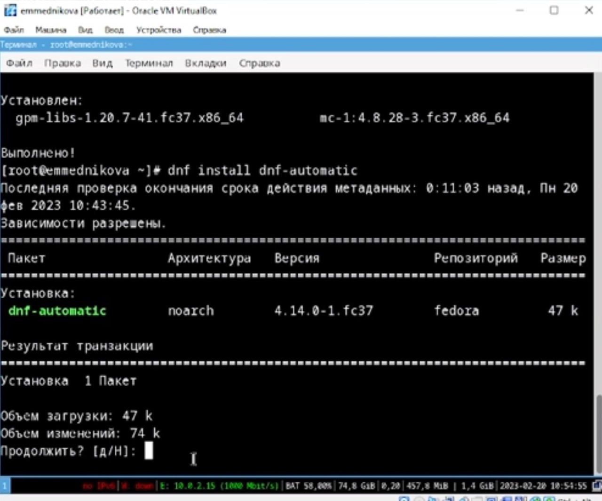

---
## Front matter
title: "Лабораторная работа №1"
subtitle: "Установка ОС Linux"
author: "Медникова Екатерина Михайловна"

## Generic otions
lang: ru-RU
toc-title: "Содержание"

## Bibliography
bibliography: bib/cite.bib
csl: pandoc/csl/gost-r-7-0-5-2008-numeric.csl

## Pdf output format
toc: true # Table of contents
toc-depth: 2
lof: true # List of figures
lot: true # List of tables
fontsize: 12pt
linestretch: 1.5
papersize: a4
documentclass: scrreprt
## I18n polyglossia
polyglossia-lang:
  name: russian
  options:
	- spelling=modern
	- babelshorthands=true
polyglossia-otherlangs:
  name: english
## I18n babel
babel-lang: russian
babel-otherlangs: english
## Fonts
mainfont: PT Serif
romanfont: PT Serif
sansfont: PT Sans
monofont: PT Mono
mainfontoptions: Ligatures=TeX
romanfontoptions: Ligatures=TeX
sansfontoptions: Ligatures=TeX,Scale=MatchLowercase
monofontoptions: Scale=MatchLowercase,Scale=0.9
## Biblatex
biblatex: true
biblio-style: "gost-numeric"
biblatexoptions:
  - parentracker=true
  - backend=biber
  - hyperref=auto
  - language=auto
  - autolang=other*
  - citestyle=gost-numeric
## Pandoc-crossref LaTeX customization
figureTitle: "Рис."
tableTitle: "Таблица"
listingTitle: "Листинг"
lofTitle: "Список иллюстраций"
lotTitle: "Список таблиц"
lolTitle: "Листинги"
## Misc options
indent: true
header-includes:
  - \usepackage{indentfirst}
  - \usepackage{float} # keep figures where there are in the text
  - \floatplacement{figure}{H} # keep figures where there are in the text
---

# Цель работы

Целью данной работы является приобретение практических навыков установки операционной системы на виртуальную машину, настройки минимально необходимых для дальнейшей работы сервисов.

# Выполнение лабораторной работы

1. Запустила менеджер виртуальных машин, введя в строке VirtualBox &. Создала новую виртуальную машину. Указала имя виртуальной машины, тип операционной системы.

{#fig:001 width=70%}

Указала размер основной памяти виртуальной машины.

{#fig:002 width=70%}

Задала конфигурацию жёсткого диска — загрузочный, VDI (VirtualBox Disk Image), динамический виртуальный диск. Задала размер диска - 80 ГБ.

{#fig:003 width=70%}

{#fig:004 width=70%}

Общий буфер обмена и функцию Drag'n'Drop сделала двунаправленными.

{#fig:005 width=70%}

2. Загрузила LiveCD. Нажала Enter для создания конфигурации по умолчанию. Нажала Enter, чтобы выбрать в качестве модификатора клавишу Win. Нажала комбинацию Win+Enter для запуска терминала. В терминале запустила liveinst. Для перехода к раскладке окон с табами нажала Win+w.

{#fig:006 width=70%} 

Выбрала язык интерфейса и перешла к настройкам установки операционной системы. 

{#fig:007 width=70%} 

Скорректировала часовой пояс, раскладку клавиатуры. Место установки ОС оставила без изменения.

{#fig:008 width=70%} 

Установила имя и пароль для пользователя root.

{#fig:009 width=70%} 

Установила имя и пароль для своего пользователя.

{#fig:0010 width=70%} 

Задала сетевое имя своего компьютера.

{#fig:0011 width=70%}

Дальше устанавливалась операционная система.

{#fig:0012 width=70%}

Изъяла диск из привода после установки операционной системы.

{#fig:0013 width=70%}

3. Вошла в ОС под заданной мной учётной записью. Нажала комбинацию Win+Enter для запуска терминала. Переключилась на роль супер-пользователя. Обновила все пакеты.
Повысила комфорт работы в консоли.

{#fig:0014 width=70%}

{#fig:0015 width=70%}

Установила программное обеспечение.

{#fig:0016 width=70%}

Запустила таймер.

{#fig:0017 width=70%}

4. В файле /etc/selinux/config заменила значение SELINUX=enforcing на значение SELINUX=permissive. Перезагрузила машину.

{#fig:0018 width=70%}

5. Вошла в ОС под заданной мной при установке учётной записью. Нажала комбинацию Win+Enter для запуска терминала. Переключилась на роль супер-пользователя.

{#fig:0019 width=70%}

Отредактировала конфигурационный файл /etc/X11/xorg.conf.d/00-keyboard.conf. Перезагрузила машину. 

{#fig:0020 width=70%}

6. Вошла в ОС под заданной мной при установке учётной записью. Нажала комбинацию Win+Enter для запуска терминала. Переключилась на роль супер-пользователя. Установила pandoc.

{#fig:0021 width=70%}

Установила дистрибутив TeXlive.

{#fig:0022 width=70%}

{#fig:0023 width=70%}

# Контрольные вопросы

1. *Какую информацию содержит учётная запись пользователя?*

**Учетная запись пользователя** – это необходимая для системы информация о пользователе, хранящаяся в специальных файлах. Информация используется Linux для аутентификации пользователя и назначения ему прав доступа. Аутентификация – системная процедура, позволяющая Linux определить, какой именно пользователь осуществляет вход. Вся информация о пользователе обычно хранится в файлах /etc/passwd и /etc/group. Учётная запись пользователя содержит: · Имя пользователя (user name) · Идентификационный номер пользователя (UID) · Идентификационный номер группы (GID). · Пароль (password) · Полное имя (full name) · Домашний каталог (home directory) · Начальную оболочку (login shell)

2. *Укажите команды терминала и приведите примеры.*

    Для получения справки по команде: man. Например, команда «man ls» выведет справку о команде «ls».
    
    Для перемещения по файловой системе: cd. Например, команда «cd newdir» осуществляет переход в каталог newdir.
    
    Для просмотра содержимого каталога: ls. Например, команда «ls –a ~/newdir» отобразит имена скрытых файлов в каталоге newdir.
    
    Для определения объёма каталога: du. Например, команда «du –k ~/newdir» выведет размер каталога newdir в килобайтах.
    
    Для создания / удаления каталогов / файлов: mkdir / rmdir/ rm. Например, команда «mkdir –p ~/newdir1/newdir2» создаст иерархическую цепочку подкаталогов, создав каталоги newdir1 и newdir2; команда «rmdir -v ~/newdir» удалит каталог newdir; команда «rm –r ~/newdir» так же удалит каталог newdir.
    
    Для задания определённых прав на файл / каталог: сhmod [опции] [путь]. Например, команда «сhmod g+r ~/text.txt» даст группе право на чтение файла text.txt.
    
    Для просмотра истории команд: history. Например, команда «history 7» покажет список последних 7 команд.

3. *Что такое файловая система? Приведите примеры с краткой характеристикой.*

    Файловая система имеет два значения: с одной стороны – это архитектура хранения битов на жестком диске, с другой – это организация каталогов в соответствии с идеологией Unix. Файловая система (англ. «file system») – это архитектура хранения данных в системе, хранение данных в оперативной памяти и доступа к конфигурации ядра. Файловая система устанавливает физическую и логическую структуру файлов, правила их создания и управления ими. В физическом смысле файловая система Linux представляет собой пространство раздела диска, разбитое на блоки фиксированного размера. Их размер кратен размеру сектора: 1024, 2048, 4096 или 8120 байт. Существует несколько типов файловых систем:

    XFS – начало разработки 1993 год, фирма Silicon Graphics, в мае 2000 года предстала в GNU GPL, для пользователей большинства Linux систем стала доступна в 2001-2002 гг. Отличительная черта системы – прекрасная поддержка больших файлов и файловых томов, 8 эксбибайт (8*260 байт) для 64-х битных систем.
    
    ReiserFS (Reiser3) – одна из первых журналируемых файловых систем под Linux, разработана Namesys, доступна с 2001 г. Максимальный объём тома для этой системы равен 16 тебибайт (16*240 байт).
    
    JFS (Journaled File System) – файловая система, детище IBM, явившееся миру в далёком 1990 году для ОС AIX (Advanced Interactive eXecutive). В виде первого стабильного релиза, для пользователей Linux, система стала доступна в 2001 году. Из плюсов системы – хорошая масштабируемость. Из минусов – не особо активная поддержка на протяжении всего жизненного цикла. Максимальный рамер тома 32 пэбибайта (32*250 байт).
    
    ext (extended filesystem) – появилась в апреле 1992 года, это была первая файловая система, изготовленная специально под нужды Linux ОС. Разработана Remy Card с целью преодолеть ограничения файловой системы Minix.
    
    ext2 (second extended file system) – была разработана Remy Card в 1993 году. Не журналируемая файловая система, это был основной её недостаток, который исправит ext3.
    
    ext3 (third extended filesystem) – по сути расширение исконной для Linux ext2, способное к журналированию. Разработана Стивеном Твиди в 1999 году, включена в основное ядро Linux в ноябре 2001 года. На фоне других своих сослуживцев обладает более скромным размером пространства, до 4 тебибайт (4*240 байт) для 32-х разрядных систем. На данный момент является наиболее стабильной и поддерживаемой файловой системой в среде Linux.
    
    Reiser4– первая попытка создать файловую систему нового поколения для Linux. Впервые представленная в 2004 году, система включает в себя такие передовые технологии как транзакции, задержка выделения пространства, а так же встроенная возможность кодирования и сжатия данных. Ханс Рейзер (Hans Reiser) – главный разработчик системы. -xt4 – попытка создать 64-х битную ext3 способную поддерживать больший размер файловой системы (1 эксбибайт). Позже добавились возможности – непрерывные области дискового пространства, задержка выделения пространства, онлайн дефрагментация и прочие. Обеспечивается прямая совместимость с системой ext3 и ограниченная обратная совместимость при недоступной способности к непрерывным областям дискового пространства.
    
    Btrfs (B-tree FS или Butter FS)– проект изначально начатый компанией Oracle, впоследствии поддержанный большинством Linux систем. Ключевыми особенностями данной файловой системы являются технологии: copy-on-write, позволяющая сделать снимки областей диска (снапшоты), которые могут пригодится для последующего восстановления; контроль за целостностью данных и метаданных (с повышенной гарантией целостности); сжатие данных; оптимизированный режим для накопителей SSD (задаётся при монтировании) и прочие. Немаловажным фактором является возможность перехода с ext3 на Btrfs. С августа 2008 года данная система выпускается под GNU GPL.
    
    Tux2 – известная, но так и не анонсированная публично файловая система. Создатель Дэниэл Филипс (Daniel Phillips). Cистема базируется на алгоритме «Фазового Дерева», который как и журналирование защищает файловую систему от сбоев. Организована как надстройка на ext2.
    
    Tux3 – cистема создана на основе FUSE (Filesystem in Userspace), специального модуля для создания файловых систем на Unix платформах. Данный проект ставит перед собой цель избавиться от привычного журналирования, взамен предлагая версионное восстановление (состояние в определённый промежуток времени). Преимуществом используемой в данном случае версионной системы, является способ описания изменений, где для каждого файла создаётся изменённая копия, а не переписывается текущая версия.
    
    Xiafs–задумка и разработка данной файловой системы принадлежат Frank Xia, основана на файловой системе MINIX. В настоящее время считается устаревшей и практически не используется. Наряду с ext2 разрабатывалась, как замена системе ext. В декабре 1993 года система была добавлена в стандартное ядро Linux. И хотя система обладала большей стабильностью и занимала меньше дискового пространства под контрольные структуры –она оказалась слабее ext2, ведущую роль сыграли ограничения максимальных размеров файла и раздела, а так же способность к дальнейшему расширению.
    
    ZFS (Zettabyte File System)–изначально созданная в Sun Microsystems файловая система, для небезызвестной операционной системы Solaris в 2005 году. Отличительные особенности –отсутствие фрагментацииданных как таковой, возможности по управлению снапшотами (snapshots), пулами хранения (storage pools), варьируемый размер блоков, 64-х разрядный механизм контрольных сумм, а так же способность адресовать 128 бит информации. В Linux системах может использоваться посредствам FUSE.

4. *Как посмотреть, какие файловые системы подмонтированы в ОС?*

Команда «findmnt» или «findmnt--all» будет отображать все подмонтированные файловые системы или искать файловую систему.

5. *Как удалить зависший процесс?*

    Основные сигналы (каждый сигнал имеет свой номер), которые используются для завершения процесса:

    SIGINT –самый безобидный сигнал завершения, означает Interrupt. Он отправляется процессу, запущенному из терминала с помощью сочетания клавиш Ctrl+C. Процесс правильно завершает все свои действия и возвращает управление;
    
    SIGQUIT –это еще один сигнал, который отправляется с помощью сочетания клавиш, программе, запущенной в терминале. Он сообщает ей что нужно завершиться и программа может выполнить корректное завершение или проигнорировать сигнал. В отличие от предыдущего, она генерирует дамп памяти. Сочетание клавиш Ctrl+/;
    
    SIGHUP –сообщает процессу, что соединение с управляющим терминалом разорвано, отправляется, в основном, системой при разрыве соединения с интернетом;
    
    SIGTERM –немедленно завершает процесс, но обрабатывается программой, поэтому позволяет ей завершить дочерние процессы и освободить все ресурсы;
    
    SIGKILL –тоже немедленно завершает процесс, но, в отличие от предыдущего варианта, он не передается самому процессу, а обрабатывается ядром. Поэтому ресурсы и дочерние процессы остаются запущенными.Также для передачи сигналов процессам в Linux используется утилита kill, её синтаксис:kill [-сигнал][pid_процесса](PID–уникальный идентификатор процесса). Сигнал представляет собой один из выше перечисленных сигналов для завершения процесса. Перед тем, как выполнить остановку процесса, нужно определить его PID. Для этого используют команды psиgrep. Команда ps предназначена для вывода списка активных процессов всистеме иинформациионих. Команда grep запускается одновременно сps (в канале) и будет выполнять поиск по результатам команды ps.Утилита pkill –это оболочка для kill, она ведет себя точно так же, и имеет тот же синтаксис, только в качестве идентификатора процесса ей нужно передать его имя. killall работает аналогично двум предыдущим утилитам. Она тоже принимает имя процесса в качестве параметра и ищет его PID в директории /proc. Но эта утилита обнаружит все процессы с таким именем и завершит их.

# Выводы

Приобрела практические навыки установки операционной системы на виртуальную машину, настройки минимально необходимых для дальнейшей работы сервисов.

