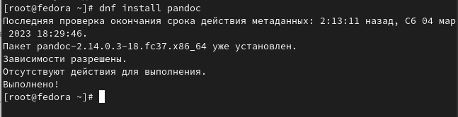
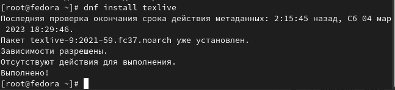
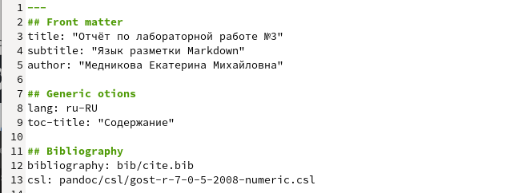
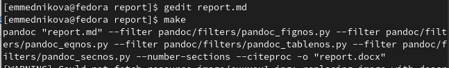

---
## Front matter
lang: ru-RU
title: Презентация по лабораторной работе №2
subtitle: Язык разметки Markdown
author:
  - Медникова Е. М.
institute:
  - Российский университет дружбы народов, Москва, Россия
  - Факультет физико-математических и естественных наук
date: 4 марта 2023

## i18n babel
babel-lang: russian
babel-otherlangs: english

## Formatting pdf
toc: false
toc-title: Содержание
slide_level: 2
aspectratio: 169
section-titles: true
theme: metropolis
header-includes:
 - \metroset{progressbar=frametitle,sectionpage=progressbar,numbering=fraction}
 - '\makeatletter'
 - '\beamer@ignorenonframefalse'
 - '\makeatother'
---

# Информация

## Докладчик

:::::::::::::: {.columns align=center}
::: {.column width="70%"}

  * Медникова Екатерина Михайловна
  * студент направления подготовки 01.03.00 Математика и механика
  * Российский университет дружбы народов
  * [mednikova.2002@list.ru](mednikova.2002@list.ru)
  * <https://github.com/emmednikova/study_2022-2023_os-intro>

:::
::: {.column width="30%"}

:::
::::::::::::::

## Цели и задачи 

- Научиться оформлять отчёты с помощью легковесного языка разметки Markdown.

## Установка pandoc, pandoc-crossref  и TeXlive

Перед началом выполнения работы нужно установить pandoc и pandoc-crossref для обработки файлов в формате Markdown. После этого переносим в нужные папки, чтобы файлы читались в правильном порядке. Также устанавливаем TeXlive для корректной работы программы. 

## Проверка 

После установки всех нужных программ нужно зайти в папку "report". Далее вводим команду "make". Через некоторое время должны создаться файлы report.pdf и report.docx. Если никаких ошибок не возникло, можно приступать к выполнению лабораторной работы. 

## Выполнение 

Проверив программы на корректность функционирования, переходим к заполнению отчёта. Пишем номер лабораторной работы, её название и ФИО. Далее оформляем работу в соответствии с правилами синтаксиса языка Markdown. 

## Завершение работы 

Сохраняем изменения, используя команду "make" (для создания файлов). Далее после того, как файлы скомпелируются, их можно проверить на правильность выполнения. Файлы: report.pdf, report.docx. 

## Вывод 

Я научилась оформлять отчёты с помощью легковесного языка разметки Markdown.
