---
## Front matter
title: "Отчёт по лабораторной работе №3"
subtitle: "Язык разметки Markdown"
author: "Медникова Екатерина Михайловна"

## Generic otions
lang: ru-RU
toc-title: "Содержание"

## Bibliography
bibliography: bib/cite.bib
csl: pandoc/csl/gost-r-7-0-5-2008-numeric.csl

## Pdf output format
toc: true # Table of contents
toc-depth: 2
lof: true # List of figures
lot: true # List of tables
fontsize: 12pt
linestretch: 1.5
papersize: a4
documentclass: scrreprt
## I18n polyglossia
polyglossia-lang:
  name: russian
  options:
	- spelling=modern
	- babelshorthands=true
polyglossia-otherlangs:
  name: english
## I18n babel
babel-lang: russian
babel-otherlangs: english
## Fonts
mainfont: PT Serif
romanfont: PT Serif
sansfont: PT Sans
monofont: PT Mono
mainfontoptions: Ligatures=TeX
romanfontoptions: Ligatures=TeX
sansfontoptions: Ligatures=TeX,Scale=MatchLowercase
monofontoptions: Scale=MatchLowercase,Scale=0.9
## Biblatex
biblatex: true
biblio-style: "gost-numeric"
biblatexoptions:
  - parentracker=true
  - backend=biber
  - hyperref=auto
  - language=auto
  - autolang=other*
  - citestyle=gost-numeric
## Pandoc-crossref LaTeX customization
figureTitle: "Рис."
tableTitle: "Таблица"
listingTitle: "Листинг"
lofTitle: "Список иллюстраций"
lotTitle: "Список таблиц"
lolTitle: "Листинги"
## Misc options
indent: true
header-includes:
  - \usepackage{indentfirst}
  - \usepackage{float} # keep figures where there are in the text
  - \floatplacement{figure}{H} # keep figures where there are in the text
---

# Цель работы

Научиться оформлять отчёты с помощью легковесного языка разметки Markdown.

# Теоретическое введение

Системы контроля версий. Общие понятия

Системы контроля версий (Version Control System, VCS) применяются при работе нескольких человек над одним проектом. Обычно основное дерево проекта хранится в локальном или удалённом репозитории, к которому настроен доступ для участников проекта. При внесении изменений в содержание проекта система контроля версий позволяет их фиксировать, совмещать изменения, произведённые разными участниками проекта, производить откат к любой более ранней версии проекта, если это требуется.
В классических системах контроля версий используется централизованная модель, предполагающая наличие единого репозитория для хранения файлов. Выполнение большинства функций по управлению версиями осуществляется специальным сервером. Участник проекта (пользователь) перед началом работы посредством определённых команд получает нужную ему версию файлов. После внесения изменений, пользователь размещает новую версию в хранилище. При этом предыдущие версии не удаляются из центрального хранилища и к ним можно вернуться в любой момент. Сервер может сохранять не полную версию изменённых файлов, а производить так называемую дельта-компрессию — сохранять только изменения между последовательными версиями, что позволяет уменьшить объём хранимых данных.
Системы контроля версий поддерживают возможность отслеживания и разрешения конфликтов, которые могут возникнуть при работе нескольких человек над одним файлом. Можно объединить (слить) изменения, сделанные разными участниками (автоматически или вручную), вручную выбрать нужную версию, отменить изменения вовсе или заблокировать файлы для изменения. В зависимости от настроек блокировка не позволяет другим пользователям получить рабочую копию или препятствует изменению рабочей копии файла средствами файловой системы ОС, обеспечивая таким образом, привилегированный доступ только одному пользователю, работающему с файлом.
Системы контроля версий также могут обеспечивать дополнительные, более гибкие функциональные возможности. Например, они могут поддерживать работу с несколькими версиями одного файла, сохраняя общую историю изменений до точки ветвления версий и собственные истории изменений каждой ветви. Кроме того, обычно доступна информация о том, кто из участников, когда и какие изменения вносил. Обычно такого рода информация хранится в журнале изменений, доступ к которому можно ограничить.
В отличие от классических, в распределённых системах контроля версий центральный репозиторий не является обязательным.
Среди классических VCS наиболее известны CVS, Subversion, а среди распределённых — Git, Bazaar, Mercurial. Принципы их работы схожи, отличаются они в основном синтаксисом используемых в работе команд.

# Выполнение лабораторной работы

1. Я установила Git.

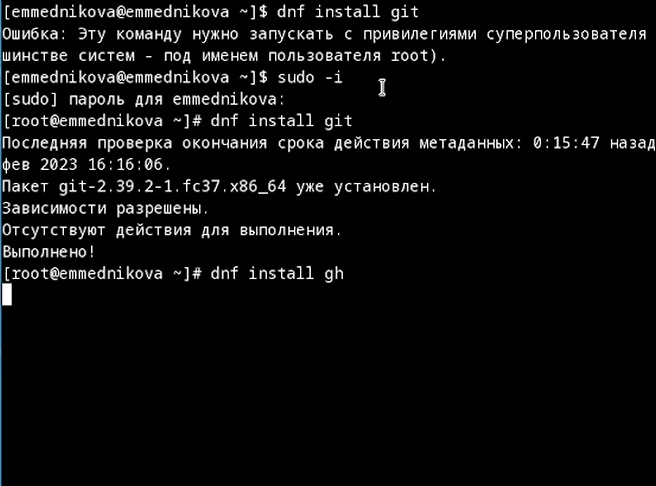{#fig:001 width=70%}

2. Установила Gh. 

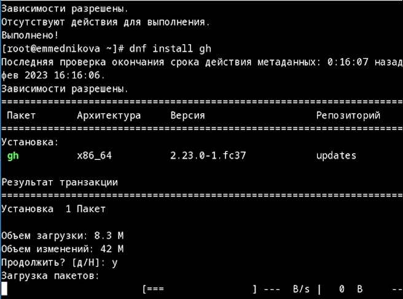{#fig:002 width=70%} 

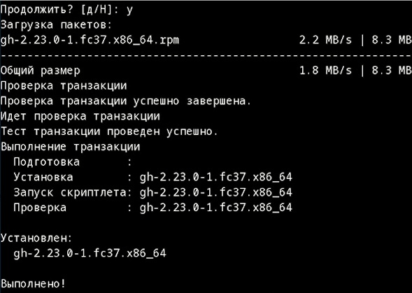{#fig:003 width=70%}

3. Задала имя и email. 

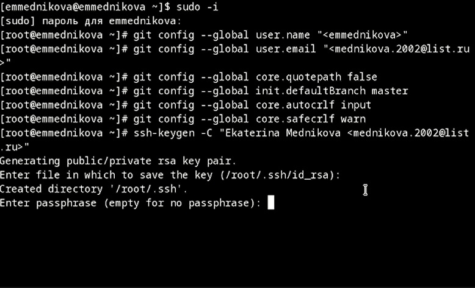{#fig:004 width=70%}

4. Настроила utf-8 в выводе сообщений git.

{#fig:005 width=70%}

5. Задала имя начальной ветки. 

{#fig:006 width=70%}

6. Применила параметры. 

{#fig:007 width=70%}

7. Создала SSH ключ. 

{#fig:008 width=70%} 

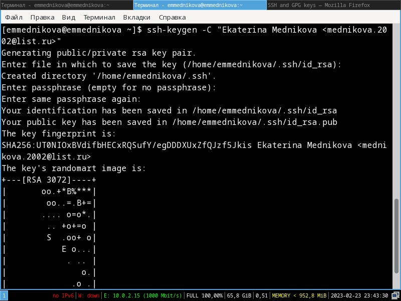{#fig:009 width=70%}

8. Загрузила ключ и указала его имя. 

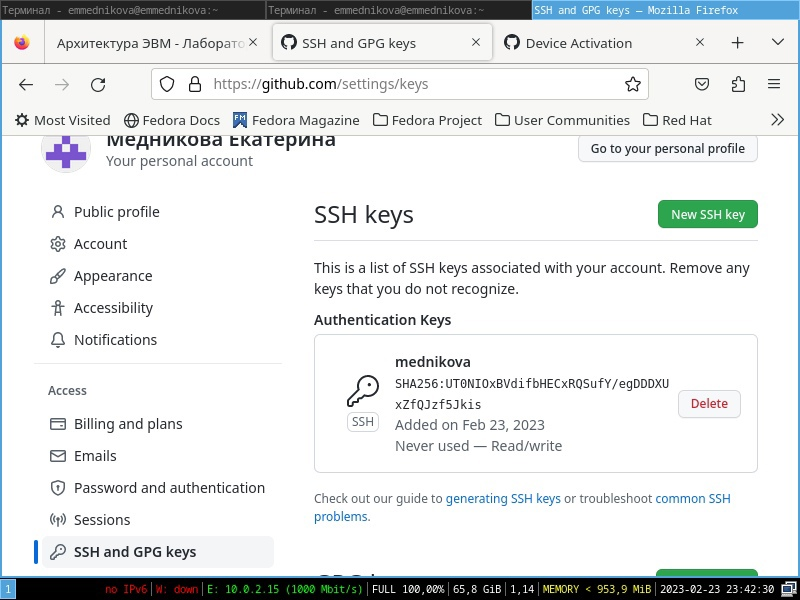{#fig:0010 width=70%}

9. Создала ключ pgp. 

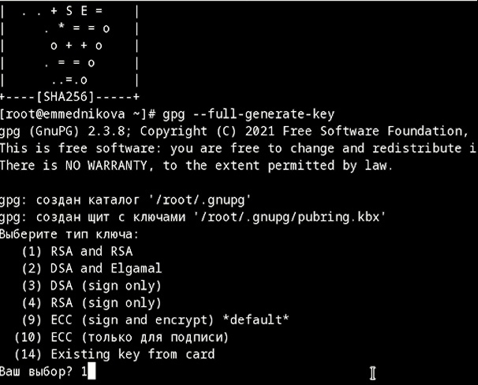{#fig:0011 width=70%} 

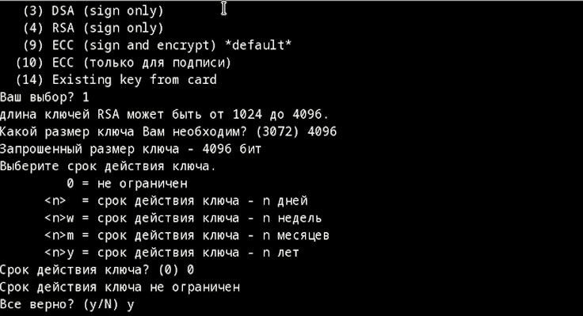{#fig:0012 width=70%}

10. Вывела список ключей и скопировала отпечаток приватного ключа. 

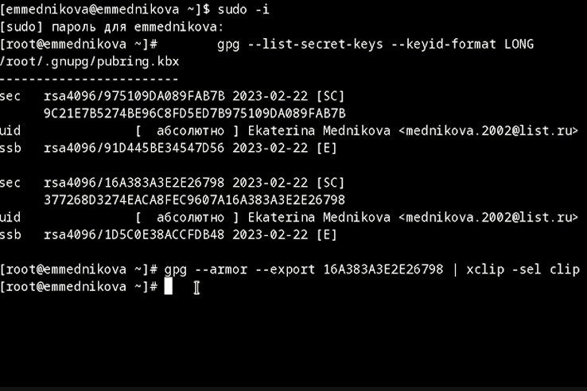{#fig:0013 width=70%} 

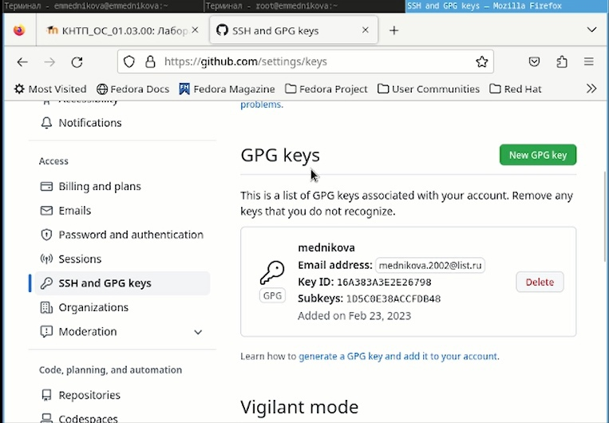{#fig:0014 width=70%}

11. Указала Git применять мой email при подписи коммитов. 

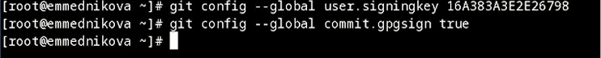{#fig:0015 width=70%} 

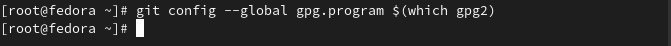{#fig:0016 width=70%}

12. Настроила Gh. 

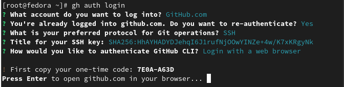{#fig:0017 width=70%} 

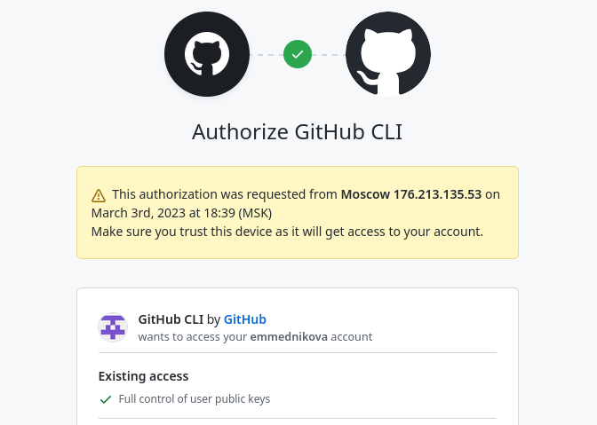{#fig:0018 width=70%} 

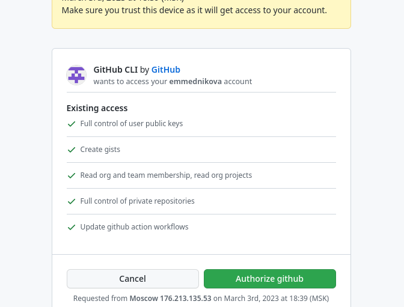{#fig:0019 width=70%} 

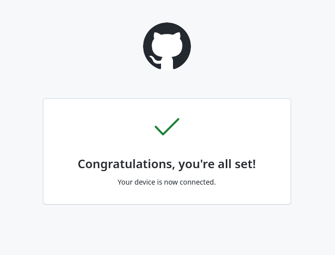{#fig:0020 width=70%}

13. Создала шаблон рабочего пространства. 

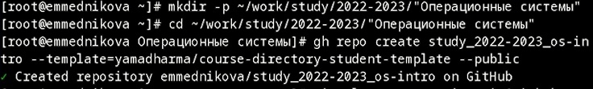{#fig:0021 width=70%}

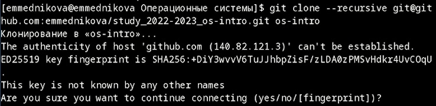{#fig:0022 width=70%} 

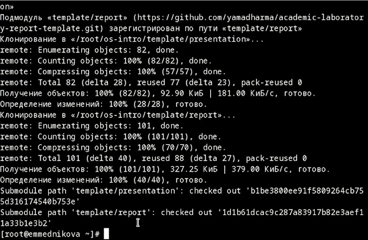{#fig:0023 width=70%} 

14. Перешла в каталог курса. 

{#fig:0024 width=70%} 

{#fig:0025 width=70%} 

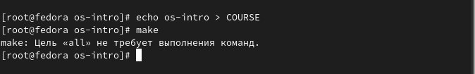{#fig:0026 width=70%} 

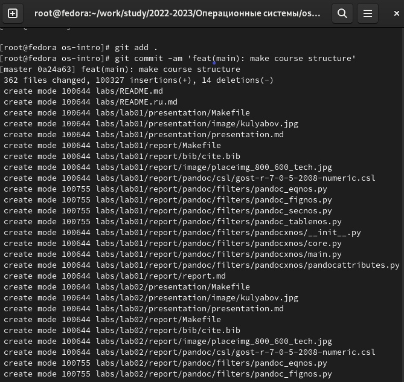{#fig:0027 width=70%} 

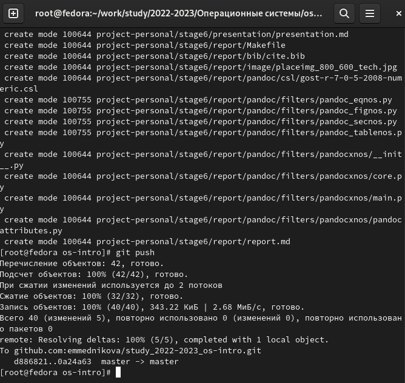{#fig:0028 width=70%} 

# Выводы

Научилась оформлять отчёты с помощью легковесного языка разметки Markdown.

# Контрольные вопросы 

1. *Что такое системы контроля версий (VCS) и для решения каких задач они предназначаются?*

Cистема контроля версий (Version Control System, VCS) представляет собой программное обеспечение для облегчения работы с изменяющейся информацией. Она позволяет комфортно работать над проектом как индивидуально, так в коллективе. VCS отслеживает изменения в файлах, предоставляет возможности для создания новых и слияние существующих ветвей проекта, производит контроль доступа пользователей к проекту, позволяет откатывать исправления и определять кто, когда и какие изменения вносил в проект.

2.  *Объясните следующие понятия VCS и их отношения: хранилище, commit, история, рабочая копия.*

Основным понятием VCS является репозиторий (repository) – специальное хранилище файлов и папок проекта, изменения в которых отслеживаются. В распоряжении разработчика имеется так называемая “рабочая копия” (working copy) проекта, с которой он непосредственно работает. Рабочую копию необходимо периодически синхронизировать с репозиторием, эта операция предполагает отправку в него изменений, которые пользователь внес в свою рабочую копию (такая операция называется commit) и актуализацию рабочей копии, в процессе которой к пользователю загружается последняя версия из репозитория (этот процесс носит название update).

3. *Что представляют собой и чем отличаются централизованные и децентрализованные VCS? Приведите примеры VCS каждого вида.*

Централизованные системы контроля версий представляют собой приложения типа клиент-сервер, когда репозиторий проекта существует в единственном экземпляре и хранится на сервере. Доступ к нему осуществлялся через специальное клиентское приложение. В качестве примеров таких программных продуктов можно привести CVS, Subversion.Примеры: CVS (Concurrent Versions System, Система одновременных версий), Subversion (SVN)
Децентрализованные системы контроля версий (Distributed Version Control System, DVCS) позволяют хранить репозиторий (его копию) у каждого разработчика, работающего с данной системой. При этом можно выделить центральный репозиторий (условно), в который будут отправляться изменения из локальных и, с ним же эти локальные репозитории будут синхронизироваться. При работе с такой системой, пользователи периодически синхронизируют свои локальные репозитории с центральным и работают непосредственно со своей локальной копией. После внесения достаточного количества изменений в локальную копию они (изменения) отправляются на сервер. При этом сервер, чаще всего, выбирается условно, т.к. в большинстве DVCS нет такого понятия как “выделенный сервер с центральным репозиторием”.
Примеры: Git, Mercurial

4. *Опишите действия с VCS при единоличной работе с хранилищем.*

Участник проекта (пользователь) перед началом работы посредством определённых команд получает нужную ему версию файлов. После внесения изменений, пользователь размещает новую версию в хранилище. При этом предыдущие версии не удаляются из центрального хранилища и к ним можно вернуться
в любой момент. Сервер может сохранять не полную версию изменённых файлов, а производить так называемую дельта-компрессию — сохранять только изменения между последовательными версиями, что позволяет уменьшить объём хранимых данных.

5. *Опишите порядок работы с общим хранилищем VCS.*

Можно объединить (слить) изменения, сделанные разными участниками (автоматически или вручную), вручную выбрать нужную версию, отменить изменения вовсе или заблокировать файлы для изменения. В зависимости от настроек блокировка не позволяет другим пользователям получить рабочую копию или препятствует изменению рабочей копии файла средствами файловой системы ОС, обеспечивая таким образом, привилегированный доступ только одному пользователю, работающему с файлом.

6. *Каковы основные задачи, решаемые инструментальным средством git?*

Система контроля версий Git представляет собой набор программ командной строки. Доступ к ним можно получить из терминала посредством ввода команды git с различными опциями. Благодаря тому, что Git является распределённой системой контроля версий, резервную копию локального хранилища можно сделать простым копированием или
архивацией.

7. *Назовите и дайте краткую характеристику командам git.*

Наиболее часто используемые команды git:
– создание основного дерева репозитория:
git init
– получение обновлений (изменений) текущего дерева из центрального репозитория:
git pull
– отправка всех произведённых изменений локального дерева в центральный репозиторий:
git push
– просмотр списка изменённых файлов в текущей директории:
git status
– просмотр текущих изменения:
git diff
– сохранение текущих изменений:
– добавить все изменённые и/или созданные файлы и/или каталоги:
git add .
– добавить конкретные изменённые и/или созданные файлы и/или каталоги:
git add имена_файлов
– удалить файл и/или каталог из индекса репозитория (при этом файл и/или
каталог остаётся в локальной директории):
git rm имена_файлов
– сохранение добавленных изменений:
– сохранить все добавленные изменения и все изменённые файлы:
git commit -am 'Описание коммита'
– сохранить добавленные изменения с внесением комментария через встроенный редактор:
git commit
– создание новой ветки, базирующейся на текущей:
git checkout -b имя_ветки
– переключение на некоторую ветку:
git checkout имя_ветки
(при переключении на ветку, которой ещё нет в локальном репозитории, она будет создана и связана с удалённой)
– отправка изменений конкретной ветки в центральный репозиторий:
git push origin имя_ветки
– слияние ветки с текущим деревом:
git merge —no-ff имя_ветки
– удаление ветки:
– удаление локальной уже слитой с основным деревом ветки:
git branch -d имя_ветки
– принудительное удаление локальной ветки:
git branch -D имя_ветки
– удаление ветки с центрального репозитория:
git push origin :имя_ветки

8. *Приведите примеры использования при работе с локальным и удалённым репозиториями.*

Работа пользователя со своей веткой начинается с проверки и получения изменений из центрального репозитория (при этом в локальное дерево до начала этой процедуры не должно было вноситься изменений):
git checkout master
git pull
git checkout -b имя_ветки
Затем можно вносить изменения в локальном дереве и/или ветке.
После завершения внесения какого-то изменения в файлы и/или каталоги проекта необходимо разместить их в центральном репозитории. Для этого необходимо
проверить, какие файлы изменились к текущему моменту:
git status
и при необходимости удаляем лишние файлы, которые не хотим отправлять в центральный репозиторий.
Затем полезно просмотреть текст изменений на предмет соответствия правилам
ведения чистых коммитов:
git diff
Если какие-либо файлы не должны попасть в коммит, то помечаем только те
файлы, изменения которых нужно сохранить. Для этого используем команды добавления и/или удаления с нужными опциями:
git add ...
git rm ...
Если нужно сохранить все изменения в текущем каталоге, то используем:
git add .
Затем сохраняем изменения, поясняя, что было сделано:
git commit -am "Some commit message"
и отправляем в центральный репозиторий:
git push origin имя_ветки
или
git push

Создадим локальный репозиторий.
Сначала сделаем предварительную конфигурацию, указав имя и email владельца репозитория:
git config —global user.name "Имя Фамилия"
git config —global user.email "work@mail"
и настроив utf-8 в выводе сообщений git:
git config —global quotepath false
Для инициализации локального репозитория, расположенного, например, в каталоге ~/tutorial, необходимо ввести в командной строке:
cd
mkdir tutorial
cd tutorial
git init
После это в каталоге tutorial появится каталог .git, в котором будет храниться история изменений.
Создадим тестовый текстовый файл hello.txt и добавим его в локальный репозиторий:
echo 'hello world' > hello.txt
git add hello.txt
git commit -am 'Новый файл'
Воспользуемся командой status для просмотра изменений в рабочем каталоге, сделанных с момента последней ревизии:
git status

9. *Что такое и зачем могут быть нужны ветви (branches)?*

Ветка в Git - это простой перемещаемый указатель на один из коммитов. По умолчанию, имя основной ветки в Git - master.
Ветки нужны для того, чтобы разделять код. Например одна ветка у нас может быть основная для разработки. Если мы делаем новый функционал, то мы создаем новую ветку под него, а после окончания работы перекидываем то, что мы сделали, в основную ветку.
Это дает нам возможность легко откатывать код, если вдруг мы передумаем его перемещать в основную ветку, либо делать несколько различных изменений в разных ветках.

10. *Как и зачем можно игнорировать некоторые файлы при commit?*

Во время работы над проектом так или иначе могут создаваться файлы, которые не требуется добавлять в последствии в репозиторий. Например, временные
файлы, создаваемые редакторами, или объектные файлы, создаваемые компиляторами. Можно прописать шаблоны игнорируемых при добавлении в репозиторий типов файлов в файл .gitignore с помощью сервисов. Для этого сначала нужно
получить список имеющихся шаблонов:
curl -L -s https://www.gitignore.io/api/list
Затем скачать шаблон, например, для C и C++
curl -L -s https://www.gitignore.io/api/c » .gitignore
curl -L -s https://www.gitignore.io/api/c++ » .gitignore

# Список литературы{.unnumbered}

::: {#refs}
:::
