---
## Front matter
lang: ru-RU
title: Лабораторная работа №4
subtitle: Основы интерфейса взаимодействия пользователя с системой Unix на уровне командной строки
author:
  - Медникова Е.М.
institute:
  - Российский университет дружбы народов, Москва, Россия
  - Факультет физико-математических и естественных наук
date: 4 марта 2023

## i18n babel
babel-lang: russian
babel-otherlangs: english

## Formatting pdf
toc: false
toc-title: Содержание
slide_level: 2
aspectratio: 169
section-titles: true
theme: metropolis
header-includes:
 - \metroset{progressbar=frametitle,sectionpage=progressbar,numbering=fraction}
 - '\makeatletter'
 - '\beamer@ignorenonframefalse'
 - '\makeatother'
---

# Информация

## Докладчик

:::::::::::::: {.columns align=center}
::: {.column width="70%"}

  * Медникова Екатерина Михайловна
  * студентка направления бакалавриата 01.03.00 Математика и механика
  * Российский университет дружбы народов
  * [1132226549@rudn.ru](mailto:1132226549@rudn.ru)

:::
::: {.column width="30%"}

:::
::::::::::::::

# Цель работы

Приобретение практических навыков взаимодействия пользователя с системой посредством командной строки.

# Выполнение лабораторной работы

## Определила полное имя своего домашнего каталога.

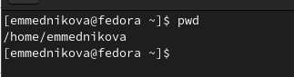

## Перешла в каталог /tmp.

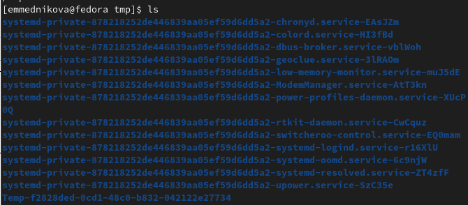

## Вывела на экран содержимое каталога /tmp.

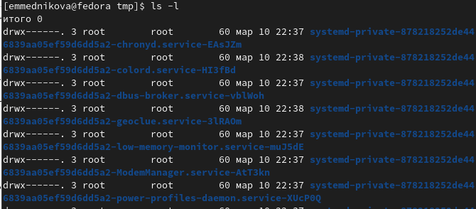

## Вывела на экран содержимое каталога /tmp.

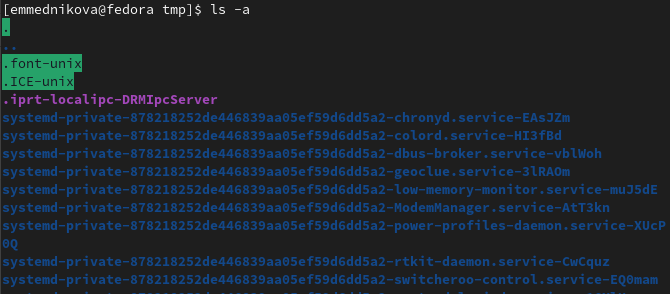

## Вывела на экран содержимое каталога /tmp.

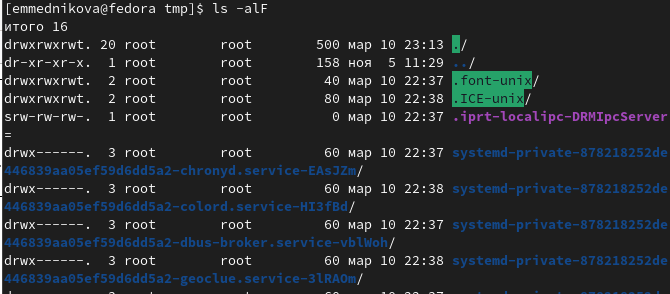

## Продолжение

Для того, чтобы отобразить имена скрытых файлов, необходимо использовать команду ls
с опцией a. Чтобы вывести на экран подробную информацию о файлах и каталогах, необходимо использовать опцию l. При этом о каждом файле и каталоге будет выведена следующая информация:
– тип файла,
– право доступа,
– число ссылок,
– владелец,
– размер,
– дата последней ревизии,
– имя файла или каталога.

## В каталоге /var/spool нет подкаталога с именем cron. 

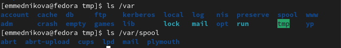

## Перешла в свой домашний каталог и вывела на экран его содержмиое.

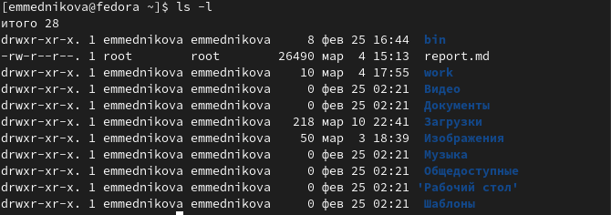

## В домашнем каталоге создала новый каталог с именем newdir.

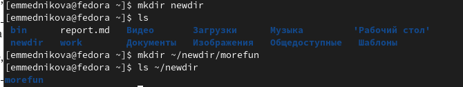

## В каталоге ~/newdir создала новый каталог с именем morefun.

## В домашнем каталоге создала одной командой три новых каталога с именами letters, memos, misk. Затем удалила эти каталоги одной командой.

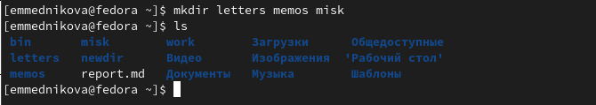

## В домашнем каталоге создала одной командой три новых каталога с именами letters, memos, misk. Затем удалила эти каталоги одной командой.

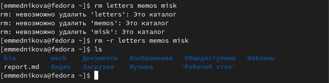

## Попробовала удалить ранее созданный каталог ~/newdir командой rm. Проверила, был ли каталог удалён.

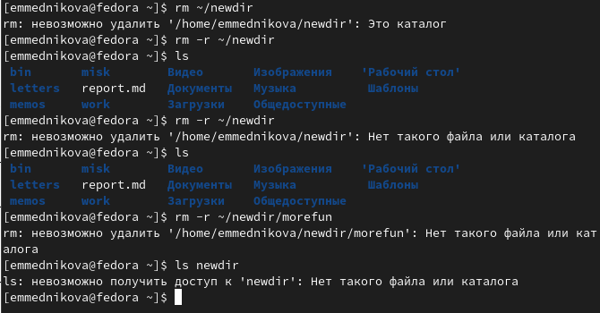

## Удалила каталог ~/newdir/morefun из домашнего каталога. Проверила, был ли каталог удалён.

## С помощью команды man определила, какую опцию команды ls нужно использовать для просмотра содержимого не только указанного каталога, но и подкаталогов, входящих в него.

## С помощью команды man определила набор опций команды ls, позволяющий отсортировать по времени последнего изменения выводимый список содержимого каталога с развёрнутым описанием файлов.

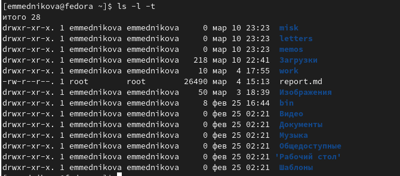

## Использовала команду man для просмотра описания следующих команд: cd, pwd, mkdir, rmdir, rm.

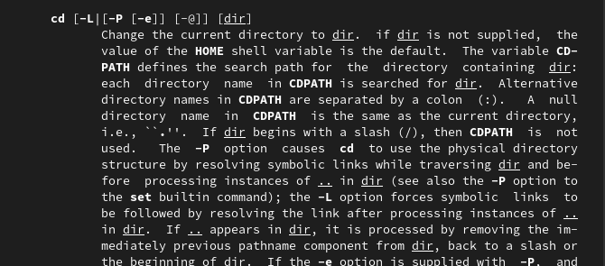

## Использовала команду man для просмотра описания следующих команд: cd, pwd, mkdir, rmdir, rm.

## Использовала команду man для просмотра описания следующих команд: cd, pwd, mkdir, rmdir, rm.

## Использовала команду man для просмотра описания следующих команд: cd, pwd, mkdir, rmdir, rm.

## Использовала команду man для просмотра описания следующих команд: cd, pwd, mkdir, rmdir, rm.

## Продолжение

Команда cd используется для перемещения по файловой системе операционной системы типа Linux. Для определения абсолютного пути к текущему каталогу используется команда pwd.
Команда mkdir используется для создания каталогов. Команда rm используется для удаления файлов и/или каталогов. Для удаления пустового каталога используется команда rmdir. 

## Используя информацию, полученную при помощи команды history, выполнила модификацию и исполнение нескольких команд из буфера команд.

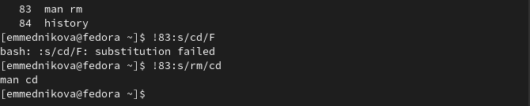

## Используя информацию, полученную при помощи команды history, выполнила модификацию и исполнение нескольких команд из буфера команд.

## Используя информацию, полученную при помощи команды history, выполнила модификацию и исполнение нескольких команд из буфера команд.

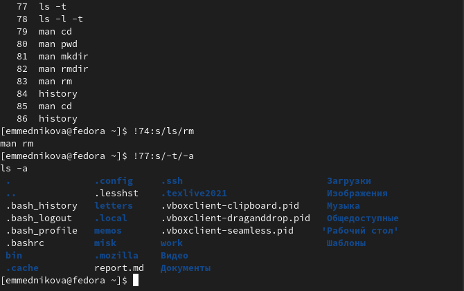

## Выводы 

Приобрела практические навыки взаимодействия пользователя с системой посредством командной строки.

