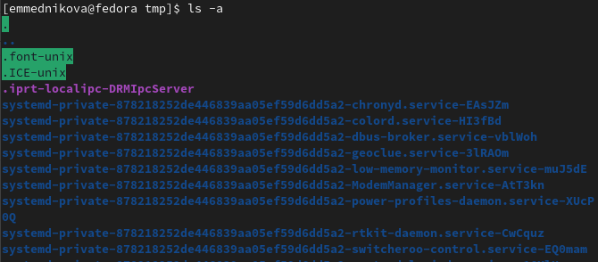
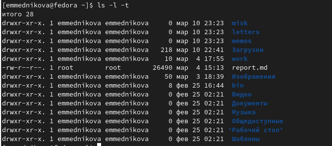
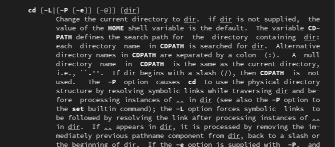
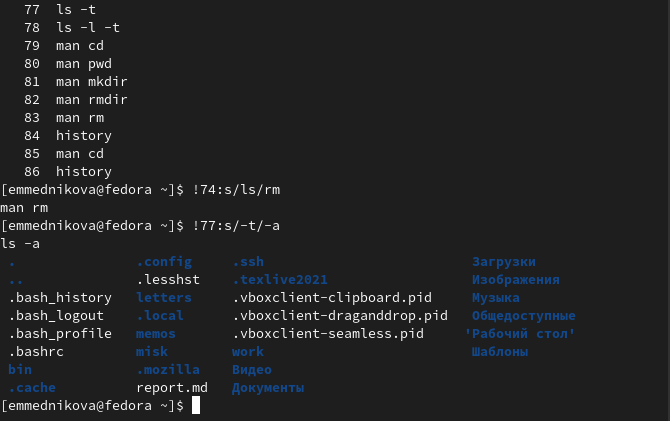

---
## Front matter
title: "Лабораторная работа №4"
subtitle: "Основы интерфейса взаимодействия пользователя с системой Unix на уровне командной строки"
author: "Медникова Екатерина Михайловна"

## Generic otions
lang: ru-RU
toc-title: "Содержание"

## Bibliography
bibliography: bib/cite.bib
csl: pandoc/csl/gost-r-7-0-5-2008-numeric.csl

## Pdf output format
toc: true # Table of contents
toc-depth: 2
lof: true # List of figures
lot: true # List of tables
fontsize: 12pt
linestretch: 1.5
papersize: a4
documentclass: scrreprt
## I18n polyglossia
polyglossia-lang:
  name: russian
  options:
	- spelling=modern
	- babelshorthands=true
polyglossia-otherlangs:
  name: english
## I18n babel
babel-lang: russian
babel-otherlangs: english
## Fonts
mainfont: PT Serif
romanfont: PT Serif
sansfont: PT Sans
monofont: PT Mono
mainfontoptions: Ligatures=TeX
romanfontoptions: Ligatures=TeX
sansfontoptions: Ligatures=TeX,Scale=MatchLowercase
monofontoptions: Scale=MatchLowercase,Scale=0.9
## Biblatex
biblatex: true
biblio-style: "gost-numeric"
biblatexoptions:
  - parentracker=true
  - backend=biber
  - hyperref=auto
  - language=auto
  - autolang=other*
  - citestyle=gost-numeric
## Pandoc-crossref LaTeX customization
figureTitle: "Рис."
tableTitle: "Таблица"
listingTitle: "Листинг"
lofTitle: "Список иллюстраций"
lotTitle: "Список таблиц"
lolTitle: "Листинги"
## Misc options
indent: true
header-includes:
  - \usepackage{indentfirst}
  - \usepackage{float} # keep figures where there are in the text
  - \floatplacement{figure}{H} # keep figures where there are in the text
---

# Цель работы

Приобретение практических навыков взаимодействия пользователя с системой посредством командной строки.

# Теоретическое введение

В операционной системе типа Linux взаимодействие пользователя с системой обычно
осуществляется с помощью командной строки посредством построчного ввода команд. При этом обычно используется командные интерпретаторы языка shell: /bin/sh; /bin/csh;  bin/ksh.

**Формат команды.** Командой в операционной системе называется записанный по
специальным правилам текст (возможно с аргументами), представляющий собой указание на выполнение какой-либо функций (или действий) в операционной системе.

Обычно первым словом идёт имя команды, остальной текст — аргументы или опции, конкретизирующие действие.

Общий формат команд можно представить следующим образом:

<имя_команды><разделитель><аргументы>

**Команда man.** Команда man используется для просмотра (оперативная помощь) в диалоговом режиме руководства (manual) по основным командам операционной системы
типа Linux.
Формат команды:

man <команда>

Пример (вывод информации о команде man):

 man man
 
Для управления просмотром результата выполнения команды man можно использовать следующие клавиши:

– Space — перемещение по документу на одну страницу вперёд;
– Enter — перемещение по документу на одну строку вперёд;
– q — выход из режима просмотра описания.

**Команда cd.** Команда cd используется для перемещения по файловой системе операционной системы типа Linux.

Файловая система ОС типа Linux — иерархическая система каталогов, подкаталогов и файлов, которые обычно организованы и сгруппированы по функциональному признаку. Самый верхний каталог в иерархии называется корневым и обозначается символом /. Корневой каталог содержит системные файлы и другие каталоги.
Формат команды:

cd [путь_к_каталогу]

**Команда pwd.** Для определения абсолютного пути к текущему каталогу используется команда pwd (print working directory).

**Команда ls.** Команда ls используется для просмотра содержимого каталога.
Формат команды:

ls [-опции] [путь]

**Команда mkdir.** Команда mkdir используется для создания каталогов.
Формат команды:

mkdir имя_каталога1 [имя_каталога2...]

**Команда rm.** Команда rm используется для удаления файлов и/или каталогов.
Формат команды:

rm [-опции] [файл]

Если требуется, чтобы выдавался запрос подтверждения на удаление файла, то необходимо использовать опцию i.
Чтобы удалить каталог, содержащий файлы, нужно использовать опцию r. Без указания этой опции команда не будет выполняться.

**Команда history.** Для вывода на экран списка ранее выполненных команд используется команда history. Выводимые на экран команды в списке нумеруются. К любой команде из выведенного на экран списка можно обратиться по её номеру в списке, воспользовавшись конструкцией !<номер_команды>.

**Использование символа «;».** Если требуется выполнить последовательно несколько
команд, записанный в одной строке, то для этого используется символ точка с запятой
Пример:

cd; ls

# Выполнение лабораторной работы

1. Определила полное имя своего домашнего каталога.

{#fig:001 width=70%}

2. Выполнила следующие действия:

2.1. Перешла в каталог /tmp.

{#fig:002 width=70%}

2.2. Вывела на экран содержимое каталога /tmp.

{#fig:003 width=70%}

{#fig:004 width=70%}

{#fig:005 width=70%}

Для того, чтобы отобразить имена скрытых файлов, необходимо использовать команду ls
с опцией a. Чтобы вывести на экран подробную информацию о файлах и каталогах, необходимо использовать опцию l. При этом о каждом файле и каталоге будет выведена следующая информация:
– тип файла,
– право доступа,
– число ссылок,
– владелец,
– размер,
– дата последней ревизии,
– имя файла или каталога.

2.3. В каталоге /var/spool нет подкаталога с именем cron. 

{#fig:006 width=70%}

2.4. Перешла в свой домашний каталог и вывела на экран его содержмиое.

{#fig:007 width=70%}

3. Выполнила следующие действия:

3.1. В домашнем каталоге создала новый каталог с именем newdir.

{#fig:008 width=70%}

3.2. В каталоге ~/newdir создала новый каталог с именем morefun.

{#fig:009 width=70%}

3.3. В домашнем каталоге создала одной командой три новых каталога с именами letters, memos, misk. Затем удалила эти каталоги одной командой.

{#fig:0010 width=70%}

{#fig:0011 width=70%}

3.4. Попробовала удалить ранее созданный каталог ~/newdir командой rm. Проверила, был ли каталог удалён.

{#fig:0012 width=70%}

3.5. Удалила каталог ~/newdir/morefun из домашнего каталога. Проверила, был ли каталог удалён.

{#fig:0013 width=70%}

4. С помощью команды man определила, какую опцию команды ls нужно использовать для просмотра содержимого не только указанного каталога, но и подкаталогов, входящих в него.

{#fig:0014 width=70%}

5. С помощью команды man определила набор опций команды ls, позволяющий отсортировать по времени последнего изменения выводимый список содержимого каталога с развёрнутым описанием файлов.

{#fig:0015 width=70%}

6. Использовала команду man для просмотра описания следующих команд: cd, pwd, mkdir, rmdir, rm.

{#fig:0016 width=70%}

{#fig:0017 width=70%}

{#fig:0018 width=70%}

{#fig:0019 width=70%}

{#fig:0020 width=70%}

Команда cd используется для перемещения по файловой системе операционной системы типа Linux. Для определения абсолютного пути к текущему каталогу используется команда pwd.
Команда mkdir используется для создания каталогов. Команда rm используется для удаления файлов и/или каталогов. Для удаления пустового каталога используется команда rmdir. 

7. Используя информацию, полученную при помощи команды history, выполнила модификацию и исполнение нескольких команд из буфера команд.

{#fig:0021 width=70%}

{#fig:0022 width=70%}

{#fig:0023 width=70%}

# Контрольные вопросы

1. *Что такое командная строка?*

Командная строка – специальная программа, позволяющая управлять операционной системой при помощи текстовых команд, вводимых в окне приложения.

2. *При помощи какой команды можно определить абсолютный путь текущего каталога? Приведите пример.*

Для определения абсолютного пути к текущему каталогу используется команда pwd (print working directory).

3. *При помощи какой команды и каких опций можно определить только тип файлов и их имена в текущем каталоге? Приведите примеры.*

Команда «ls-F» (или «ls-aF», тогда появятся еще скрытые файлы) выведет имена файлов в текущем каталоге и их типы. Тип каталога обозначается /, тип исполняемого файла обозначается *, тип ссылки обозначается @.

4. *Каким образом отобразить информацию о скрытых файлах? Приведите примеры.*

Имена скрытых файлов начинаются с точки. Эти файлы в операционной системе скрыты от просмотра и обычно используются для настройки рабочей среды. Для того, чтобы отобразить имена скрытых файлов, необходимо использовать команду «ls –a».

5. *При помощи каких команд можно удалить файл и каталог? Можно ли это сделать одной и той же командой? Приведите примеры.*

Команда rm используется для удаления файлов и/или каталогов. Команда rm-i выдает запрос подтверждения наудаление файла. Команда rm-r необходима, чтобы удалить каталог, содержащий файлы. Без указания этой опции команда не будет выполняться. Если каталог пуст, то можно воспользоваться командой rmdir. Если удаляемый каталог содержит файлы, то команда не будет выполнена. Нужно использовать «rm -r имя_каталога». Таким образом, каталог, не содержащий файлов, можно удалить и командой rm, и командой rmdir. Файл командой rmdir удалить нельзя.

6. *Каким образом можно вывести информацию о последних выполненных пользователем командах? работы?*

Чтобы определить, какие команды выполнил пользователь в сеансе работы, необходимо воспользоваться командой «history».

7. *Как воспользоваться историей команд для их модифицированного выполнения? Приведите примеры.*

Чтобы исправить илизапустить на выполнение команду, которую пользователь уже использовал в сеансе работы, необходимо: в первом случае:воспользоваться конструкцией !<номер_команды>:s/<что_меняем>/<на_что_меняем>, во втором случае: !<номер_команды>.

8. *Приведите примеры запуска нескольких команд в одной строке.*

Чтобы записать в одной строке несколько команд, необходимо между ними поставить ; . Например, «cd /tmp; ls».

9. *Дайте определение и приведите примера символов экранирования.*

Символ обратного слэша \ позволяет использовать управляющие символы (".", "/", "$", "*", "[", "]", "^", "&") без их интерпретации командной оболочкой; процедура добавления данного символа перед управляющими символами называетсяэкранированием символов.Например, команда «lsnewdir/morefun» отобразит содержимое каталога newdir/morefun.

10. *Охарактеризуйте вывод информации на экран после выполнения команды ls с опцией l.*

Команда «ls -l» отображает список каталогов и файлов с подробной информацией о них(тип файла, право доступа, число ссылок, владелец, размер, дата последней ревизии, имя файла или каталога).

11. *Что такое относительный путь к файлу? Приведите примеры использования относительного и абсолютного пути при выполнении какой-либо команды.*

Полный, абсолютный путь от корня файловой системы – этот путь начинается от корня "/" и описывает весь путь к файлуили каталогу; Относительный путь – это путь к файлу относительно текущего каталога(каталога, где находится пользователь).Например, «cd/newdir/morefun»–абсолютный путь, «cdnewdir»–относительный путь.

12. *Как получить информацию об интересующей вас команде?*

Чтобы получить необходимую информацию о команде, необходимо воспользоваться конструкцией man[имя_команды], либо использовать опцию help, которая предусмотрена для некоторых команд.

13. *Какая клавиша или комбинация клавиш служит для автоматического дополнения вводимых команд?*

Для автоматического дополнения вводимых команд служит клавиша Tab.

# Выводы

Приобрела практические навыки взаимодействия пользователя с системой посредством командной строки.

