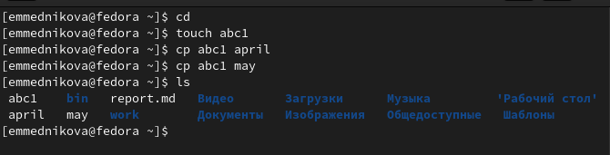

---
## Front matter
title: "Отчёт по лабораторной работе №5"
subtitle: "Анализ файловой системы Linux. Команды для работы с файлами и каталогами"
author: "Медникова Екатерина Михайловна"

## Generic otions
lang: ru-RU
toc-title: "Содержание"

## Bibliography
bibliography: bib/cite.bib
csl: pandoc/csl/gost-r-7-0-5-2008-numeric.csl

## Pdf output format
toc: true # Table of contents
toc-depth: 2
lof: true # List of figures
lot: true # List of tables
fontsize: 12pt
linestretch: 1.5
papersize: a4
documentclass: scrreprt
## I18n polyglossia
polyglossia-lang:
  name: russian
  options:
	- spelling=modern
	- babelshorthands=true
polyglossia-otherlangs:
  name: english
## I18n babel
babel-lang: russian
babel-otherlangs: english
## Fonts
mainfont: PT Serif
romanfont: PT Serif
sansfont: PT Sans
monofont: PT Mono
mainfontoptions: Ligatures=TeX
romanfontoptions: Ligatures=TeX
sansfontoptions: Ligatures=TeX,Scale=MatchLowercase
monofontoptions: Scale=MatchLowercase,Scale=0.9
## Biblatex
biblatex: true
biblio-style: "gost-numeric"
biblatexoptions:
  - parentracker=true
  - backend=biber
  - hyperref=auto
  - language=auto
  - autolang=other*
  - citestyle=gost-numeric
## Pandoc-crossref LaTeX customization
figureTitle: "Рис."
tableTitle: "Таблица"
listingTitle: "Листинг"
lofTitle: "Список иллюстраций"
lotTitle: "Список таблиц"
lolTitle: "Листинги"
## Misc options
indent: true
header-includes:
  - \usepackage{indentfirst}
  - \usepackage{float} # keep figures where there are in the text
  - \floatplacement{figure}{H} # keep figures where there are in the text
---

# Цель работы

Ознакомление с файловой системой Linux, её структурой, именами и содержанием каталогов. Приобретение практических навыков по применению команд для работы с файлами и каталогами, по управлению процессами (и работами), по проверке использования диска и обслуживанию файловой системы. 

# Выполнение лабораторной работы

1. Скопировала файл ~/abc1 в файл april и в файл may. 

{#fig:001 width=70%}

2. Скопировала файлы april и may в каталог monthly. 

{#fig:002 width=70%}

3. Скопировала файл monthly/may в файл с именем june. 

{#fig:003 width=70%}

4. Скопировала каталог monthly в каталог monthly.00. 

{#fig:004 width=70%}

5. Скопировала каталог monthly.00 в каталог /tmp. 

{#fig:005 width=70%}

6. Изменила название файла april на july в домашнем каталоге.

{#fig:006 width=70%}

7. Переместила файл july в каталог monthly.00.

{#fig:007 width=70%}

8. Переименовала каталог monthly.00 в monthly.01.

{#fig:008 width=70%}

9. Переместила каталог monthly.01 в каталог reports.

{#fig:009 width=70%}

10. Переименовала каталог reports/monthly.01 в reports/monthly. 

{#fig:0010 width=70%}

11. Скопировала файл /usr/include/sys/glob.h в домашний каталог и назвала его equipment.

{#fig:0011 width=70%}

{#fig:0012 width=70%}

12. В домашнем каталоге создала директорию ~/ski.plases.

{#fig:0013 width=70%}

13. Переместила файл equipment в каталог ~/ski.plases.

{#fig:0014 width=70%}

14. Переименовала файл ~/ski.plases/equipment в ~/ski.plases/equiplist.

{#fig:0015 width=70%}

15. Создала в домашнем каталоге файл abc1 и скопировала его в каталог ~/ski.plases, назвала его equiplist2.

{#fig:0016 width=70%}

16. Создала каталог с именем equipment в каталоге ~/ski.plases.

{#fig:0017 width=70%}

17. Переместила файлы ~/ski.plases/equiplist и equiplist2 в каталог ~/ski.plases/equipment.

{#fig:0018 width=70%}

18. Создала и переместила каталог ~/newdir в каталог ~/ski.plases и назвала его plans.

{#fig:0019 width=70%}

19. Определила опции команды chmod, необходимые для того, чтобы присвоить перечисленным ниже файлам выделенные права доступа, считая, что в начале таких прав нет.

{#fig:0020 width=70%}

{#fig:0021 width=70%}

{#fig:0022 width=70%}

20. Просмотрела содержимое файла /etc/password.

{#fig:0023 width=70%}

21. Скопировала файл ~/feathers в файл ~/file.old.

{#fig:0024 width=70%}

22. Переместила файл ~/file.old в каталог ~/play.

{#fig:0025 width=70%}

23. Скопировала каталог ~/play в каталог ~/fun.

{#fig:0026 width=70%}

24. Переместила каталог ~/fun в каталог ~/play и назвала его games.

{#fig:0027 width=70%}

25. Лишила владельца файла ~/feathers права на чтение.

{#fig:0028 width=70%}

26. Попыталась просмотреть файл ~/feathers командой cat.

{#fig:0029 width=70%}

27. Попыталась скопировать файл ~/feathers.

{#fig:0030 width=70%}

28. Дала владельцу файла ~/feathers право на чтение.

{#fig:0031 width=70%}

29. Лишила владельца каталога ~/play права на выполнение.

{#fig:0032 width=70%}

30. Перешла в каталог ~/play. 

{#fig:0033 width=70%}

31. Дала владельцу каталога ~/play право на выполнение.

{#fig:0034 width=70%}

32. Прочитала man по командам mount, fsck, mkfs, kill. Команда fsck проверяет наличие и работу системы файлов. Команда mount открывает системы файлов. Команда kill остнавливает какой-либо процесс. Команда mkfs создаёт системы файлов. 

{#fig:0035 width=70%}

{#fig:0036 width=70%}

{#fig:0037 width=70%}

{#fig:0038 width=70%}

# Выводы

Ознакомилась с файловой системой Linux, её структурой, именами и содержанием каталогов. Приобрела практические навыки по применению команд для работы с файлами и каталогами, по управлению процессами (и работами), по проверке использования диска и обслуживанию файловой системы. 

# Контрольные вопросы 

1. *Дайте характеристику каждой файловой системе, существующей на жёстком диске компьютера, на котором вы выполняли лабораторную работу.*

Ответ: Ext2, Ext3, Ext4 или Extended Filesystem - это стандартная файловая система для Linux. Она была разработана еще для Minix. Она самая стабильная из всех существующих, кодовая база изменяется очень редко и эта файловая система содержит больше всего функций. Версия ext2 была разработана уже именно для Linux и получила много улучшений. В 2001 году вышла ext3, которая добавила еще больше стабильности благодаря использованию журналирования. В 2006 была выпущена версия ext4, которая используется во всех дистрибутивах Linux до сегодняшнего дня. В ней было внесено много улучшений, в том числе увеличен максимальный размер раздела до одного экзабайта. 
JFS или Journaled File System была разработана в IBM для AIX UNIX и использовалась в качестве альтернативы для файловых систем ext. Сейчас она используется там, где необходима высокая стабильность и минимальное потребление ресурсов. При разработке файловой системы ставилась цель создать максимально эффективную файловую систему для многопроцессорных компьютеров. Также как и ext, это журналируемая файловая система, но в журнале хранятся только метаданные, что может привести к использованию старых версий файлов после сбоев. 
ReiserFS - была разработана намного позже, в качестве альтернативы ext3 с улучшенной производительностью и расширенными возможностями. Она была разработана под руководством Ганса Райзера и поддерживает только Linux. Из особенностей можно отметить динамический размер блока, что позволяет упаковывать несколько небольших файлов в один блок, что предотвращает фрагментацию и улучшает работу с небольшими файлами. Еще одно преимущество - в возможности изменять размеры разделов на лету. Но минус в некоторой нестабильности и риске потери данных при отключении энергии. Раньше ReiserFS применялась по умолчанию в SUSE Linux, но сейчас разработчики перешли на Btrfs. 
XFS - это высокопроизводительная файловая система, разработанная в Silicon Graphics для собственной операционной системы еще в 2001 году. Она изначально была рассчитана на файлы большого размера, и поддерживала диски до 2 Терабайт. Из преимуществ файловой системы можно отметить высокую скорость работы с большими файлами, отложенное выделение места, увеличение разделов на лету и незначительный размер служебной информации. 
Btrfs или B-Tree File System - это совершенно новая файловая система, которая сосредоточена на отказоустойчивости, легкости администрирования и восстановления данных. Файловая система объединяет в себе очень много новых интересных возможностей, таких как размещение на нескольких разделах, поддержка подтомов, изменение размера не лету, создание мгновенных снимков, а также высокая производительность. Но многими пользователями файловая система Btrfs считается нестабильной. Тем не менее, она уже используется как файловая система по умолчанию в OpenSUSE и SUSE Linux.

2. *Приведите общую структуру файловой системы и дайте характеристику каждой директории первого уровня этой структуры.*

Ответ:/ — root каталог. Содержит в себе всю иерархию системы;
/bin — здесь находятся двоичные исполняемые файлы. Основные общие команды, хранящиеся отдельно от других программ в системе (прим.: pwd, ls, cat, ps);
/boot — тут расположены файлы, используемые для загрузки системы (образ initrd, ядро vmlinuz);
/dev — в данной директории располагаются файлы устройств (драйверов). С помощью этих файлов можно взаимодействовать с устройствами. К примеру, если это жесткий диск, можно подключить его к файловой системе. В файл принтера же можно написать напрямую и отправить задание на печать;
/etc — в этой директории находятся файлы конфигураций программ. Эти файлы позволяют настраивать системы, сервисы, скрипты системных демонов;
/home — каталог, аналогичный каталогу Users в Windows. Содержит домашние каталоги учетных записей пользователей (кроме root). При создании нового пользователя здесь создается одноименный каталог с аналогичным именем и хранит личные файлы этого пользователя;
/lib — содержит системные библиотеки, с которыми работают программы и модули ядра;
/lost+found — содержит файлы, восстановленные после сбоя работы системы. Система проведет проверку после сбоя и найденные файлы можно будет посмотреть в данном каталоге;
/media — точка монтирования внешних носителей. Например, когда вы вставляете диск в дисковод, он будет автоматически смонтирован в директорию /media/cdrom;
/mnt — точка временного монтирования. Файловые системы подключаемых устройств обычно монтируются в этот каталог для временного использования;
/opt — тут расположены дополнительные (необязательные) приложения. Такие программы обычно не подчиняются принятой иерархии и хранят свои файлы в одном подкаталоге (бинарные, библиотеки, конфигурации);
/proc — содержит файлы, хранящие информацию о запущенных процессах и о состоянии ядра ОС;
/root — директория, которая содержит файлы и личные настройки суперпользователя;
/run — содержит файлы состояния приложений. Например, PID-файлы или UNIX-сокеты;
/sbin — аналогично /bin содержит бинарные файлы. Утилиты нужны для настройки и администрирования системы суперпользователем;
/srv — содержит файлы сервисов, предоставляемых сервером (прим. FTP или Apache HTTP);
/sys — содержит данные непосредственно о системе. Тут можно узнать информацию о ядре, драйверах и устройствах;
/tmp — содержит временные файлы. Данные файлы доступны всем пользователям на чтение и запись. Стоит отметить, что данный каталог очищается при перезагрузке;
/usr — содержит пользовательские приложения и утилиты второго уровня, используемые пользователями, а не системой. Содержимое доступно только для чтения (кроме root). Каталог имеет вторичную иерархию и похож на корневой;
/var — содержит переменные файлы. Имеет подкаталоги, отвечающие за отдельные переменные. Например, логи будут храниться в /var/log, кэш в /var/cache, очереди заданий в /var/spool/ и так далее.

3. *Какая операция должна быть выполнена, чтобы содержимое некоторой файловой системы было доступно операционной системе?*

Ответ: Монтирование тома (каждая файловая система связана с отдельным устройством).

4. *Назовите основные причины нарушения целостности файловой системы. Как устранить повреждения файловой системы?*

Ответ: Отсутствие синхронизации между образом файловой системы в памяти и ее данными на диске в случае аварийного останова может привести к появлению следующих ошибок: 
-  Один блок адресуется несколькими mode (принадлежит нескольким файлам).
-  Блок помечен как свободный, но в то же время занят (на него ссылается onode).
-  Блок помечен как занятый, но в то же время свободен (ни один inode на него не ссылается).
-  Неправильное число ссылок в inode (недостаток или избыток ссылающихся записей в каталогах).
-  Несовпадение между размером файла и суммарным размером адресуемых inode блоков.
-  Недопустимые адресуемые блоки (например, расположенные за пределами файловой системы).
-  "Потерянные" файлы (правильные inode, на которые не ссылаются записи каталогов).
-  Недопустимые или неразмещенные номера inode в записях каталогов.

5. *Как создаётся файловая система?*

Ответ: Создать файловую систему linux, семейства ext, на устройстве можно с помощью команды mkfs. 
Доступны дополнительные параметры:
    -с - проверить устройство на наличие битых секторов
    -b - размер блока файловой системы
    -j - использовать журналирование для ext3
    -L - задать метку раздела
    -v - показать подробную информацию о процессе работы
    -V - версия программы

6. *Дайте характеристику командам для просмотра текстовых файлов.*

Ответ: Команда cat используется для просмотра текстового файла полностью.  В основном, для просмотра небольших текстовых файлов, например, каких-либо конфигурационных файлов. 
cat имя-файла
Команда tac - это тоже самое, что и cat, только отображает строки в обратном порядке. 
tac имя-файла
Для просмотра файлов постранично удобнее использовать команду less. 
less имя-файла
Команда head выводит по умолчанию первые 10 строк файла.
head [-n] имя-файла,
где n — количество выводимых строк.
Команда tail выводит умолчанию 10 последних строк файла.
tail [-n] имя-файла,
где n — количество выводимых строк.

7. *Приведите основные возможности команды cp в Linux.*

Ответ: сp – копирует или перемещает директорию, файлы.

8. *Приведите основные возможности команды mv в Linux.*

Ответ: Команды mv и mvdir предназначены для перемещения и переименования файлов
и каталогов.
mv [-опции] старый_файл новый_файл

9. *Что такое права доступа? Как они могут быть изменены?*

Ответ: Каждый файл или каталог имеет права доступа.
В сведениях о файле или каталоге указываются:
– тип файла (символ (-) обозначает файл, а символ (d) — каталог);
– права для владельца файла (r — разрешено чтение, w — разрешена запись, x — разрешено выполнение, - — право доступа отсутствует);
– права для членов группы (r — разрешено чтение, w — разрешена запись, x — разрешено
выполнение, - — право доступа отсутствует);
– права для всех остальных (r — разрешено чтение, w — разрешена запись, x — разрешено
выполнение, - — право доступа отсутствует).
Права доступа к файлу или каталогу можно изменить, воспользовавшись командой
chmod. Сделать это может владелец файла (или каталога) или пользователь с правами
администратора.
Формат команды:
 chmod режим имя_файла
Режим (в формате команды) имеет следующие компоненты структуры и способ записи:
= установить право
- лишить права
+ дать право
r чтение
w запись
x выполнение
u (user) владелец файла
g (group) группа, к которой принадлежит владелец файла
o (others) все остальные

# Список литературы{.unnumbered}

::: {#refs}
:::
