---
## Front matter
lang: ru-RU
title: Презентация по лабораторной работе №6
subtitle: Поиск файлов. Перенаправление ввода-вывода. Просмотр запущенных процессов
author:
  - Медникова Е. М.
institute:
  - Российский университет дружбы народов, Москва, Россия
  - Факультет физико-математических и естественных наук
date: 17 марта 2023

## i18n babel
babel-lang: russian
babel-otherlangs: english

## Formatting pdf
toc: false
toc-title: Содержание
slide_level: 2
aspectratio: 169
section-titles: true
theme: metropolis
header-includes:
 - \metroset{progressbar=frametitle,sectionpage=progressbar,numbering=fraction}
 - '\makeatletter'
 - '\beamer@ignorenonframefalse'
 - '\makeatother'
---

# Информация

## Докладчик

:::::::::::::: {.columns align=center}
::: {.column width="70%"}

  * Медникова Екатерина Михайловна
  * студент направления подготовки 01.03.00 Математика и механика
  * Российский университет дружбы народов
  * [1132226549@rudn.ru](mailto:1132226549@rudn.ru)
  

:::
::: {.column width="30%"}

:::
::::::::::::::

## Цели и задачи

Ознакомление с инструментами поиска файлов и фильтрации текстовых данных.
Приобретение практических навыков: по управлению процессами (и заданиями), по
проверке использования диска и обслуживанию файловых систем.

# Выполнение лабораторной работы

## Осуществила вход в систему, использовав соответствующее имя пользователя. Записала в файл file.txt названия файлов, содержащихся в каталоге /etc. Дописала в этот же файл названия файлов, содержащихся в моём домашнем каталоге.

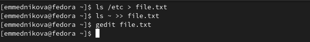

## Вывела имена всех файлов из file.txt, имеющих расширение .conf, после чего записала их в новый текстовой файл conf.txt.

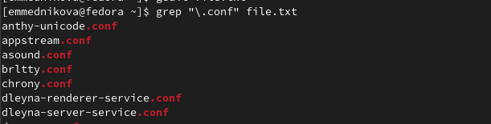

## Определила, какие файлы в моём домашнем каталоге имеют имена, начинавшиеся с символа c.

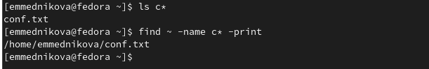

## Вывела на экран имена файлов из каталога /etc, начинающиеся с символа h. 

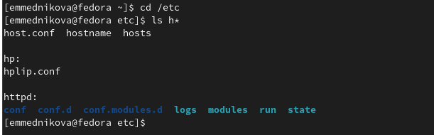

## Запустила в фоновом режиме процесс, который записывал в файл ~/logfile файлы, имена которых начинаются с log.

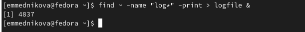

## Удалила файл ~/logfile.

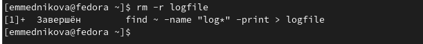

## Запустила из консоли в фоновом режиме редактор gedit.

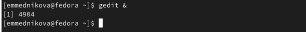

## Определила идентификатор процесса gedit, используя команду ps, конвейер и фильтр grep.

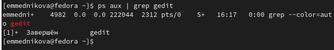

## Прочитала справку (man) команды kill, после чего использовала её для завершения процесса gedit.

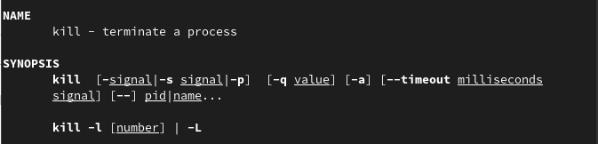

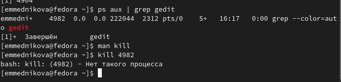

## Выполнила команды df и du, предварительно получив более подробную информацию об этих командах, с помощью команды man.

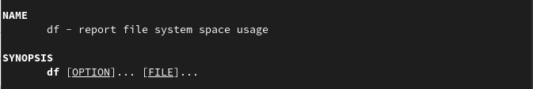

## Выполнила команды df и du, предварительно получив более подробную информацию об этих командах, с помощью команды man.

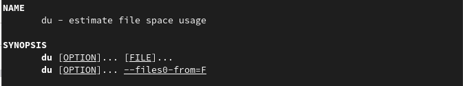

## Выполнила команды df и du, предварительно получив более подробную информацию об этих командах, с помощью команды man.

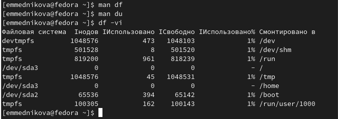

## Выполнила команды df и du, предварительно получив более подробную информацию об этих командах, с помощью команды man.

## Выполнила команды df и du, предварительно получив более подробную информацию об этих командах, с помощью команды man.

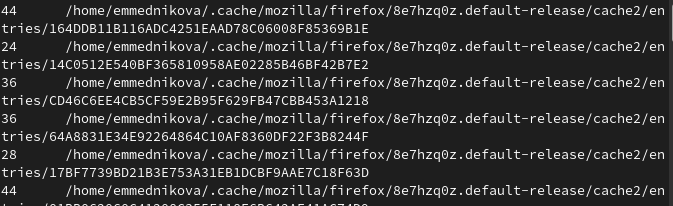

## Воспользовалась справкой команды find, вывела имена всех директорий, имеющихся в моём домашнем каталоге.

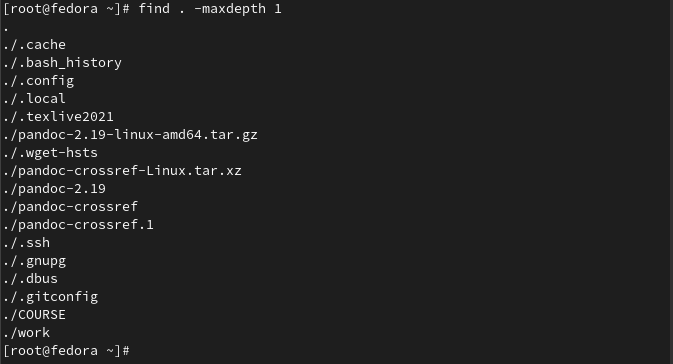

## Воспользовалась справкой команды find, вывела имена всех директорий, имеющихся в моём домашнем каталоге.

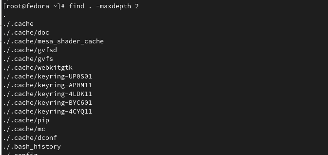

# Выводы 

Ознакомилась с инструментами поиска файлов и фильтрации текстовых данных.
Приобрела практические навыки: по управлению процессами (и заданиями), по
проверке использования диска и обслуживанию файловых систем.

# Контрольные вопросы

## Какие потоки ввода вывода вы знаете?

В системе по умолчанию открыто три специальных потока:
– stdin — стандартный поток ввода (по умолчанию: клавиатура), файловый дескриптор
0;
– stdout — стандартный поток вывода (по умолчанию: консоль), файловый дескриптор
1;
– stderr — стандартный поток вывод сообщений об ошибках (по умолчанию: консоль),
файловый дескриптор 2.

## Объясните разницу между операцией > и >>.

">": Перезаписывает существующий файл или создает файл, если файл с указанным именем отсутствует в каталоге.
">>": добавляет существующий файл или создает файл, если файл с указанным именем отсутствует в каталоге.

## то такое конвейер?

Конвейер (pipe) служит для объединения простых команд или утилит в цепочки, в ко-
торых результат работы предыдущей команды передаётся последующей. Синтаксис
следующий:
 команда 1 | команда 2 
 
## Что такое процесс? Чем это понятие отличается от программы?

Компьютерная программа — последовательность инструкций. В то время как процесс — непосредственное выполнение этих инструкций. Также процессом называют выполняющуюся программу и все её элементы: адресное пространство, глобальные переменные, регистры, стек, открытые файлы и так далее.

## Что такое PID и GID?

GID — идентификатор группы, которой принадлежит файл, тип объекта и набор атрибутов, а также некоторую дополнительную информацию. PID – это ID процесса. 

## Что такое задачи и какая команда позволяет ими управлять?

Любую выполняющуюся в консоли команду или внешнюю программу можно запустить в фоновом режиме. Для этого следует в конце имени команды указать знак амперсанда &. Например: gedit &.

## Найдите информацию об утилитах top и htop. Каковы их функции?

Top - отображает запущенные процессы, используемые ими ресурсы и другую полезную информацию (с автоматическим обновлением данных).
Htop - показывает динамический список системных процессов, список обычно выравнивается по использованию ЦПУ. В отличие от top, htop показывает все процессы в системе. Также показывает время непрерывной работы, использование процессоров и памяти. Htop часто применяется в тех случаях, когда информации даваемой утилитой top недостаточно, например при поиске утечек памяти в процессах.

## Назовите и дайте характеристику команде поиска файлов. Приведите примеры использования этой команды.

Команда find используется для поиска и отображения на экран имён файлов, соответствующих заданной строке символов. Формат команды: find путь [-опции]

## Можно ли по контексту (содержанию) найти файл? Если да, то как?

Да, через команду grep. Например: grep Aug -R /var/log/* вывода строки, содержащие "Aug", во всех файлах, находящихся в директории /var/log и ниже.

## Как определить объем свободной памяти на жёстком диске?

Для определения объёма свободного пространства на файловой системе можно воспользоваться командой df, которая выведет на экран список всех файловых систем в соответствии с именами устройств, с указанием размера и точки монтирования.

## Как определить объем вашего домашнего каталога?

Команда du показывает число килобайт, используемое каждым файлом или каталогом.

## Как удалить зависший процесс?

Можно удалить через kill, написав ID процесса.

