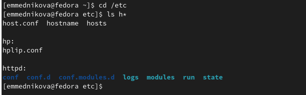

---
## Front matter
title: "Лабораторная работа №6"
subtitle: "Поиск файлов. Перенаправление ввода-вывода. Просмотр запущенных процессов"
author: "Медникова Екатерина Михайловна"

## Generic otions
lang: ru-RU
toc-title: "Содержание"

## Bibliography
bibliography: bib/cite.bib
csl: pandoc/csl/gost-r-7-0-5-2008-numeric.csl

## Pdf output format
toc: true # Table of contents
toc-depth: 2
lof: true # List of figures
lot: true # List of tables
fontsize: 12pt
linestretch: 1.5
papersize: a4
documentclass: scrreprt
## I18n polyglossia
polyglossia-lang:
  name: russian
  options:
	- spelling=modern
	- babelshorthands=true
polyglossia-otherlangs:
  name: english
## I18n babel
babel-lang: russian
babel-otherlangs: english
## Fonts
mainfont: PT Serif
romanfont: PT Serif
sansfont: PT Sans
monofont: PT Mono
mainfontoptions: Ligatures=TeX
romanfontoptions: Ligatures=TeX
sansfontoptions: Ligatures=TeX,Scale=MatchLowercase
monofontoptions: Scale=MatchLowercase,Scale=0.9
## Biblatex
biblatex: true
biblio-style: "gost-numeric"
biblatexoptions:
  - parentracker=true
  - backend=biber
  - hyperref=auto
  - language=auto
  - autolang=other*
  - citestyle=gost-numeric
## Pandoc-crossref LaTeX customization
figureTitle: "Рис."
tableTitle: "Таблица"
listingTitle: "Листинг"
lofTitle: "Список иллюстраций"
lotTitle: "Список таблиц"
lolTitle: "Листинги"
## Misc options
indent: true
header-includes:
  - \usepackage{indentfirst}
  - \usepackage{float} # keep figures where there are in the text
  - \floatplacement{figure}{H} # keep figures where there are in the text
---

# Цель работы

Ознакомление с инструментами поиска файлов и фильтрации текстовых данных.
Приобретение практических навыков: по управлению процессами (и заданиями), по
проверке использования диска и обслуживанию файловых систем.

# Выполнение лабораторной работы

1. Осуществила вход в систему, использовав соответствующее имя пользователя.

2. Записала в файл file.txt названия файлов, содержащихся в каталоге /etc. Дописала в этот же файл названия файлов, содержащихся в моём домашнем каталоге.

{#fig:001 width=70%}

3. Вывела имена всех файлов из file.txt, имеющих расширение .conf, после чего
записала их в новый текстовой файл conf.txt.

{#fig:002 width=70%}

{#fig:003 width=70%}

4. Определила, какие файлы в моём домашнем каталоге имеют имена, начинавшиеся
с символа c.

{#fig:004 width=70%}

5. Вывела на экран имена файлов из каталога /etc, начинающиеся
с символа h.

{#fig:005 width=70%}

6. Запустила в фоновом режиме процесс, который записывал в файл ~/logfile
файлы, имена которых начинаются с log.

{#fig:006 width=70%}

7. Удалила файл ~/logfile.

{#fig:007 width=70%}

8. Запустила из консоли в фоновом режиме редактор gedit.

{#fig:008 width=70%}

9. Определила идентификатор процесса gedit, используя команду ps, конвейер и фильтр grep. 

{#fig:009 width=70%}

10. Прочитала справку (man) команды kill, после чего использовала её для завершения процесса gedit.

{#fig:0010 width=70%}

{#fig:0011 width=70%}

11. Выполнила команды df и du, предварительно получив более подробную информацию
об этих командах, с помощью команды man.

{#fig:0012 width=70%}

{#fig:0013 width=70%}

{#fig:0014 width=70%}

{#fig:0015 width=70%}

{#fig:0016 width=70%}

12. Воспользовалась справкой команды find, вывела имена всех директорий, имеющихся в моём домашнем каталоге.

{#fig:0017 width=70%}

{#fig:0018 width=70%}

# Выводы

Ознакомилась с инструментами поиска файлов и фильтрации текстовых данных.
Приобрела практические навыки: по управлению процессами (и заданиями), по
проверке использования диска и обслуживанию файловых систем.

# Контрольные вопросы 

1. *Какие потоки ввода вывода вы знаете?*

В системе по умолчанию открыто три специальных потока:
– stdin — стандартный поток ввода (по умолчанию: клавиатура), файловый дескриптор
0;
– stdout — стандартный поток вывода (по умолчанию: консоль), файловый дескриптор
1;
– stderr — стандартный поток вывод сообщений об ошибках (по умолчанию: консоль),
файловый дескриптор 2.

2. *Объясните разницу между операцией > и >>.*

     ">": Перезаписывает существующий файл или создает файл, если файл с указанным именем отсутствует в каталоге.
    ">>": добавляет существующий файл или создает файл, если файл с указанным именем отсутствует в каталоге.

3. *Что такое конвейер?*

Конвейер (pipe) служит для объединения простых команд или утилит в цепочки, в ко-
торых результат работы предыдущей команды передаётся последующей. Синтаксис
следующий:
 команда 1 | команда 2 

4. *Что такое процесс? Чем это понятие отличается от программы?*

Компьютерная программа — последовательность инструкций. В то время как процесс — непосредственное выполнение этих инструкций. Также процессом называют выполняющуюся программу и все её элементы: адресное пространство, глобальные переменные, регистры, стек, открытые файлы и так далее.

5. *Что такое PID и GID?*

 GID — идентификатор группы, которой принадлежит файл, тип объекта и набор атрибутов, а также некоторую дополнительную информацию. PID – это ID процесса. 

6. *Что такое задачи и какая команда позволяет ими управлять?*

Любую выполняющуюся в консоли команду или внешнюю программу можно запустить в фоновом режиме. Для этого следует в конце имени команды указать знак амперсанда &. Например: gedit &.

7. *Найдите информацию об утилитах top и htop. Каковы их функции?*

Top - отображает запущенные процессы, используемые ими ресурсы и другую полезную информацию (с автоматическим обновлением данных).
Htop - показывает динамический список системных процессов, список обычно выравнивается по использованию ЦПУ. В отличие от top, htop показывает все процессы в системе. Также показывает время непрерывной работы, использование процессоров и памяти. Htop часто применяется в тех случаях, когда информации даваемой утилитой top недостаточно, например при поиске утечек памяти в процессах.

8. *Назовите и дайте характеристику команде поиска файлов. Приведите примеры использования этой команды.*

Команда find используется для поиска и отображения на экран имён файлов, соответствующих заданной строке символов. Формат команды: find путь [-опции]

9. *Можно ли по контексту (содержанию) найти файл? Если да, то как?*

Да, через команду grep. Например: grep Aug -R /var/log/* вывода строки, содержащие "Aug", во всех файлах, находящихся в директории /var/log и ниже.

10. *Как определить объем свободной памяти на жёстком диске?*

Для определения объёма свободного пространства на файловой системе можно воспользоваться командой df, которая выведет на экран список всех файловых систем в соответствии с именами устройств, с указанием размера и точки монтирования.

11. *Как определить объем вашего домашнего каталога?*

Команда du показывает число килобайт, используемое каждым файлом или каталогом.

12. *Как удалить зависший процесс?*

Можно удалить через kill, написав ID процесса.

# Список литературы{.unnumbered}

::: {#refs}
:::
