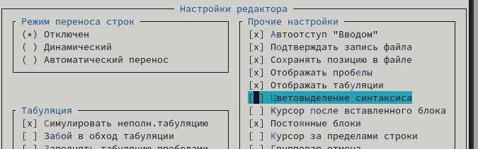

---
## Front matter
title: "Лабораторная работа №7"
subtitle: "Командная оболочка Midnight Commander"
author: "Медникова Екатерина Михайловна"

## Generic otions
lang: ru-RU
toc-title: "Содержание"

## Bibliography
bibliography: bib/cite.bib
csl: pandoc/csl/gost-r-7-0-5-2008-numeric.csl

## Pdf output format
toc: true # Table of contents
toc-depth: 2
lof: true # List of figures
lot: true # List of tables
fontsize: 12pt
linestretch: 1.5
papersize: a4
documentclass: scrreprt
## I18n polyglossia
polyglossia-lang:
  name: russian
  options:
	- spelling=modern
	- babelshorthands=true
polyglossia-otherlangs:
  name: english
## I18n babel
babel-lang: russian
babel-otherlangs: english
## Fonts
mainfont: PT Serif
romanfont: PT Serif
sansfont: PT Sans
monofont: PT Mono
mainfontoptions: Ligatures=TeX
romanfontoptions: Ligatures=TeX
sansfontoptions: Ligatures=TeX,Scale=MatchLowercase
monofontoptions: Scale=MatchLowercase,Scale=0.9
## Biblatex
biblatex: true
biblio-style: "gost-numeric"
biblatexoptions:
  - parentracker=true
  - backend=biber
  - hyperref=auto
  - language=auto
  - autolang=other*
  - citestyle=gost-numeric
## Pandoc-crossref LaTeX customization
figureTitle: "Рис."
tableTitle: "Таблица"
listingTitle: "Листинг"
lofTitle: "Список иллюстраций"
lotTitle: "Список таблиц"
lolTitle: "Листинги"
## Misc options
indent: true
header-includes:
  - \usepackage{indentfirst}
  - \usepackage{float} # keep figures where there are in the text
  - \floatplacement{figure}{H} # keep figures where there are in the text
---

# Цель работы

Освоение основных возможностей командной оболочки Midnight Commander. Приобретение навыков практической работы по просмотру каталогов и файлов; манипуляций с ними.

# Выполнение лабораторной работы

**Задание по mc.**

1. Изучила информацию о mc, вызвав в командной строке man mc.

{#fig:001 width=70%}

2. Запустила из командной строки mc, изучила его структуру и меню.

{#fig:002 width=70%}

{#fig:003 width=70%}

3. Выполнила несколько операций в mc, используя управляющие клавиши.

{#fig:004 width=70%}

{#fig:005 width=70%}

4. Выполнила основные команды меню левой (или правой) панели. 

{#fig:006 width=70%}

{#fig:007 width=70%}

5. Просмотрела содержимое текстового файла, редактировала содержимое текстового файла (без сохранения результатов редактирования), создала каталог, копировала файл в созданный каталог. 

{#fig:008 width=70%}

{#fig:009 width=70%}

{#fig:0010 width=70%}

{#fig:0011 width=70%}

{#fig:0012 width=70%}

6. Осуществила поиск в файловой системе с заданными условиями, выбрала и повторила одну из предыдущих команд, перешла в домашний каталог, проанализировала файл меню и файл расширений.

{#fig:0013 width=70%}

{#fig:0014 width=70%}

{#fig:0015 width=70%}

{#fig:0016 width=70%}

{#fig:0017 width=70%}

7. Вызвала подменю "Настройки". Освоила операции, определяющие структуру экрана mc.

{#fig:0018 width=70%}

{#fig:0019 width=70%}

**Задание по встроенному редактору mc.**

1. Создала текстовой файл text.txt.

{#fig:0020 width=70%}

2. Открыла этот файл с помощью встроенного в mc редактора.

{#fig:0021 width=70%}

3. Вставила в открытый файл небольшой фрагмент текста, скопированный из любого
другого файла или Интернета.

{#fig:0022 width=70%}

4. Проделала с текстом следующие манипуляции, используя горячие клавиши: удалила строку текста, выделила фрагмент текста и скопировала его на новую строку, выделила фрагмент текста и перенесла его на новую строку, сохранила файл, отменила последнее действие, перешла в конец файла и написала некоторый текст, перешла в начало файла и написала некоторый текст, сохранила и закрыла файл. 

{#fig:0023 width=70%}

{#fig:0024 width=70%}

{#fig:0025 width=70%}

{#fig:0026 width=70%}

{#fig:0027 width=70%}

{#fig:0028 width=70%}

{#fig:0029 width=70%}

{#fig:0030 width=70%}

{#fig:0031 width=70%}

5. Не установлен язык программирования.

6. Используя меню редактора, выключила подсветку синтаксиса.

{#fig:0032 width=70%}

# Выводы

Освоила основные возможности командной оболочки Midnight Commander. Приобрела навыки практической работы по просмотру каталогов и файлов; манипуляций с ними.

# Контрольные вопросы 

1. *Какие режимы работы есть в mc. Охарактеризуйте их.*

Панель в mc отображает список файлов текущего каталога. Абсолютный путь к этому каталогу отображается в заголовке панели. У активной панели заголовок и одна из её строк подсвечиваются. Управление панелями осуществляется с помощью определённых комбинаций клавиш или пунктов меню mc. Панели можно поменять местами. Для этого и используется комбинация клавиш Ctrl-u или команда меню mc "Переставить панели". Также можно временно убрать отображение панелей (отключить их) с помощью комбинации клавиш Ctrl-o или команды меню mc "Отключить панели". Это может быть полезно, например, если необходимо увидеть вывод какой-то информации на экран после выполнения какой-либо команды shell. С помощью последовательного применения комбинации клавиш Ctrl-x d есть возможность сравнения каталогов, отображённых на двух панелях. Панели могут дополнительно быть переведены в один из двух режимов:  "Информация" или "Дерево" . В режиме "Информация" на панель выводятся сведения о файле и текущей файловой системе, расположенных на активной панели. В режиме "Дерево" на одной из панелей выводится структура дерева каталогов. Управлять режимами отображения панелей можно через пункты меню mc "Правая панель" и "Левая панель".

2. *Какие операции с файлами можно выполнить как с помощью команд shell, так и с помощью меню (комбинаций клавиш) mc? Приведите несколько примеров.*

Системная информация, поиск и копирование.

3. *Опишите структуру меню левой (или правой) панели mc, дайте характеристику командам.*

Перейти в строку меню панелей mc можно с помощью функциональной клавиши F9. В строке меню имеются пять меню: "Левая панель", "Файл","Команда", "Настройки" и "Правая панель". Подпункт меню "Быстрый просмотр" позволяет выполнить быстрый просмотр содержимого панели. Подпункт меню "Информация" позволяет посмотреть информацию о файле или каталоге. В меню каждой (левой или правой) панели можно выбрать "Формат списка":
– стандартный — выводит список файлов и каталогов с указанием размера и времени правки;
– ускоренный — позволяет задать число столбцов, на которые разбивается панель при выводе списка имён файлов или каталогов без дополнительной информации;
– расширенный — помимо названия файла или каталога выводит сведения о правах доступа, владельце, группе, размере, времени правки;
– определённый пользователем — позволяет вывести те сведения о файле или каталоге, которые задаст сам пользователь. 
Подпункт меню "Порядок сортировки" позволяет задать критерии сортировки при выводе списка файлов и каталогов: без сортировки, по имени, расширенный, время правки, время доступа, время изменения атрибута, размер, узел.

4. *Опишите структуру меню Файл mc, дайте характеристику командам.*

В меню  "Файл" содержит перечень команд, которые могут быть применены к одному или нескольким файлам или каталогам. Команды меню "Файл":
– Просмотр ( F3 ) — позволяет посмотреть содержимое текущего (или выделенного)файла без возможности редактирования.
– Просмотр вывода команды ( М + ! ) — функция запроса команды с параметрами (аргумент к текущему выбранному файлу).
– Правка ( F4 ) — открывает текущий (или выделенный) файл для его редактирования.
– Копирование ( F5 ) — осуществляет копирование одного или нескольких файлов или каталогов в указанное пользователем во всплывающем окне место.
– Права доступа ( Ctrl-x c ) — позволяет указать (изменить) права доступа к одному или нескольким файлам или каталогам.
- Жёсткая ссылка ( Ctrl-x l ) — позволяет создать жёсткую ссылку к текущему (или выделенному) файлу1.
– Символическая ссылка ( Ctrl-x s ) — позволяет создать символическую ссылку к текущему (или выделенному) файлу2.
– Владелец/группа ( Ctrl-x o ) — позволяет задать (изменить) владельца и имя группы для одного или нескольких файлов или каталогов.
– Права (расширенные) — позволяет изменить права доступа и владения для одного или нескольких файлов или каталогов.
– Переименование ( F6 ) — позволяет переименовать (или переместить) один или несколько файлов или каталогов.
– Создание каталога ( F7 ) — позволяет создать каталог.
– Удалить ( F8 ) — позволяет удалить один или несколько файлов или каталогов.
– Выход ( F10 ) — завершает работу mc.

5. *Опишите структуру меню Команда mc, дайте характеристику командам.*

В меню "Команда" содержатся более общие команды для работы с mc. Команды меню "Команда":
– Дерево каталогов — отображает структуру каталогов системы.
– Поиск файла — выполняет поиск файлов по заданным параметрам.
– Переставить панели — меняет местами левую и правую панели.
– Сравнить каталоги ( Ctrl-x d ) — сравнивает содержимое двух каталогов.
– Размеры каталогов — отображает размер и время изменения каталога (по умолчанию в mc размер каталога корректно не отображается).
– История командной строки — выводит на экран список ранее выполненных в оболочке команд.
– Каталоги быстрого доступа ( Ctrl-\ ) — пр вызове выполняется быстрая смена текущего каталога на один из заданного списка.
– Восстановление файлов — позволяет восстановить файлы на файловых системах ext2 и ext3.
– Редактировать файл расширений — позволяет задать с помощью определённого синтаксиса действия при запуске файлов с определённым расширением (например, какое программного обеспечение запускать для открытия или редактирования файлов с расширением doc или docx).
– Редактировать файл меню — позволяет отредактировать контекстное меню пользователя, вызываемое по клавише F2 .
– Редактировать файл расцветки имён — позволяет подобрать оптимальную для пользователя расцветку имён файлов в зависимости от их типа.

6. *Опишите структура меню Настройки mc, дайте характеристику командам.*

Меню "Настройки" содержит ряд дополнительных опций по внешнему виду и функциональности mc.
Меню "Настройки" содержит:
– Конфигурация — позволяет скорректировать настройки работы с панелями.
– Внешний вид и Настройки панелей — определяет элементы (строка меню, командная строка, подсказки и прочее), отображаемые при вызове mc, а также геометрию расположения панелей и цветовыделение.
– Биты символов — задаёт формат обработки информации локальным терминалом.
– Подтверждение — позволяет установить или убрать вывод окна с запросом подтверждения действий при операциях удаления и перезаписи файлов, а также при выходе из программы.
– Распознание клавиш — диалоговое окно используется для тестирования функциональных клавиш, клавиш управления курсором и прочее.
– Виртуальные ФС –– настройки виртуальной файловой системы: тайм-аут, пароль и прочее. 

7. *Назовите и дайте характеристику встроенным командам mc.*

F1 - Вызов контекстно-зависимой подсказки.
F2 - Вызов пользовательского меню с возможностью создания и/или дополнения дополнительных функций.
F3 - Просмотр содержимого файла, на который указывает подсветка в активной панели (без возможности редактирования).
F4 - Вызов встроенного в mc редактора для изменения содержания файла, на который указывает подсветка в активной панели.
F5 - Копирование одного или нескольких файлов, отмеченных в первой (активной) панели, в каталог, отображаемый на второй панели.
F6 - Перенос одного или нескольких файлов, отмеченных в первой (активной) панели, в каталог, отображаемый на второй панели.
F7 - Создание подкаталога в каталоге, отображаемом в активной панели.
F8 - Удаление одного или нескольких файлов (каталогов), отмеченных в первой (активной) панели файлов.
F9 - Вызов меню mc.
F10 - Выход из mc.

8. *Назовите и дайте характеристику командам встроенного редактора mc.*

Команды mc:
Ctrl-y - удалить строку.
Ctrl-u  - отмена последней операции.
Ins - вставка/замена.
F7  - поиск (можно использовать регулярные выражения).
F7 - повтор последней операции поиска.
F4 - замена.
F3 - первое нажатие — начало выделения, второе — окончание выделения.
F5 - копировать выделенный фрагмент.
F6 - переместить выделенный фрагмент.
F8 - удалить выделенный фрагмент.
F2 - записать изменения в файл.
F10 - выйти из редактора.

9. *Дайте характеристику средствам mc, которые позволяют создавать меню, определяемые пользователем.*

Меню пользователя – это меню, состоящее из команд, определенных пользователем. При вызове меню используется файл ~/.mc.menu. Если такого файла нет, то по умолчанию используется системный файл меню /usr/lib/mc/mc.menu. Формат этого файла достаточно прост. Строки, не начинающиеся с пробела или табуляции, являются записями меню (для того чтобы у записи была горячая клавиша, нужно, чтобы строка начиналась с буквы). Все строки, начинающиеся с пробела или табуляции, являются командами, которые выполняются при выборе записи. 

10. *Дайте характеристику средствам mc, которые позволяют выполнять действия, определяемые пользователем, над текущим файлом.*

Если нажать клавишу Enter в тот момент, когда подсветка указывает на имя файла, не являющегося исполняемым, Midnight Commander сравнивает расширение выбранного файла с расширениями, прописанными в «файле расширений» ~/mc.ext. Если в файле расширений найдется подраздел, задающий процедуры обработки файлов с данным расширением, то обработка файла производится в соответствии с заданными в этом подразделе командами.

# Список литературы{.unnumbered}

::: {#refs}
:::
