---
## Front matter
lang: ru-RU
title:  Лабораторная работа №8
subtitle: Текстовый редактор vi
author:
  - Медникова Е. М.
institute:
  - Российский университет дружбы народов, Москва, Россия
  - Факультет физико-математических и естественных наук
date: 01 апреля 2023

## i18n babel
babel-lang: russian
babel-otherlangs: english

## Formatting pdf
toc: false
toc-title: Содержание
slide_level: 2
aspectratio: 169
section-titles: true
theme: metropolis
header-includes:
 - \metroset{progressbar=frametitle,sectionpage=progressbar,numbering=fraction}
 - '\makeatletter'
 - '\beamer@ignorenonframefalse'
 - '\makeatother'
---

# Информация

## Докладчик

:::::::::::::: {.columns align=center}
::: {.column width="70%"}

  * Медникова Екатерина Михайловна
  * студентка направления 01.03.00 Математика и механика
  * Российский университет дружбы народов
  * [1132226549@rudn.ru](mailto:1132226549@rudn.ru)
  

:::
::: {.column width="30%"}

:::
::::::::::::::

## Цель работы 

Познакомиться с операционной системой Linux. Получить практические навыки работы с редактором vi, установленным по умолчанию практически во всех дистрибутивах.

# Выполнение работы 

# Задание 1. Создание нового файла с использованием vi.

## Ознакомилась с теоретическим материалом и редактором vi.

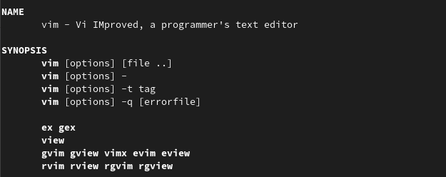

## Создала каталог с именем ~/work/os/lab06 и перешла в него.

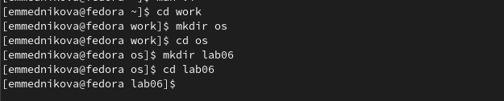

## Вызвала vi и создала файл hello.sh.

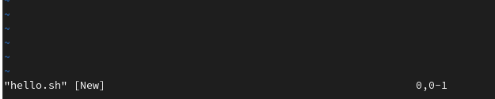

## Нажала клавишу i и ввела текст.

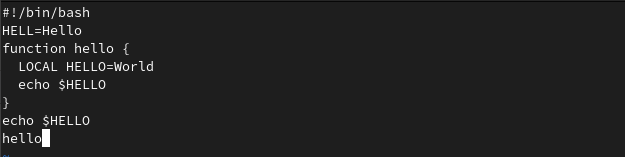

## Нажала клавишу Esc для перехода в командный режим после завершения ввода текста и нажала : для перехода в режим последней строки.

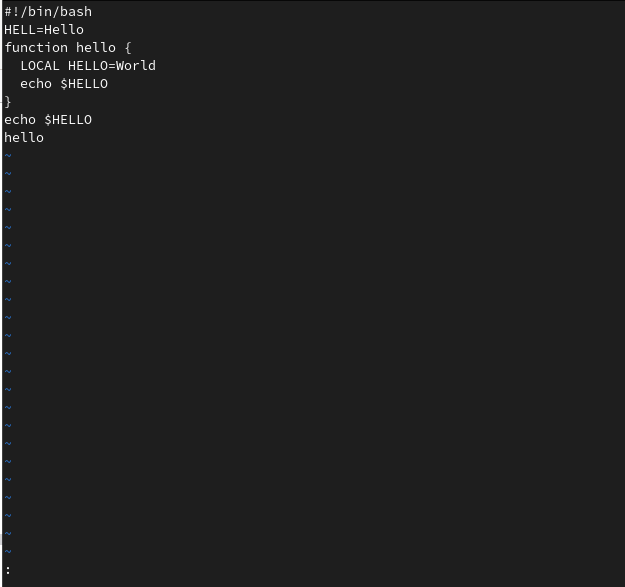

## Нажала w и q, а затем нажала клавишу Enter для сохранения моего текста и завершения работы.

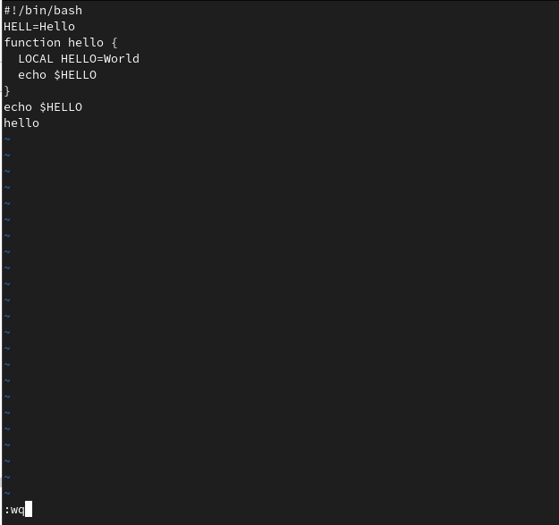

## Сделала файл исполняемым. 

# Задание 2. Редактирование существующего файла.

## Вызвала vi на редактирование файла.

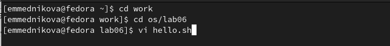

## Установила курсор в конец слова HELL второй строки. Перешла в режим вставки и заменила на HELLO. Нажала Esc для возврата в командный режим.

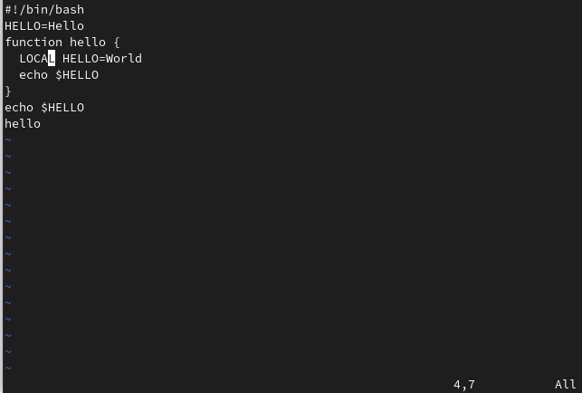

## Установила курсор на четвертую строку и стёрла слово LOCAL. Перешла в режим вставки и набрала следующий текст: local, нажала Esc для возврата в командный режим.

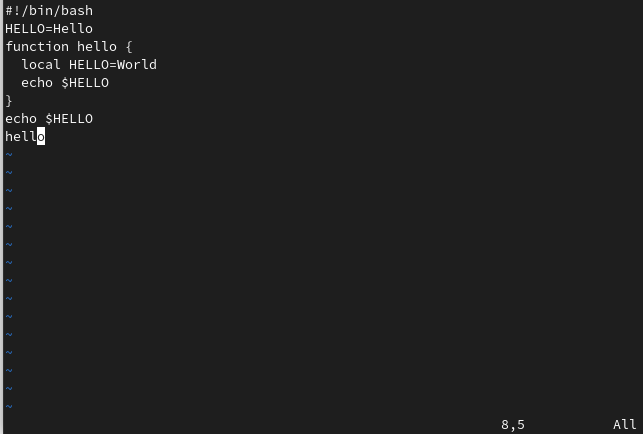

## Установила курсор на последней строке файла. Вставила после неё строку, содержащую следующий текст: echo $HELLO.

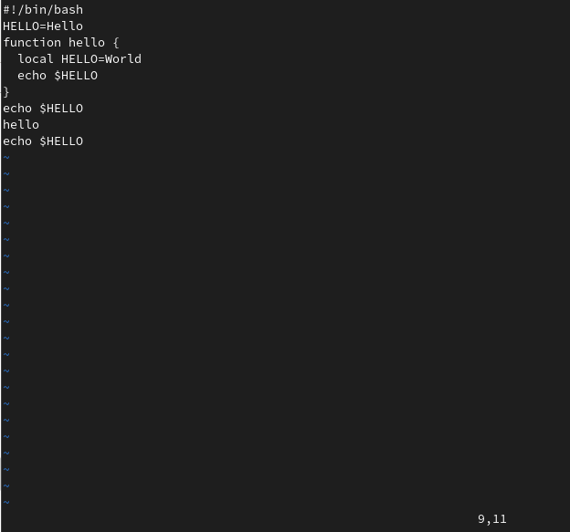

## Нажала Esc для перехода в командный режим. Удалила последнюю строку.

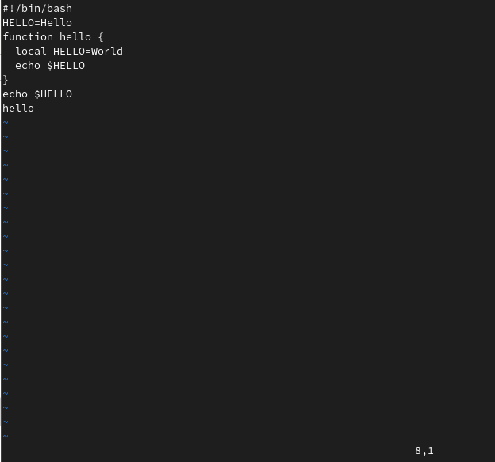

## Ввела команду отмены изменений u для отмены последней команды.

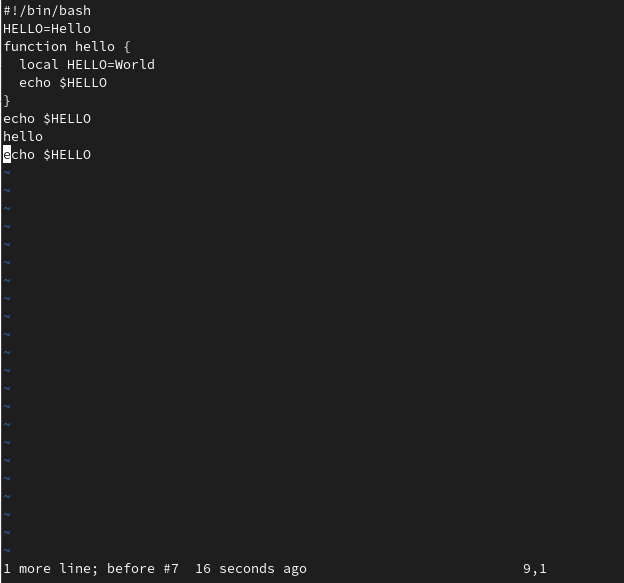

## Ввела символ : для перехода в режим последней строки. Записала произведённые изменения и вышла из vi.

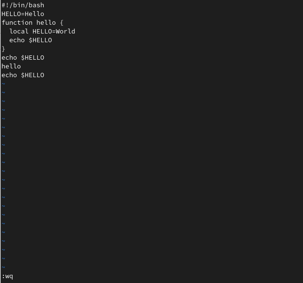

# Вывод

Познакомилась с операционной системой Linux. Получила практические навыки работы с редактором vi, установленным по умолчанию практически во всех дистрибутивах.

# Контрольные вопросы

## Дайте краткую характеристику режимам работы редактора vi.

Редактор vi имеет три режима работы:
– командный режим — предназначен для ввода команд редактирования и навигации по
редактируемому файлу;
– режим вставки — предназначен для ввода содержания редактируемого файла;
– режим последней (или командной) строки — используется для записи изменений в файл
и выхода из редактора.

## Как выйти из редактора, не сохраняя произведённые изменения?

Переход в командный режим осуществляется нажатием клавиши Esc . Для выхода из
редактора vi необходимо перейти в режим последней строки: находясь в командном
режиме, нажать Shift-; (по сути символ : — двоеточие), затем:
– набрать символ q (или q!), если требуется выйти из редактора без сохранения.

## Назовите и дайте краткую характеристику командам позиционирования.

– 0 (ноль) — переход в начало строки;
– $ — переход в конец строки;
– G — переход в конец файла;
– n G — переход на строку с номером n.

## Что для редактора vi является словом?

При использовании прописных W и B под разделителями понимаются только пробел, табуляция и возврат каретки. При использовании строчных w и b под разделителями понимаются также любые знаки пунктуации.

## Каким образом из любого места редактируемого файла перейти в начало (конец) файла?

Если нужно перейти в начало файла, нужно нажать gg, если в конец - G.

## Назовите и дайте краткую характеристику основным группам команд редактирования.

1) Вставка текста 
– а — вставить текст после курсора;
– А — вставить текст в конец строки;
– i — вставить текст перед курсором;
– n i — вставить текст n раз;
– I — вставить текст в начало строки.
2) Вставка строки 
– о — вставить строку под курсором;
– О — вставить строку над курсором.
3) Удаление строки 
– x — удалить один символ в буфер;
– d w — удалить одно слово в буфер;
– d $ — удалить в буфер текст от курсора до конца строки;
– d 0 — удалить в буфер текст от начала строки до позиции курсора;
– d d — удалить в буфер одну строку;
– n d d — удалить в буфер n строк.
4) Отмена и повтор произведённых изменений
– u — отменить последнее изменение;
– . — повторить последнее изменение.
5) Копирование текста в буфер
– Y — скопировать строку в буфер;
– n Y — скопировать n строк в буфер;
– y w — скопировать слово в буфер.
6) Вставка текста из буфера
– p — вставить текст из буфера после курсора;
– P — вставить текст из буфера перед курсором.
7) Замена текста
– c w — заменить слово;
– n c w — заменить n слов;
– c $ — заменить текст от курсора до конца строки;
– r — заменить слово;
– R — заменить текст.
8) Поиск текста
– / текст — произвести поиск вперёд по тексту указанной строки символов текст;
– ? текст — произвести поиск назад по тексту указанной строки символов текст.

## Как отменить некорректное действие, связанное с процессом редактирования?

Использовать команду u. 

## Назовите и дайте характеристику основным группам команд режима последней строки.

Команды редактирования в режиме командной строки
1) Копирование и перемещение текста
– : n,m d — удалить строки с n по m;
– : i,j m k — переместить строки с i по j, начиная со строки k;
– : i,j t k — копировать строки с i по j в строку k;
– : i,j w имя-файла — записать строки с i по j в файл с именем имя-файла.
2) Запись в файл и выход из редактора
– : w — записать изменённый текст в файл, не выходя из vi;
– : w имя-файла — записать изменённый текст в новый файл с именем имя-файла;
– : w ! имя-файла — записать изменённый текст в файл с именем имя-файла;
– : w q — записать изменения в файл и выйти из vi;
– : q — выйти из редактора vi;
– : q ! — выйти из редактора без записи;
– : e ! — вернуться в командный режим, отменив все изменения, произведённые
со времени последней записи. 

## Как определить, не перемещая курсора, позицию, в которой заканчивается строка?

Использовать команду $ для перехода в конец строки. 

## Выполните анализ опций редактора vi (сколько их, как узнать их назначение и т.д.).

Опции редактора vi позволяют настроить рабочую среду. Для задания опций используется команда set (в режиме последней строки):
– : set all — вывести полный список опций;
– : set nu — вывести номера строк;
– : set list — вывести невидимые символы;
– : set ic — не учитывать при поиске, является ли символ прописным или строчным.
Если вы хотите отказаться от использования опции, то в команде set перед именем
опции надо поставить no.

## Как определить режим работы редактора vi?

Переход в командный режим осуществляется нажатием клавиши Esc. Для режима вставки нужно нажать команду i.  Для выхода из редактора vi необходимо перейти в режим последней строки: находясь в командном режиме, нажать Shift-; (по сути символ : — двоеточие), затем:
– набрать символы wq, если перед выходом из редактора требуется записать изменения
в файл;
– набрать символ q (или q!), если требуется выйти из редактора без сохранения. 

