---
## Front matter
title: "Лабораторная работа №8"
subtitle: "Текстовый редактор vi"
author: "Медникова Екатерина Михайловна"

## Generic otions
lang: ru-RU
toc-title: "Содержание"

## Bibliography
bibliography: bib/cite.bib
csl: pandoc/csl/gost-r-7-0-5-2008-numeric.csl

## Pdf output format
toc: true # Table of contents
toc-depth: 2
lof: true # List of figures
lot: true # List of tables
fontsize: 12pt
linestretch: 1.5
papersize: a4
documentclass: scrreprt
## I18n polyglossia
polyglossia-lang:
  name: russian
  options:
	- spelling=modern
	- babelshorthands=true
polyglossia-otherlangs:
  name: english
## I18n babel
babel-lang: russian
babel-otherlangs: english
## Fonts
mainfont: PT Serif
romanfont: PT Serif
sansfont: PT Sans
monofont: PT Mono
mainfontoptions: Ligatures=TeX
romanfontoptions: Ligatures=TeX
sansfontoptions: Ligatures=TeX,Scale=MatchLowercase
monofontoptions: Scale=MatchLowercase,Scale=0.9
## Biblatex
biblatex: true
biblio-style: "gost-numeric"
biblatexoptions:
  - parentracker=true
  - backend=biber
  - hyperref=auto
  - language=auto
  - autolang=other*
  - citestyle=gost-numeric
## Pandoc-crossref LaTeX customization
figureTitle: "Рис."
tableTitle: "Таблица"
listingTitle: "Листинг"
lofTitle: "Список иллюстраций"
lotTitle: "Список таблиц"
lolTitle: "Листинги"
## Misc options
indent: true
header-includes:
  - \usepackage{indentfirst}
  - \usepackage{float} # keep figures where there are in the text
  - \floatplacement{figure}{H} # keep figures where there are in the text
---

# Цель работы

Познакомиться с операционной системой Linux. Получить практические навыки работы с редактором vi, установленным по умолчанию практически во всех дистрибутивах.

# Выполнение лабораторной работы

**Задание 1. Создание нового файла с использованием vi.**

1. Ознакомилась с теоретическим материалом и редактором vi.

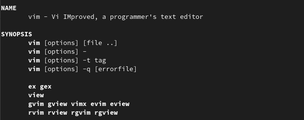{#fig:001 width=70%}

2. Создала каталог с именем ~/work/os/lab06 и перешла в него.

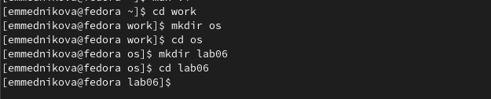{#fig:002 width=70%}

3. Вызвала vi и создала файл hello.sh.

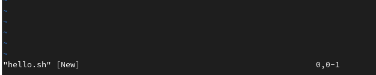{#fig:003 width=70%}

4. Нажала клавишу i и ввела текст.

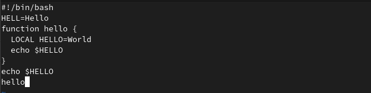{#fig:004 width=70%}

5. Нажала клавишу Esc для перехода в командный режим после завершения ввода
текста и нажала : для перехода в режим последней строки.

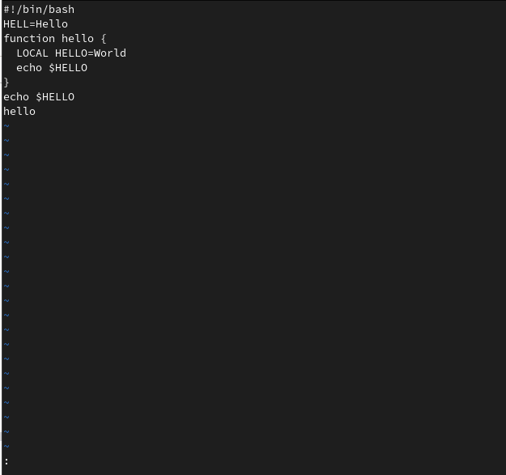{#fig:005 width=70%}

6. Нажала w и q, а затем нажала клавишу Enter для сохранения моего текста и завершения работы.

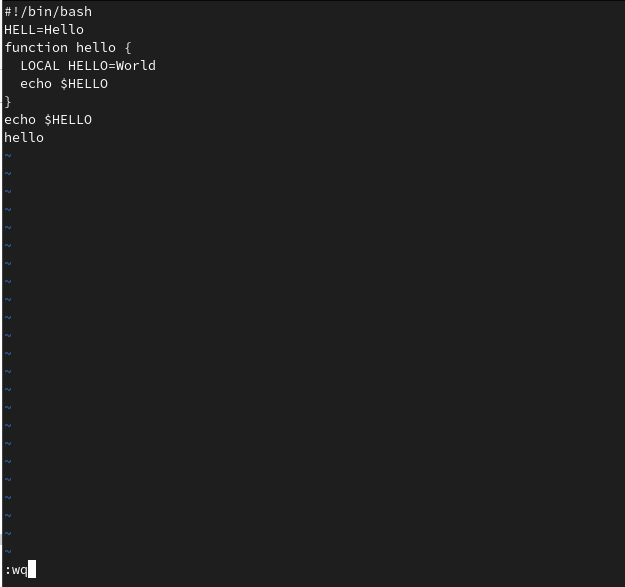{#fig:006 width=70%}

7. Сделала файл исполняемым. 

{#fig:007 width=70%}

**Задание 2. Редактирование существующего файла.**

1. Вызвала vi на редактирование файла.

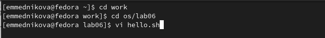{#fig:009 width=70%}

2. Установила курсор в конец слова HELL второй строки. Перешла в режим вставки и заменила на HELLO. Нажала Esc для возврата в командный режим.

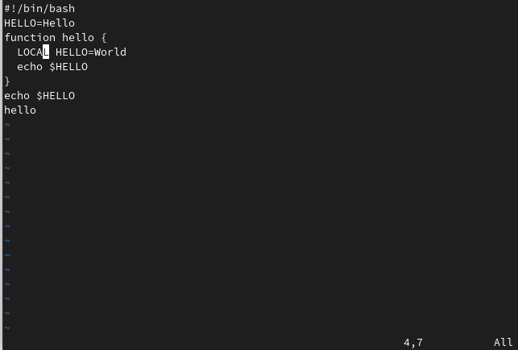{#fig:009 width=70%}

3. Установила курсор на четвертую строку и стёрла слово LOCAL. Перешла в режим вставки и набрала следующий текст: local, нажала Esc для возврата в командный режим.

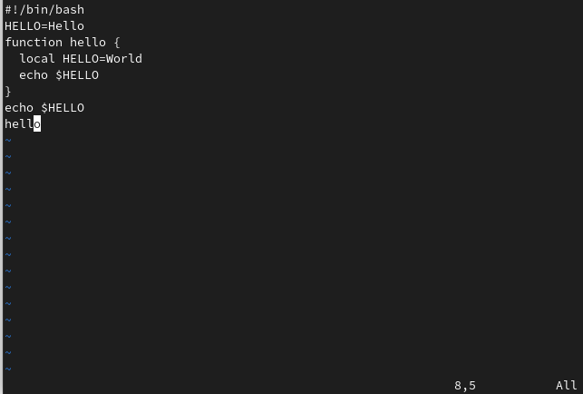{#fig:0010 width=70%}

4. Установила курсор на последней строке файла. Вставила после неё строку, содержащую следующий текст: echo $HELLO.

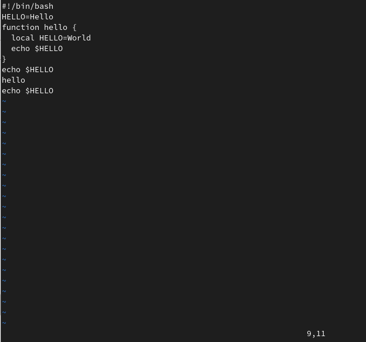{#fig:0011 width=70%}

5. Нажала Esc для перехода в командный режим. Удалила последнюю строку.

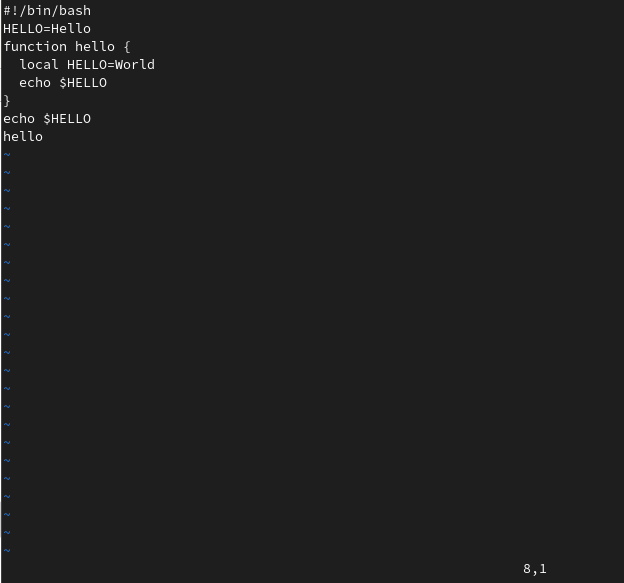{#fig:0012 width=70%}

6. Ввела команду отмены изменений u для отмены последней команды.

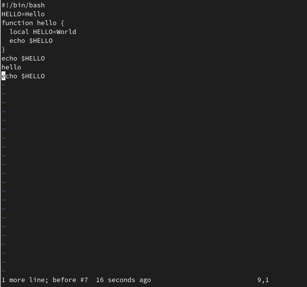{#fig:0013 width=70%}

7. Ввела символ : для перехода в режим последней строки. Записала произведённые
изменения и вышла из vi.

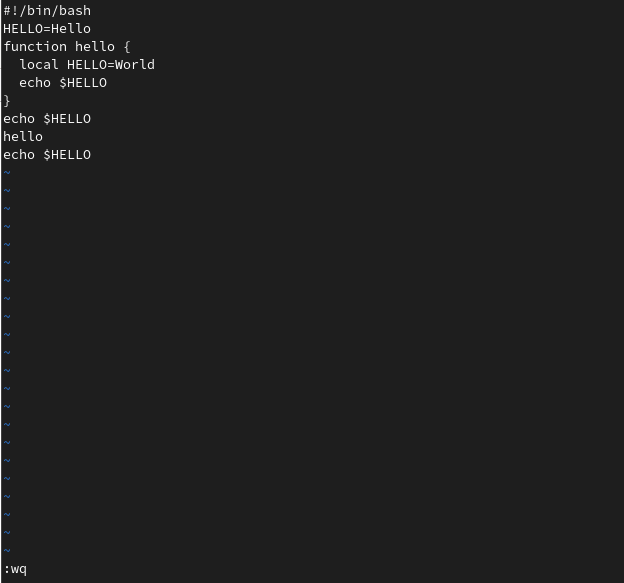{#fig:0014 width=70%}

# Выводы

Познакомилась с операционной системой Linux. Получила практические навыки работы с редактором vi, установленным по умолчанию практически во всех дистрибутивах.

# Контрольные вопросы

1. *Дайте краткую характеристику режимам работы редактора vi.*

Редактор vi имеет три режима работы:
– командный режим — предназначен для ввода команд редактирования и навигации по
редактируемому файлу;
– режим вставки — предназначен для ввода содержания редактируемого файла;
– режим последней (или командной) строки — используется для записи изменений в файл
и выхода из редактора.

2. *Как выйти из редактора, не сохраняя произведённые изменения?*

Переход в командный режим осуществляется нажатием клавиши Esc . Для выхода из
редактора vi необходимо перейти в режим последней строки: находясь в командном
режиме, нажать Shift-; (по сути символ : — двоеточие), затем:
– набрать символ q (или q!), если требуется выйти из редактора без сохранения.

3. *Назовите и дайте краткую характеристику командам позиционирования.*

– 0 (ноль) — переход в начало строки;
– $ — переход в конец строки;
– G — переход в конец файла;
– n G — переход на строку с номером n.

4. *Что для редактора vi является словом?*

При использовании прописных W и B под разделителями понимаются только пробел, табуляция и возврат каретки. При использовании строчных w и b под разделителями понимаются также любые знаки пунктуации.

5. *Каким образом из любого места редактируемого файла перейти в начало (конец) файла?*

Если нужно перейти в начало файла, нужно нажать gg, если в конец - G.

6. *Назовите и дайте краткую характеристику основным группам команд редактирования.*

1) Вставка текста 
– а — вставить текст после курсора;
– А — вставить текст в конец строки;
– i — вставить текст перед курсором;
– n i — вставить текст n раз;
– I — вставить текст в начало строки.
2) Вставка строки 
– о — вставить строку под курсором;
– О — вставить строку над курсором.
3) Удаление строки 
– x — удалить один символ в буфер;
– d w — удалить одно слово в буфер;
– d $ — удалить в буфер текст от курсора до конца строки;
– d 0 — удалить в буфер текст от начала строки до позиции курсора;
– d d — удалить в буфер одну строку;
– n d d — удалить в буфер n строк.
4) Отмена и повтор произведённых изменений
– u — отменить последнее изменение;
– . — повторить последнее изменение.
5) Копирование текста в буфер
– Y — скопировать строку в буфер;
– n Y — скопировать n строк в буфер;
– y w — скопировать слово в буфер.
6) Вставка текста из буфера
– p — вставить текст из буфера после курсора;
– P — вставить текст из буфера перед курсором.
7) Замена текста
– c w — заменить слово;
– n c w — заменить n слов;
– c $ — заменить текст от курсора до конца строки;
– r — заменить слово;
– R — заменить текст.
8) Поиск текста
– / текст — произвести поиск вперёд по тексту указанной строки символов текст;
– ? текст — произвести поиск назад по тексту указанной строки символов текст.

8. *Как отменить некорректное действие, связанное с процессом редактирования?*

Использовать команду u. 

9. *Назовите и дайте характеристику основным группам команд режима последней строки.*

Команды редактирования в режиме командной строки
1) Копирование и перемещение текста
– : n,m d — удалить строки с n по m;
– : i,j m k — переместить строки с i по j, начиная со строки k;
– : i,j t k — копировать строки с i по j в строку k;
– : i,j w имя-файла — записать строки с i по j в файл с именем имя-файла.
2) Запись в файл и выход из редактора
– : w — записать изменённый текст в файл, не выходя из vi;
– : w имя-файла — записать изменённый текст в новый файл с именем имя-файла;
– : w ! имя-файла — записать изменённый текст в файл с именем имя-файла;
– : w q — записать изменения в файл и выйти из vi;
– : q — выйти из редактора vi;
– : q ! — выйти из редактора без записи;
– : e ! — вернуться в командный режим, отменив все изменения, произведённые
со времени последней записи. 

10. *Как определить, не перемещая курсора, позицию, в которой заканчивается строка?*

Использовать команду $ для перехода в конец строки. 

11. *Выполните анализ опций редактора vi (сколько их, как узнать их назначение и т.д.).*

Опции редактора vi позволяют настроить рабочую среду. Для задания опций используется команда set (в режиме последней строки):
– : set all — вывести полный список опций;
– : set nu — вывести номера строк;
– : set list — вывести невидимые символы;
– : set ic — не учитывать при поиске, является ли символ прописным или строчным.
Если вы хотите отказаться от использования опции, то в команде set перед именем
опции надо поставить no.

12. *Как определить режим работы редактора vi?*

Переход в командный режим осуществляется нажатием клавиши Esc. Для режима вставки нужно нажать команду i.  Для выхода из редактора vi необходимо перейти в режим последней строки: находясь в командном режиме, нажать Shift-; (по сути символ : — двоеточие), затем:
– набрать символы wq, если перед выходом из редактора требуется записать изменения
в файл;
– набрать символ q (или q!), если требуется выйти из редактора без сохранения. 

# Список литературы{.unnumbered}

::: {#refs}
:::
