---
## Front matter
lang: ru-RU
title: Лабораторная работа №9
subtitle: Текстовый редактор emacs
author:
  - Медникова Е. М.
institute:
  - Российский университет дружбы народов, Москва, Россия
  - Факультет физико-математических и естественных наук 
date: 8 апреля 2023

## i18n babel
babel-lang: russian
babel-otherlangs: english

## Formatting pdf
toc: false
toc-title: Содержание
slide_level: 2
aspectratio: 169
section-titles: true
theme: metropolis
header-includes:
 - \metroset{progressbar=frametitle,sectionpage=progressbar,numbering=fraction}
 - '\makeatletter'
 - '\beamer@ignorenonframefalse'
 - '\makeatother'
---

# Информация

## Докладчик

:::::::::::::: {.columns align=center}
::: {.column width="70%"}

  * Медникова Екатерина Михайловна
  * студентка направления бакалавриата 01.03.00 Математика и механика 
  * Российский университет дружбы народов
  * [1132226549@rudn.ru](mailto:1132226549@rudn.ru)

:::
::: {.column width="30%"}

:::
::::::::::::::

# Цели и задачи

Познакомиться с операционной системой Linux. Получить практические навыки работы с редактором Emacs.

# Выполнение лабораторной работы

## Установила текстовый редактор emacs.

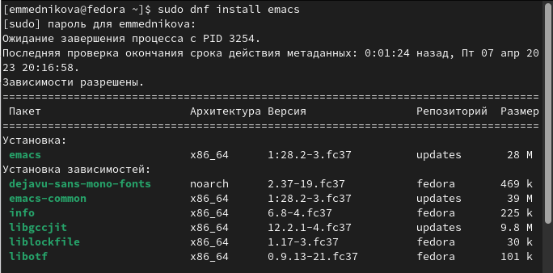

## Открыла emacs.

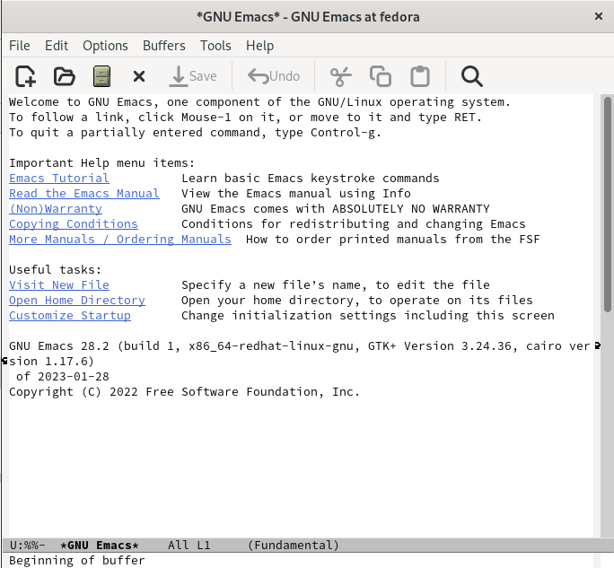

## Создала файл. 

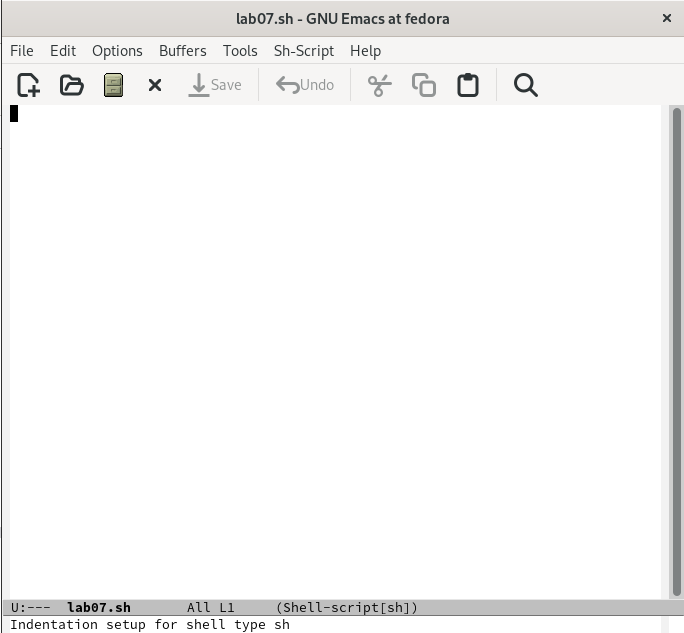

## Набрала текст. 

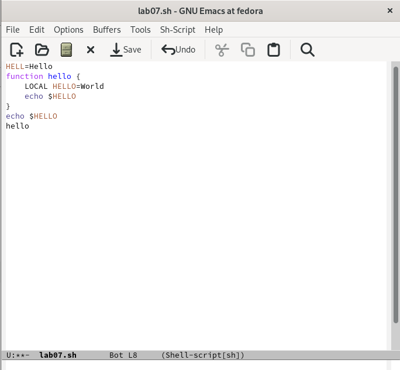

## Сохранила файл. 

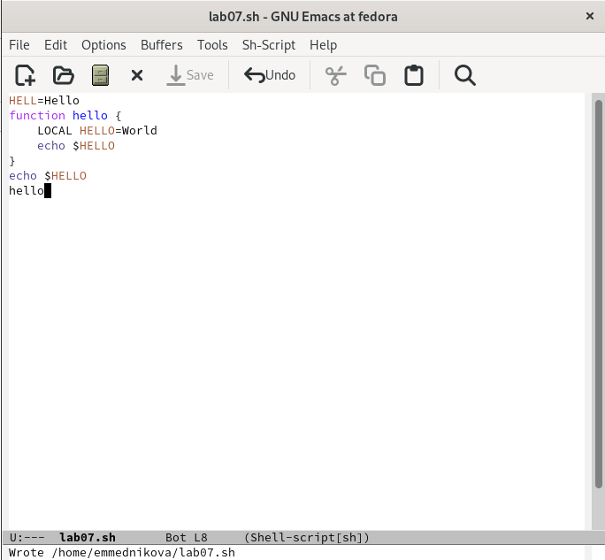

## Вырезала одной командой целую строку.

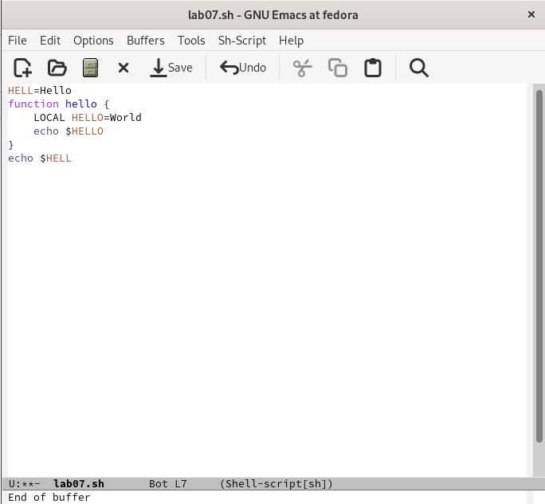

## Вставила строку в конец файла.

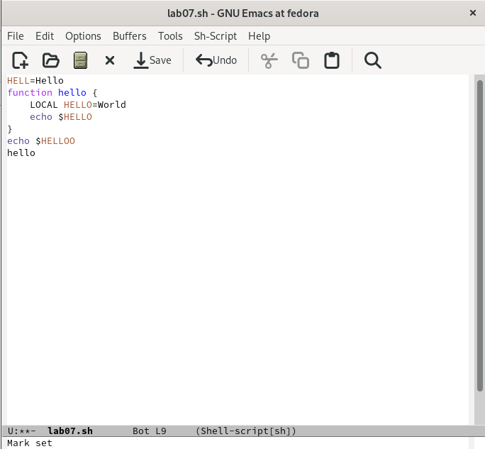

## Выделила область текста и скопировала в буфер обмена. 

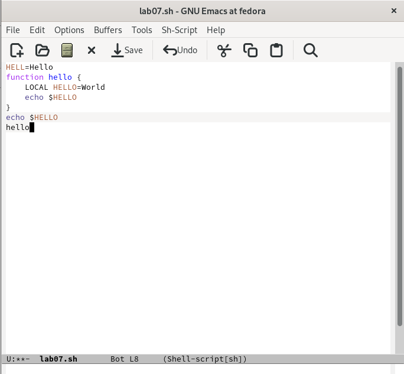

## Вставила область в конец файла.

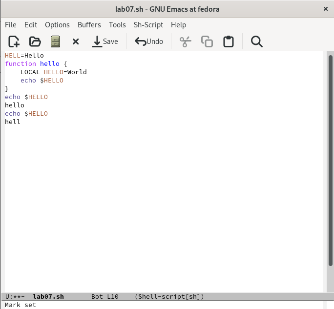

## Вновь выделила область и вырезала её.

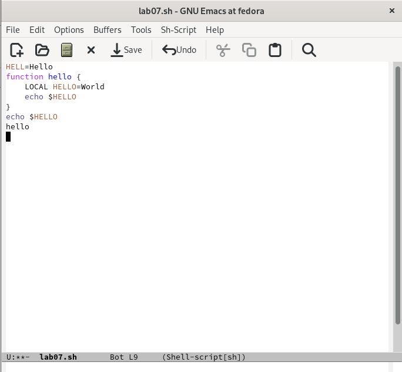

## Отменила последнее действие. 

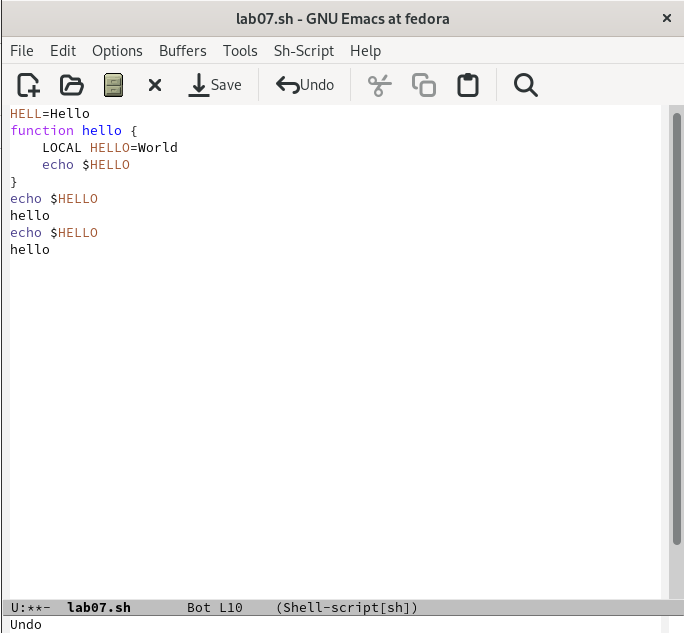

## Переместила курсор в начало строки.

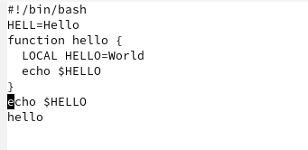

## Переместила курсор в конец строки.

## Переместила курсор в начало буфера.

## Переместила курсор в конец буфера.

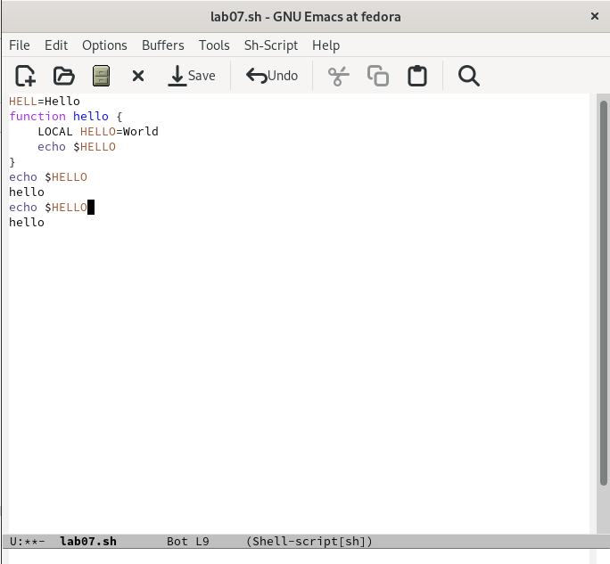

## Вывела список активных буферов на экран.

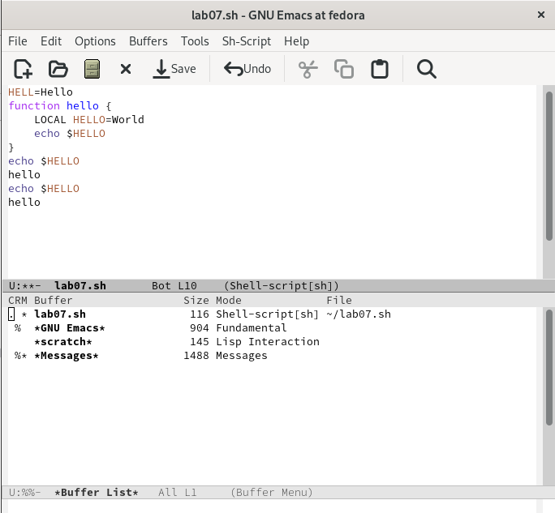

## Переместилась в открытое окно со списком открытых буферов и переключилась на другой буфер.

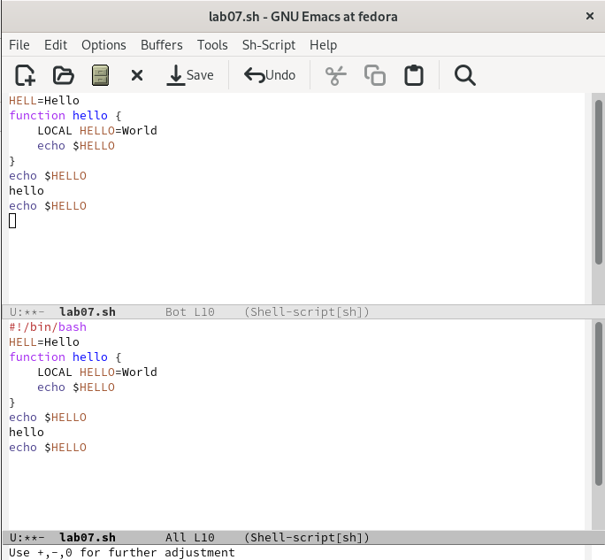

## Закрыла окно.

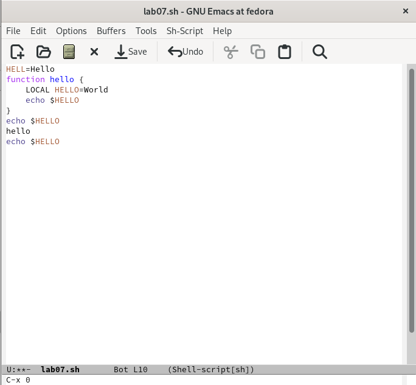

## Переключилась между буферами уже без вывода их списка на экран.

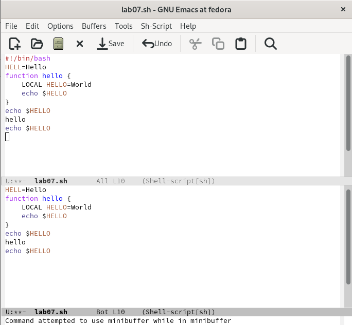

## Поделила фрейм на 4 части.

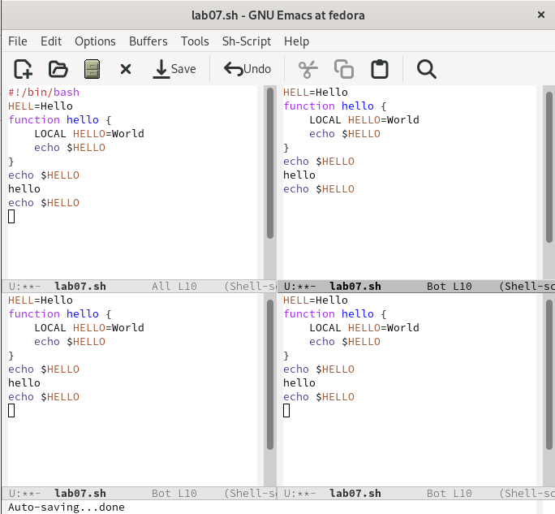

## В каждом из четырёх созданных окон открыла новый буфер (файл) и ввела несколько строк текста.

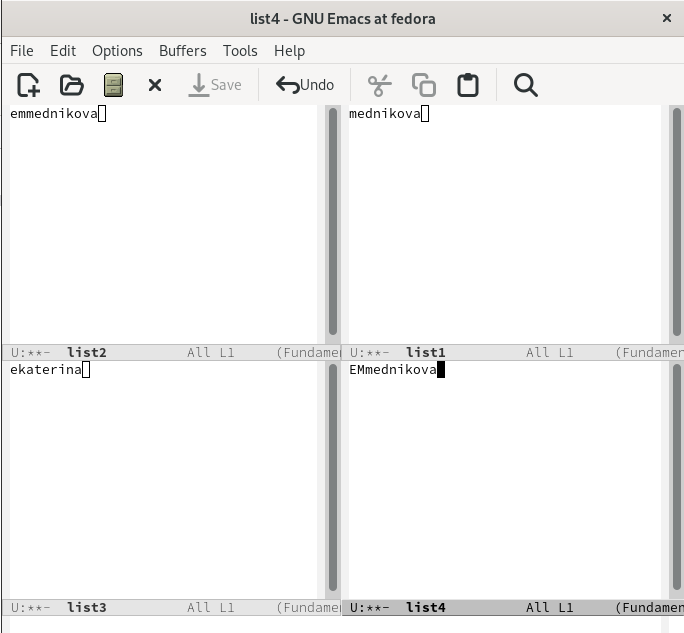

## Переключилась в режим поиска и нашла несколько слов, присутствующих в тексте. Переключалась между результатами поиска.

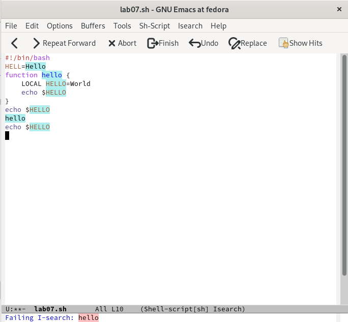

## Вышла из режима поиска.

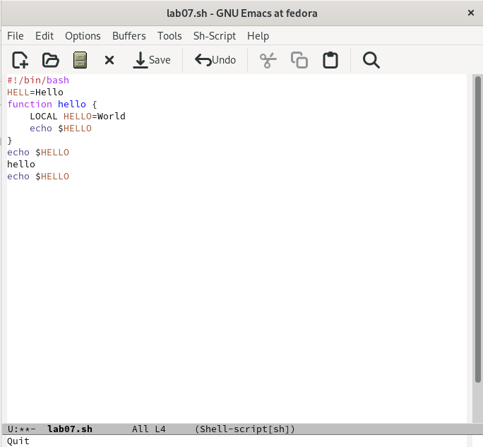

## Перешла в режим поиска и замены, ввела текст, который нужно было найти и заменить, нажала Enter, затем ввела текст для замены. Далее подтвердила замену.

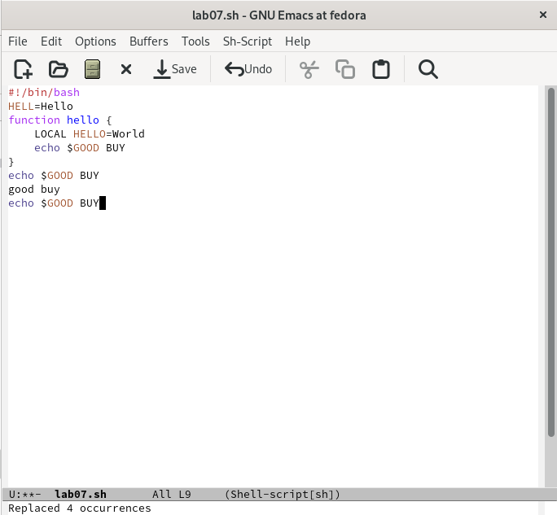

## Попробовала другой режим поиска.

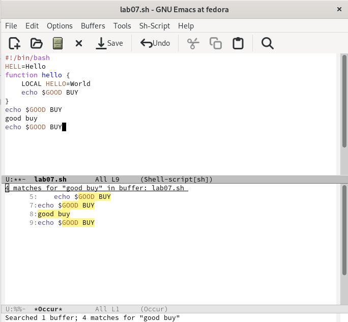

# Контрольные вопросы

## Кратко охарактеризуйте редактор emacs.

Emacs — интегрированная среда для выполнения большого количества типов задач. Это значит, что все инструменты редактирования, поиска, обработки текста, работы с файлами  доступны в любой момент. Для управления Emacs обычно используются сочетания клавиш, включающие в себя клавишу CONTROL (иногда отмечаемая как CTRL или C) или клавишу META (иногда помеченную как ALT или EDIT). Многие действия в Emacs выполняются с помощью последовательного нажатия нескольких комбинаций клавиш. Например, открытие файла выполняется комбинацией C-x C-f. Если Emacs перестал реагировать на команды, то можно вывести его из этого состояния нажав C-g. Также использовать можно C-g для того, чтобы остановить выполнение команд, которые слишком долго выполняются.Комбинациям клавиш соответствуют команды (функции Elisp). Для поиска и непосредственного ввода команд можно использовать комбинацию M-x. Для выхода из редактора нужно использовать комбинацию C-x C-c. 

## Какие особенности данного редактора могут сделать его сложным для освоения новичком?

У Emacs есть несколько особенностей, которые могут вызвать трудности. Во-первых, в текстовом режиме клавиша Backspace ­- это не удаление предыдущего символа, а синоним Ctrl+H - префикс "команд помощи". Во-вторых, по умолчанию русские буквы не вводятся как буквы, а вызывают некие команды Emacs'а. В-третьих, если нажимать стрелку вниз за концом файла, то Emacs будет сам добавлять дополнительные строки.
Многие команды состоят не из одной клавиши, а из нескольких - первой обычно является Ctrl+X, Ctrl+C или Ctrl+H. 

## Своими словами опишите, что такое буфер и окно в терминологии emacs’а.

Текст, который редактируется в Emacs, находится в объекте, называемом буфером. Когда Emacs создает множество окон, каждое окно имеет свой выбранный буфер, но в любой момент времени только одно из окон является выбранным, и его буфер - это выбранный буфер. То, что обычно мы называем окном, в Emacs называется фреймом (frame). Окном (window) называется некоторая часть фрейма. Обычно окно занимает весь фрейм, но можно разделить фрейм на несколько окон.

## Можно ли открыть больше 10 буферов в одном окне?

Каждое окно Emacs отображает в одно время один буфер. Один и тот же буфер может появиться более чем в одном окне; если это произошло, то любые изменения в его тексте показываются во всех окнах, где он отображен.

## Какие буферы создаются по умолчанию при запуске emacs?

При запуске Emacs несет один буфер с именем scratch, который может быть использован для вычисления выражений Лиспа в Emacs. В именах буферов имеет значение различие между верхним и нижним регистрами.

## Какие клавиши вы нажмёте, чтобы ввести следующую комбинацию C-c | и C-c C-|?

Удерживая клавишу Ctrl, нужно нажать на английскую букву "с", после отпустить и нажать |.  Удерживая клавишу Ctrl, нужно нажать на английскую букву "с", затем отпустить и снова, удерживая клавишу Ctrl, нужно нажать на |.

## Как поделить текущее окно на две части?

Нужно использовать комбинацию клавиш С-х 3.

## В каком файле хранятся настройки редактора emacs?

Для настройки Emacs используется специальный файл, который обычно находится в каталоге пользователя и называется ". emacs".

## Какую функцию выполняет клавиша и можно ли её переназначить?

Клавиша Backspace является функцией C-k. Переназначить можно.

## Какой редактор вам показался удобнее в работе vi или emacs? Поясните почему.

Мне понравился редактор emacs. В редакторе vi нужно постоянно переключаться между режимами ввода и командами. Нельзя свободно смешивать текст и команды; нужно постоянно нажимать клавишу escape или клавишу режима ввода, чтобы перейти в другой режим. Нельзя изменять базовые сопоставления клавиатуры. Управление буферами едва ли способно редактировать несколько файлов, а просмотр нескольких буферов невозможен. Существует небольшая поддержка языкового редактирования, а отсутствие общей расширяемости делает невозможным расширение vi для работы с другими языками. В основном редактор vi может быть удобен для редактирования небольших заданий, в то время как emacs недоступен. Если нужно редактировать большой файл, то подойдёт редактор emacs. 

