---
## Front matter
title: "Лабораторная работа №9"
subtitle: "Текстовый реадктор emacs"
author: "Медникова Екатерина Михайловна"

## Generic otions
lang: ru-RU
toc-title: "Содержание"

## Bibliography
bibliography: bib/cite.bib
csl: pandoc/csl/gost-r-7-0-5-2008-numeric.csl

## Pdf output format
toc: true # Table of contents
toc-depth: 2
lof: true # List of figures
lot: true # List of tables
fontsize: 12pt
linestretch: 1.5
papersize: a4
documentclass: scrreprt
## I18n polyglossia
polyglossia-lang:
  name: russian
  options:
	- spelling=modern
	- babelshorthands=true
polyglossia-otherlangs:
  name: english
## I18n babel
babel-lang: russian
babel-otherlangs: english
## Fonts
mainfont: PT Serif
romanfont: PT Serif
sansfont: PT Sans
monofont: PT Mono
mainfontoptions: Ligatures=TeX
romanfontoptions: Ligatures=TeX
sansfontoptions: Ligatures=TeX,Scale=MatchLowercase
monofontoptions: Scale=MatchLowercase,Scale=0.9
## Biblatex
biblatex: true
biblio-style: "gost-numeric"
biblatexoptions:
  - parentracker=true
  - backend=biber
  - hyperref=auto
  - language=auto
  - autolang=other*
  - citestyle=gost-numeric
## Pandoc-crossref LaTeX customization
figureTitle: "Рис."
tableTitle: "Таблица"
listingTitle: "Листинг"
lofTitle: "Список иллюстраций"
lotTitle: "Список таблиц"
lolTitle: "Листинги"
## Misc options
indent: true
header-includes:
  - \usepackage{indentfirst}
  - \usepackage{float} # keep figures where there are in the text
  - \floatplacement{figure}{H} # keep figures where there are in the text
---

# Цель работы

Познакомиться с операционной системой Linux. Получить практические навыки работы с редактором Emacs.

# Выполнение лабораторной работы

1. Установила редактор emacs.

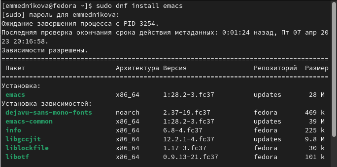{#fig:001 width=70%}
 
2. Открыла emacs. 

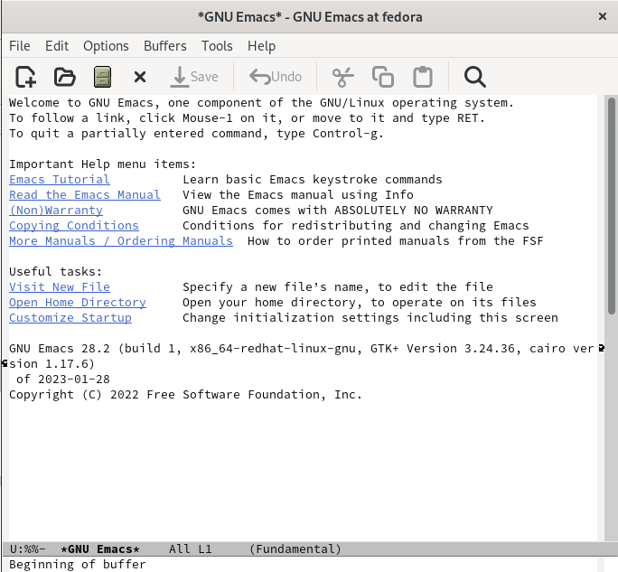{#fig:002 width=70%}

3. Создала файл. 

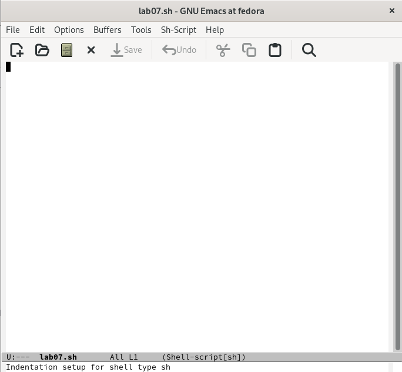{#fig:003 width=70%}

4. Набрала текст. 

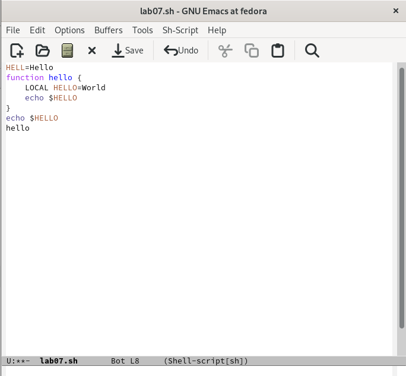{#fig:004 width=70%}

5. Сохранила файл. 

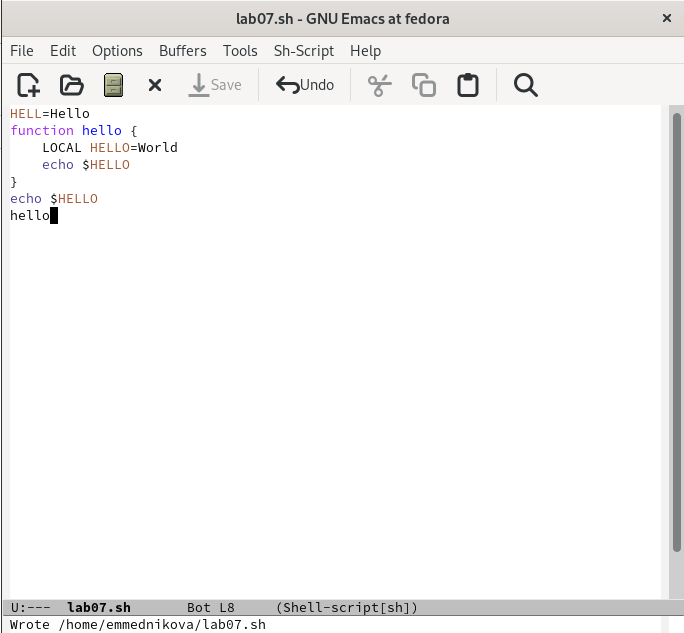{#fig:005 width=70%}

6. Вырезала одной командой целую строку.

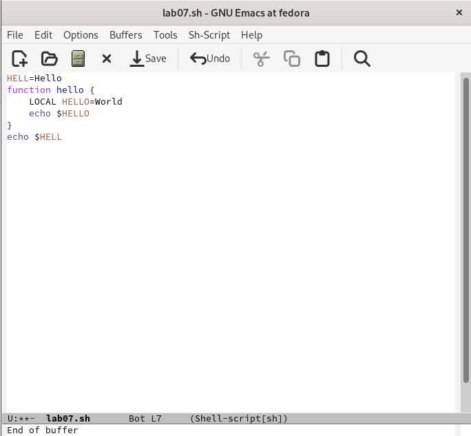{#fig:006 width=70%}

7. Вставила строку в конец файла. 

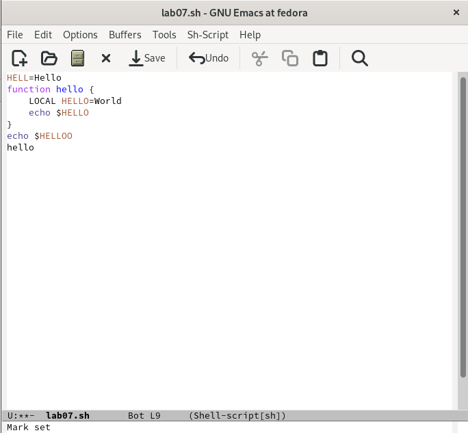{#fig:007 width=70%}

8. Выделила область текста и скопировала в буфер обмена. 

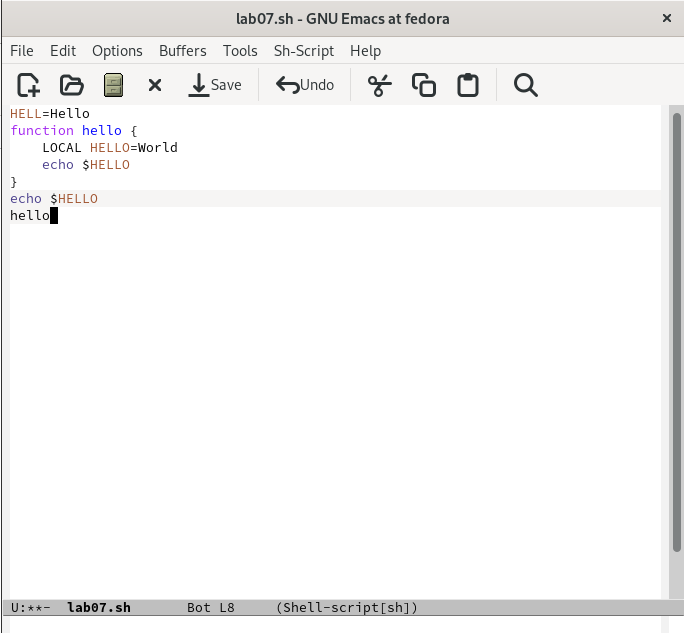{#fig:008 width=70%}

9. Вставила область в конец файла.

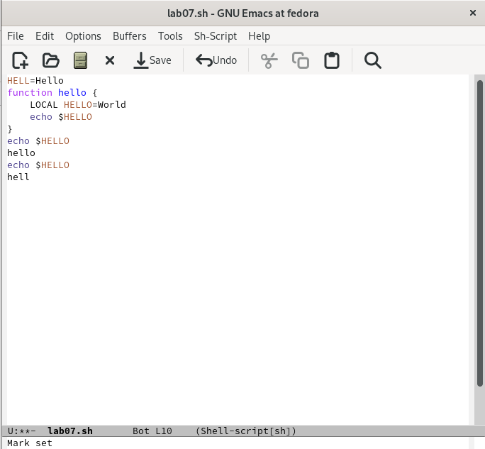{#fig:0010 width=70%} 

10. Вновь выделила область и вырезала её.

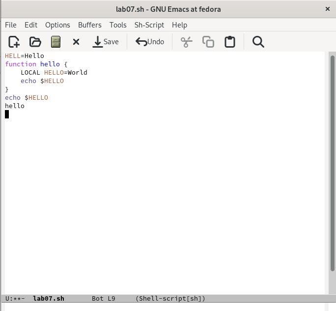{#fig:0011 width=70%}

11. Отменила последнее действие. 

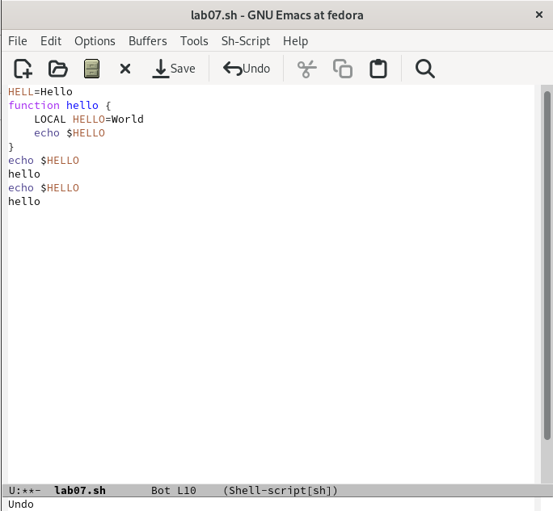{#fig:0012 width=70%}

12. Переместила курсор в начало строки.

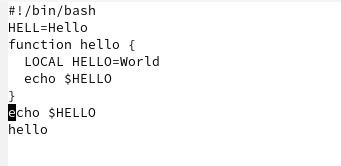{#fig:0013 width=70%}

13. Переместила курсор в конец строки.

{#fig:0014 width=70%}

14. Переместила курсор в начало буфера.

{#fig:0015 width=70%}

15. Переместила курсор в конец буфера.

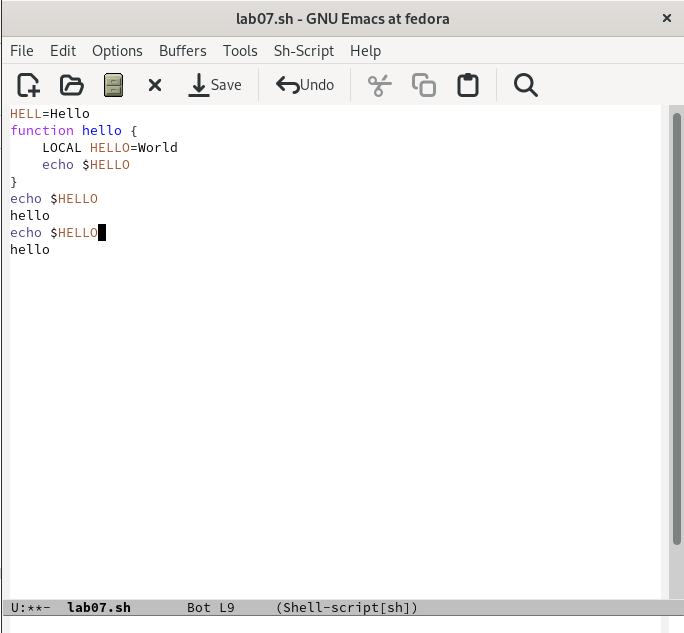{#fig:0016 width=70%}

16. Вывела список активных буферов на экран.

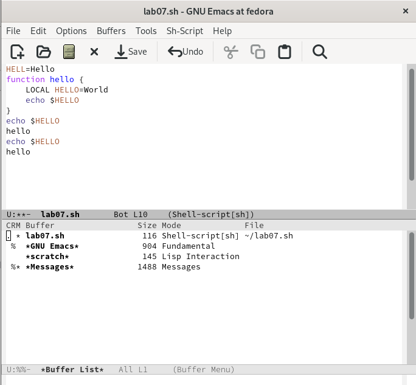{#fig:0017 width=70%}

17. Переместилась в открытое окно со списком открытых буферов и переключилась на другой буфер.

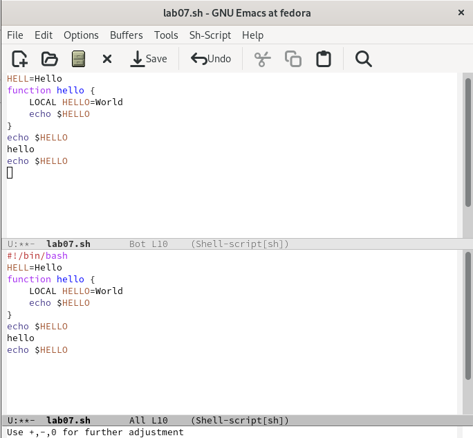{#fig:0018 width=70%}

18. Закрыла окно.

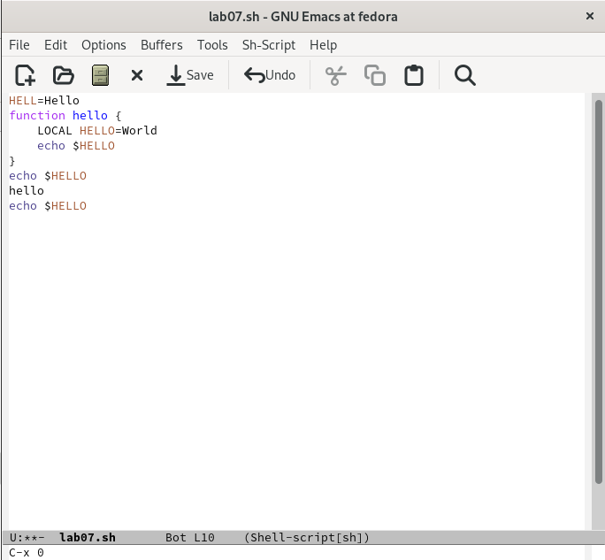{#fig:0019 width=70%}

19. Переключилась между буферами уже без вывода их списка на экран.

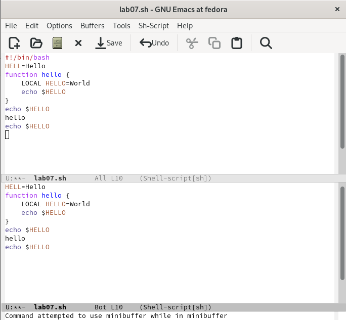{#fig:0020 width=70%}

20. Поделила фрейм на 4 части.

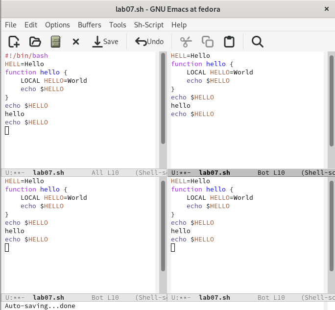{#fig:0021 width=70%}

21. В каждом из четырёх созданных окон открыла новый буфер (файл) и ввела несколько строк текста.

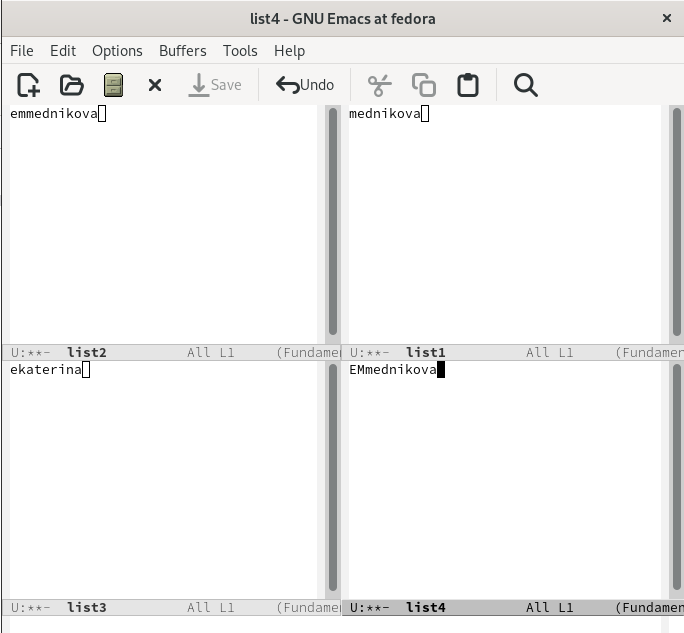{#fig:0021 width=70%}

22. Переключилась в режим поиска и нашла несколько слов, присутствующих в тексте. Переключалась между результатами поиска.

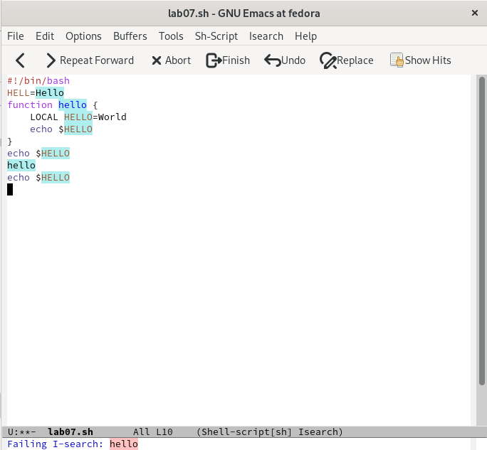{#fig:0022 width=70%}

23. Вышла из режима поиска.

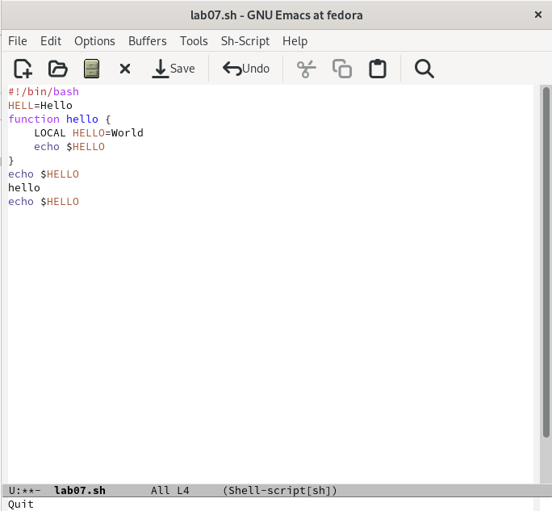{#fig:0024 width=70%}

24. Перешла в режим поиска и замены, ввела текст, который нужно было найти
и заменить, нажала Enter, затем ввела текст для замены. Далее подтвердила замену.

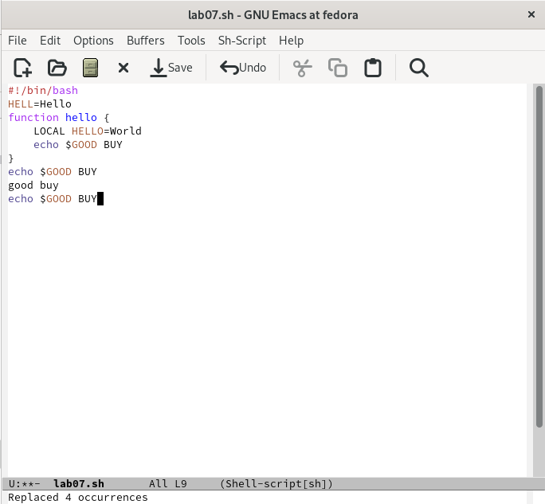{#fig:0025 width=70%}

25. Попробовала другой режим поиска.

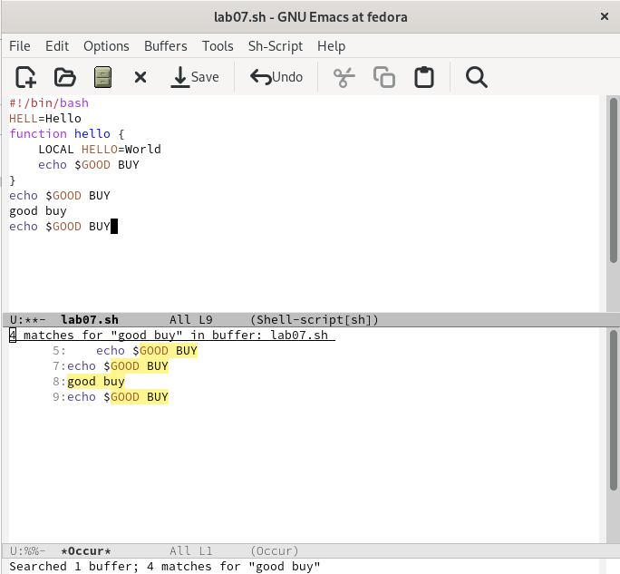{#fig:0026 width=70%}

# Выводы

Познакомилась с операционной системой Linux. Получила практические навыки работы с редактором Emacs.

# Контрольные вопросы 

1. *Кратко охарактеризуйте редактор emacs.*

Emacs — интегрированная среда для выполнения большого количества типов задач. Это значит, что все инструменты редактирования, поиска, обработки текста, работы с файлами  доступны в любой момент. Для управления Emacs обычно используются сочетания клавиш, включающие в себя клавишу CONTROL (иногда отмечаемая как CTRL или C) или клавишу META (иногда помеченную как ALT или EDIT). Многие действия в Emacs выполняются с помощью последовательного нажатия нескольких комбинаций клавиш. Например, открытие файла выполняется комбинацией C-x C-f. Если Emacs перестал реагировать на команды, то можно вывести его из этого состояния нажав C-g. Также использовать можно C-g для того, чтобы остановить выполнение команд, которые слишком долго выполняются.Комбинациям клавиш соответствуют команды (функции Elisp). Для поиска и непосредственного ввода команд можно использовать комбинацию M-x. Для выхода из редактора нужно использовать комбинацию C-x C-c. 

2. *Какие особенности данного редактора могут сделать его сложным для освоения новичком?*

У Emacs есть несколько особенностей, которые могут вызвать трудности. Во-первых, в текстовом режиме клавиша Backspace ­- это не удаление предыдущего символа, а синоним Ctrl+H - префикс "команд помощи". Во-вторых, по умолчанию русские буквы не вводятся как буквы, а вызывают некие команды Emacs'а. В-третьих, если нажимать стрелку вниз за концом файла, то Emacs будет сам добавлять дополнительные строки.
Многие команды состоят не из одной клавиши, а из нескольких - первой обычно является Ctrl+X, Ctrl+C или Ctrl+H. 

3. *Своими словами опишите, что такое буфер и окно в терминологии emacs’а.*

Текст, который редактируется в Emacs, находится в объекте, называемом буфером. Когда Emacs создает множество окон, каждое окно имеет свой выбранный буфер, но в любой момент времени только одно из окон является выбранным, и его буфер - это выбранный буфер. То, что обычно мы называем окном, в Emacs называется фреймом (frame). Окном (window) называется некоторая часть фрейма. Обычно окно занимает весь фрейм, но можно разделить фрейм на несколько окон.

4. *Можно ли открыть больше 10 буферов в одном окне?*

Каждое окно Emacs отображает в одно время один буфер. Один и тот же буфер может появиться более чем в одном окне; если это произошло, то любые изменения в его тексте показываются во всех окнах, где он отображен.

5. *Какие буферы создаются по умолчанию при запуске emacs?*

При запуске Emacs несет один буфер с именем scratch, который может быть использован для вычисления выражений Лиспа в Emacs. В именах буферов имеет значение различие между верхним и нижним регистрами.

6. *Какие клавиши вы нажмёте, чтобы ввести следующую комбинацию C-c | и C-c C-|?*

Удерживая клавишу Ctrl, нужно нажать на английскую букву "с", после отпустить и нажать |.  Удерживая клавишу Ctrl, нужно нажать на английскую букву "с", затем отпустить и снова, удерживая клавишу Ctrl, нужно нажать на |.

7. *Как поделить текущее окно на две части?*

Нужно использовать комбинацию клавиш С-х 3. 

8. *В каком файле хранятся настройки редактора emacs?*

Для настройки Emacs используется специальный файл, который обычно находится в каталоге пользователя и называется ". emacs".

9. *Какую функцию выполняет клавиша и можно ли её переназначить?*

Клавиша Backspace является функцией C-k. Переназначить можно.

10. *Какой редактор вам показался удобнее в работе vi или emacs? Поясните почему.*

Мне понравился редактор emacs. В редакторе vi нужно постоянно переключаться между режимами ввода и командами. Нельзя свободно смешивать текст и команды; нужно постоянно нажимать клавишу escape или клавишу режима ввода, чтобы перейти в другой режим. Нельзя изменять базовые сопоставления клавиатуры. Управление буферами едва ли способно редактировать несколько файлов, а просмотр нескольких буферов невозможен. Существует небольшая поддержка языкового редактирования, а отсутствие общей расширяемости делает невозможным расширение vi для работы с другими языками. В основном редактор vi может быть удобен для редактирования небольших заданий, в то время как emacs недоступен. Если нужно редактировать большой файл, то подойдёт редактор emacs. 

# Список литературы{.unnumbered}

::: {#refs}
:::
