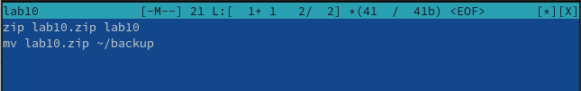
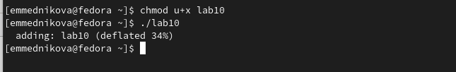
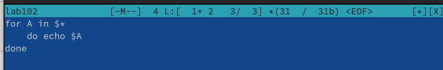
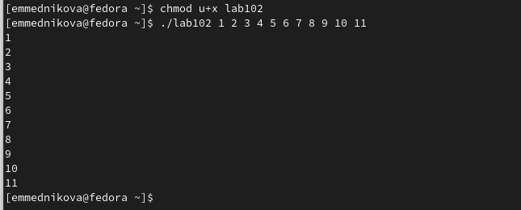
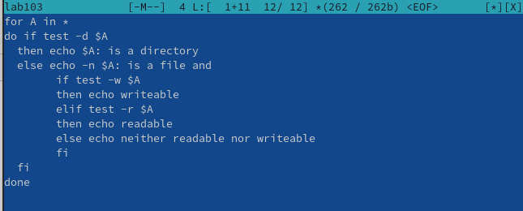
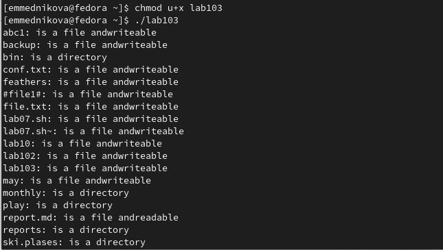
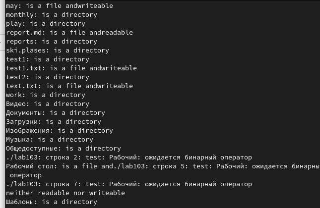
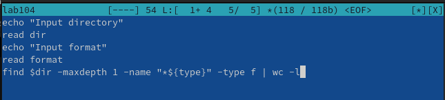
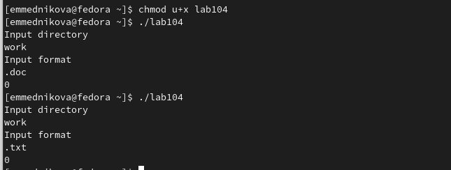

---
## Front matter
lang: ru-RU
title: Лабораторная работа №10
subtitle: Программирование в командном процессоре ОС UNIX. Командные файлы
author:
  - Медникова Е. М.
institute:
  - Российский университет дружбы народов, Москва, Россия
  - Факультет физико-математических и естественных наук
date: 14 апреля 2023

## i18n babel
babel-lang: russian
babel-otherlangs: english

## Formatting pdf
toc: false
toc-title: Содержание
slide_level: 2
aspectratio: 169
section-titles: true
theme: metropolis
header-includes:
 - \metroset{progressbar=frametitle,sectionpage=progressbar,numbering=fraction}
 - '\makeatletter'
 - '\beamer@ignorenonframefalse'
 - '\makeatother'
---

# Информация

## Докладчик

:::::::::::::: {.columns align=center}
::: {.column width="70%"}

  * Медникова Екатерина Михайловна 
  * студентка направления бакалавриата 01.03.00 Математика и механика
  * Российский университет дружбы народов
  * [1132226549@rudn.ru](mailto:1132226549@rudn.ru)

:::
::: {.column width="30%"}

:::
::::::::::::::

## Цели и задачи

Изучить основы программирования в оболочке ОС UNIX/Linux. Научиться писать небольшие командные файлы.

# Выполнение лабораторной работы

## Написала скрипт, который при запуске делает резервную копию самого себя. 

## Продолжение 

## Написала пример командного файла, обрабатывающего любое произвольное число аргументов командной строки.

## Продолжение 

## Написала командный файл - аналог команды ls. 

## Продолжение

## Продолжение

## Написала командный файл, который получает в качестве аргумента командной строки формат файла. 

## Продолжение 

## Выводы

Изучила основы программирования в оболочке ОС UNIX/Linux. Научилась писать небольшие командные файлы.

