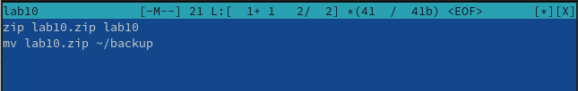
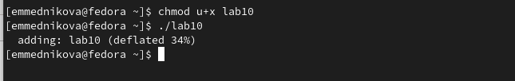
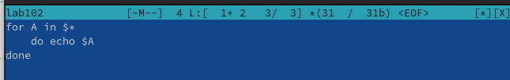
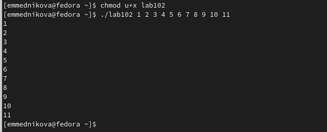
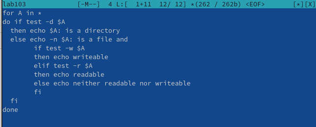
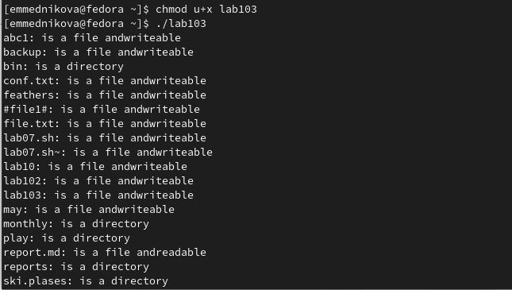
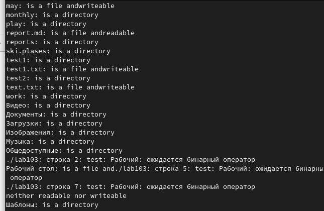
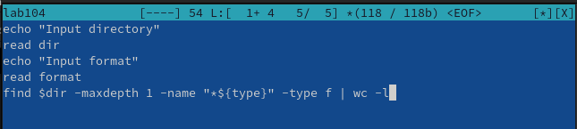
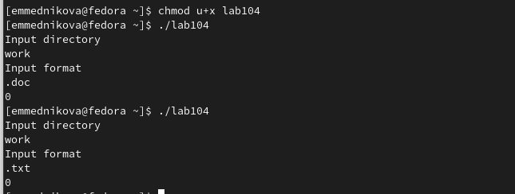

---
## Front matter
title: "Лабораторная работа №10"
subtitle: "Программирование в командном процессоре ОС UNIX. Командные файлы"
author: "Медникова Екатерина Михайловна"

## Generic otions
lang: ru-RU
toc-title: "Содержание"

## Bibliography
bibliography: bib/cite.bib
csl: pandoc/csl/gost-r-7-0-5-2008-numeric.csl

## Pdf output format
toc: true # Table of contents
toc-depth: 2
lof: true # List of figures
lot: true # List of tables
fontsize: 12pt
linestretch: 1.5
papersize: a4
documentclass: scrreprt
## I18n polyglossia
polyglossia-lang:
  name: russian
  options:
	- spelling=modern
	- babelshorthands=true
polyglossia-otherlangs:
  name: english
## I18n babel
babel-lang: russian
babel-otherlangs: english
## Fonts
mainfont: PT Serif
romanfont: PT Serif
sansfont: PT Sans
monofont: PT Mono
mainfontoptions: Ligatures=TeX
romanfontoptions: Ligatures=TeX
sansfontoptions: Ligatures=TeX,Scale=MatchLowercase
monofontoptions: Scale=MatchLowercase,Scale=0.9
## Biblatex
biblatex: true
biblio-style: "gost-numeric"
biblatexoptions:
  - parentracker=true
  - backend=biber
  - hyperref=auto
  - language=auto
  - autolang=other*
  - citestyle=gost-numeric
## Pandoc-crossref LaTeX customization
figureTitle: "Рис."
tableTitle: "Таблица"
listingTitle: "Листинг"
lofTitle: "Список иллюстраций"
lotTitle: "Список таблиц"
lolTitle: "Листинги"
## Misc options
indent: true
header-includes:
  - \usepackage{indentfirst}
  - \usepackage{float} # keep figures where there are in the text
  - \floatplacement{figure}{H} # keep figures where there are in the text
---

# Цель работы

Изучить основы программирования в оболочке ОС UNIX/Linux. Научиться писать небольшие командные файлы.

# Выполнение лабораторной работы

1. Написала скрипт, который при запуске делает резервную копию самого себя. 

{#fig:001 width=70%}

{#fig:002 width=70%}

2. Написала пример командного файла, обрабатывающего любое произвольное число аргументов командной строки.

{#fig:003 width=70%}

{#fig:004 width=70%}

3. Написала командный файл - аналог команды ls. 

{#fig:005 width=70%}

{#fig:006 width=70%}

{#fig:007 width=70%}

4. Написала командный файл, который получает в качестве аргумента командной строки формат файла. 

{#fig:008 width=70%}

{#fig:009 width=70%}

# Выводы

Изучила основы программирования в оболочке ОС UNIX/Linux. Научилась писать небольшие командные файлы.

# Контрольные вопросы

1. *Объясните понятие командной оболочки. Приведите примеры командных оболочек. Чем они отличаются?*

Командный процессор (командная оболочка, интерпретатор команд shell) — это программа, позволяющая пользователю взаимодействовать с операционной системой компьютера. В операционных системах типа UNIX/Linux наиболее часто используются следующие реализации командных оболочек:

– оболочка Борна (Bourne shell или sh) — стандартная командная оболочка UNIX/Linux, содержащая базовый, но при этом полный набор функций;

– С-оболочка (или csh) — надстройка на оболочкой Борна, использующая С-подобный синтаксис команд с возможностью сохранения истории выполнения команд;

– оболочка Корна (или ksh) — напоминает оболочку С, но операторы управления программой совместимы с операторами оболочки Борна;

– BASH — сокращение от Bourne Again Shell (опять оболочка Борна), в основе своей совмещает свойства оболочек С и Корна (разработка компании Free Software Foundation).

2. *Что такое POSIX?*

POSIX (Portable Operating System Interface for Computer Environments) — набор стандартов описания интерфейсов взаимодействия операционной системы и прикладных программ. Стандарты POSIX разработаны комитетом IEEE (Institute of Electrical and Electronics Engineers) для обеспечения совместимости различных UNIX/Linux подобных операционных систем и переносимости прикладных программ на уровне исходного кода. POSIX-совместимые оболочки разработаны на базе оболочки Корна.

3. *Как определяются переменные и массивы в языке программирования bash?*

Командный процессор bash обеспечивает возможность использования переменных типа строка символов. Имена переменных могут быть выбраны пользователем. Пользователь имеет возможность присвоить переменной значение некоторой строки символов. Значение, присвоенное некоторой переменной, может быть впоследствии использовано. Для этого в соответствующем месте командной строки должно быть употреблено имя этой переменной, которому предшествует метасимвол $. Оболочка bash позволяет работать с массивами. Для создания массива используется команда set с флагом -A. За флагом следует имя переменной, а затем список значений, разделённых пробелами.

4. *Каково назначение операторов let и read?*

Оболочка bash поддерживает встроенные арифметические функции. Команда let является показателем того, что последующие аргументы представляют собой выражение, подлежащее вычислению. Простейшее выражение — это единичный терм (term), обычно целочисленный. Команда let берет два операнда и присваивает их переменной. Положительным моментом команды let можно считать то, что для идентификации переменной ей не нужен знак доллара. Команда let также расширяет другие выражения let, если они заключены в двойные круглые скобки. Команда let не ограничена простыми арифметическими выражениями. Команда read позволяет читать значения переменных со стандартного ввода. 

5. *Какие арифметические операции можно применять в языке программирования bash?*

!   (!ехр) - Если ехр равно 0, то возвращает 1; иначе 0

!=  (ехр1 !=ехр2) - Если ехр1 не равно ехр2, то возвращает 1; иначе 0

%  (ехр1%ехр2) - Возвращает остаток от деления ехр1 на ехр2

%=  (var=%exp) - Присваивает остаток от деления var на ехр переменной var

&  (ехр1&ехр2) - Возвращает побитовое AND выражений ехр1 и ехр2

&&  (ехр1&&ехр2) - Если и ехр1 и ехр2 не равны нулю, то возвращает 1; иначе 0

&=  (var &= ехр) - Присваивает переменной var побитовое AND var и ехр

(ехр1 * ехр2) - Умножает ехр1 на ехр2

*=  (var *= ехр) - Умножает ехр на значение переменной var и присваивает результат переменной var

(ехр1 + ехр2) - Складывает ехр1 и ехр2

+=  (var += ехр) - Складывает ехр со значением переменной var и результат присваивает переменной var

(-exp) - Операция отрицания exp (унарный минус)

(expl - exp2) - Вычитает exp2 из exp1

-=  (var -= exp) - Вычитает exp из значения переменной var и присваивает результат переменной var

/  (exp / exp2) - Делит exp1 на exp2

/=  (var /= exp) - Делит значение переменной var на exp и присваивает результат переменной var

<  (expl < exp2) - Если exp1 меньше, чем exp2, то возвращает 1, иначе возвращает 0

<<  (exp1 << exp2) - Сдвигает exp1 влево на exp2 бит

<<=  (var <<= exp) - Побитовый сдвиг влево значения переменной var на exp

<=  (expl <= exp2) - Если exp1 меньше или равно exp2, то возвращает 1; иначе возвращает 0

=  (var = exp) - Присваивает значение exp переменной var

==  (exp1==exp2) - Если exp1 равно exp2, то возвращает 1; иначе возвращает 0

(exp1 > exp2) - 1, если exp1 больше, чем exp2; иначе 0

(exp1 >= exp2) - 1, если exp1 больше или равно exp2; иначе 0

(exp >> exp2) - Сдвигает exp1 вправо на exp2 бит

(var >>=exp)  - Побитовый сдвиг вправо значения переменной var на exp

^  (exp1 ^ exp2) - Исключающее OR выражений exp1 и exp2

^=  (var ^= exp) - Присваивает переменной var побитовое XOR var и exp

|  (exp1 | exp2) - Побитовое OR выражений exp1 и exp2

|=  (var |= exp)  - Присваивает переменной var результат операции XOR var и exp

|| (exp1 || exp2) - 1, если или exp1 или exp2 являются ненулевыми значениями; иначе 0

~  (~exp) - Побитовое дополнение до exp

6. *Что означает операция (( ))?*

Подобно С оболочка bash может присваивать переменной любое значение, а произвольное выражение само имеет значение, которое может использоваться. При этом «ноль» воспринимается как «ложь», а любое другое значение выражения — как «истина». Для облегчения программирования можно записывать условия оболочки bash в двойные скобки — (( )).

7. *Какие стандартные имена переменных Вам известны?*

Переменные PS1 и PS2 предназначены для отображения промптера командного процессора. PS1 — это промптер командного процессора, по умолчанию его значение равно символу $ или #. Если какая-то интерактивная программа, запущенная командным процессором, требует ввода, то используется промптер PS2. Он по умолчанию имеет значение символа >.

Другие стандартные переменные:

– HOME — имя домашнего каталога пользователя. Если команда cd вводится без аргументов, то происходит переход в каталог, указанный в этой переменной.

– IFS — последовательность символов, являющихся разделителями в командной строке, например, пробел, табуляция и перевод строки (new line).

– MAIL — командный процессор каждый раз перед выводом на экран промптера проверяет содержимое файла, имя которого указано в этой переменной, и если содержимое этого файла изменилось с момента последнего ввода из него, то перед тем как вывести на терминал промптер, командный процессор выводит на терминал сообщение You have mail (у Вас есть почта).

– TERM — тип используемого терминала.

– LOGNAME — содержит регистрационное имя пользователя, которое устанавливается автоматически при входе в систему.

8. *Что такое метасимволы?*

Такие символы, как ' < > * ? | \ " &, являются метасимволами и имеют для командного процессора специальный смысл. 

9. *Как экранировать метасимволы?*

Экранирование может быть осуществлено с помощью предшествующего метасимволу символа \, который, в свою очередь, является метасимволом. Для экранирования группы метасимволов нужно заключить её в одинарные кавычки. Строка, заключённая в двойные кавычки, экранирует все метасимволы, кроме $, ' , \, ". 

10. *Как создавать и запускать командные файлы?*

Последовательность команд может быть помещена в текстовый файл. Такой файл называется командным. Далее этот файл можно выполнить по команде: 

 bash командный_файл [аргументы]
 
Чтобы не вводить каждый раз последовательности символов bash, необходимо изменить код защиты этого командного файла, обеспечив доступ к этому файлу по выполнению. Это может быть сделано с помощью команды:

 chmod +x имя_файла
 
11. *Как определяются функции в языке программирования bash?*

Группу команд можно объединить в функцию. Для этого существует ключевое слово function, после которого следует имя функции и список команд, заключённых в фигурные скобки. 

12. *Каким образом можно выяснить, является файл каталогом или обычным файлом?*

Нужно использовать команду ls -lrt. Если в правах доступа первой стоит буква d, то это каталог, иначе - файл. 

13. *Каково назначение команд set, typeset и unset?*

Команда set позволяет просмотреть значение всех переменных. Команда unset с флагом -f удаляет функцию. 

Команда typeset имеет четыре опции для работы с функциями:

– -f — перечисляет определённые на текущий момент функции;

– -ft — при последующем вызове функции инициирует её трассировку;

– -fx — экспортирует все перечисленные функции в любые дочерние программы оболочек;

– -fu — обозначает указанные функции как автоматически загружаемые. Автоматически загружаемые функции хранятся в командных файлах, а при их вызове оболочка просматривает переменную FPATH, отыскивая файл с одноимёнными именами функций, загружает его и вызывает эти функции.

14. *Как передаются параметры в командные файлы?*

При использовании в командном файле комбинации символов $# вместо неё будет осуществлена подстановка числа параметров, указанных в командной строке при вызове данного командного файла на выполнение.

Вот ещё несколько специальных переменных, используемых в командных файлах:

– $* — отображается вся командная строка или параметры оболочки;

– $? — код завершения последней выполненной команды;

– $$ — уникальный идентификатор процесса, в рамках которого выполняется командный процессор;

– $! — номер процесса, в рамках которого выполняется последняя вызванная на выполнение в командном режиме команда;

– $- — значение флагов командного процессора;

– ${#*} — возвращает целое число — количество слов, которые были результатом $*;

– ${#name} — возвращает целое значение длины строки в переменной name;

– ${name[n]} — обращение к n-му элементу массива;

– ${name[*]} — перечисляет все элементы массива, разделённые пробелом;

– ${name[@]} — то же самое, но позволяет учитывать символы пробелы в самих переменных;

– ${name:-value} — если значение переменной name не определено, то оно будет заменено на указанное value;

– ${name:value} — проверяется факт существования переменной;

– ${name=value} — если name не определено, то ему присваивается значение value;

– ${name?value} — останавливает выполнение, если имя переменной не определено, и выводит value как сообщение об ошибке;

– ${name+value} — это выражение работает противоположно ${name-value}. Если переменная определена, то подставляется value;

– ${name#pattern} — представляет значение переменной name с удалённым самым коротким левым образцом (pattern);

– ${#name[*]} и ${#name[@]} — эти выражения возвращают количество элементов в массиве name.

# Список литературы{.unnumbered}

::: {#refs}
:::
