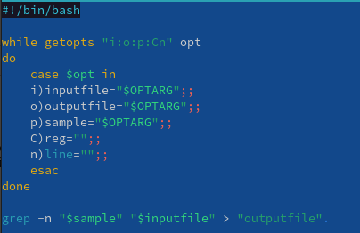
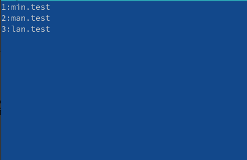
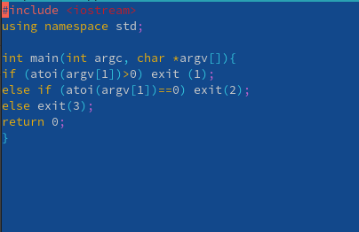
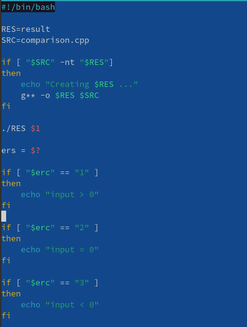
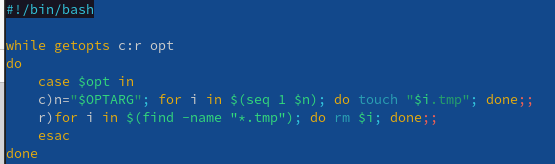
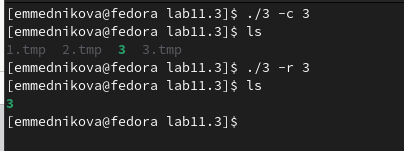
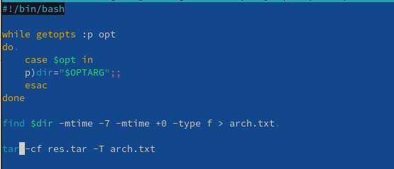
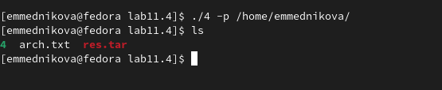

---
## Front matter
title: "Лабораторная работа №11"
subtitle: "Программирование в командном процессоре ОС UNIX. Ветвления и циклы"
author: "Медникова Екатерина Михайловна"

## Generic otions
lang: ru-RU
toc-title: "Содержание"

## Bibliography
bibliography: bib/cite.bib
csl: pandoc/csl/gost-r-7-0-5-2008-numeric.csl

## Pdf output format
toc: true # Table of contents
toc-depth: 2
lof: true # List of figures
lot: true # List of tables
fontsize: 12pt
linestretch: 1.5
papersize: a4
documentclass: scrreprt
## I18n polyglossia
polyglossia-lang:
  name: russian
  options:
	- spelling=modern
	- babelshorthands=true
polyglossia-otherlangs:
  name: english
## I18n babel
babel-lang: russian
babel-otherlangs: english
## Fonts
mainfont: PT Serif
romanfont: PT Serif
sansfont: PT Sans
monofont: PT Mono
mainfontoptions: Ligatures=TeX
romanfontoptions: Ligatures=TeX
sansfontoptions: Ligatures=TeX,Scale=MatchLowercase
monofontoptions: Scale=MatchLowercase,Scale=0.9
## Biblatex
biblatex: true
biblio-style: "gost-numeric"
biblatexoptions:
  - parentracker=true
  - backend=biber
  - hyperref=auto
  - language=auto
  - autolang=other*
  - citestyle=gost-numeric
## Pandoc-crossref LaTeX customization
figureTitle: "Рис."
tableTitle: "Таблица"
listingTitle: "Листинг"
lofTitle: "Список иллюстраций"
lotTitle: "Список таблиц"
lolTitle: "Листинги"
## Misc options
indent: true
header-includes:
  - \usepackage{indentfirst}
  - \usepackage{float} # keep figures where there are in the text
  - \floatplacement{figure}{H} # keep figures where there are in the text
---

# Цель работы

Изучить основы программирования в оболочке ОС UNIX. Научиться писать более
сложные командные файлы с использованием логических управляющих конструкций
и циклов.

# Выполнение лабораторной работы

1. Используя команды getopts grep, написала командный файл, который анализирует
командную строку с ключами, прописанные в задании.

{#fig:001 width=70%}

{#fig:002 width=70%}

2. Написала на языке Си программу, которая вводит число и определяет, является ли оно больше нуля, меньше нуля или равно нулю. 

{#fig:003 width=70%}

{#fig:004 width=70%}

3. Написала командный файл, создающий указанное число файлов, пронумерованных
последовательно от 1 до N. 

{#fig:005 width=70%}

{#fig:006 width=70%}

4. Написала командный файл, который с помощью команды tar запаковывает в архив
все файлы в указанной директории. 

{#fig:007 width=70%}

{#fig:008 width=70%}

# Выводы

Изучила основы программирования в оболочке ОС UNIX. Научилась писать более
сложные командные файлы с использованием логических управляющих конструкций
и циклов.

# Контрольные вопросы 

1. *Каково предназначение команды getopts?*

Осуществляет синтаксический анализ командной строки, выделяя флаги (это опции командной строки, обычно помеченные знаком минус), и используется для объявления переменных. Синтаксис команды следующий:

	getopts option-string variable [arg ... ]
	
2. *Какое отношение метасимволы имеют к генерации имён файлов?*

При перечислении имён файлов текущего каталога можно использовать следующие
символы:

– * — соответствует произвольной, в том числе и пустой строке;

– ? — соответствует любому одинарному символу;

– [c1-c1] — соответствует любому символу, лексикографически находящемуся между символами c1 и с2.

Например,
– echo * — выведет имена всех файлов текущего каталога, что представляет собой
простейший аналог команды ls;

– ls *.c — выведет все файлы с последними двумя символами, совпадающими с .c.

– echo prog.? — выведет все файлы, состоящие из пяти или шести символов, первыми
пятью символами которых являются prog..

– [a-z]* — соответствует произвольному имени файла в текущем каталоге, начинающемуся с любой строчной буквы латинского алфавита.

3. *Какие операторы управления действиями вы знаете?*

For, case, if и while.

4. *Какие операторы используются для прерывания цикла?*

Break, continue.

5. *Для чего нужны команды false и true?*

Команда true, которая всегда возвращает код завершения, равный нулю (т.е. истина), и команда false, которая всегда возвращает код завершения, не равный нулю (т. е. ложь).

6. *Объясните различия между конструкциями while и until.*

Выполнение оператора цикла while сводится к тому, что сначала выполняется последовательность команд (операторов), которую задаёт список-команд в строке, содержащей служебное слово while, а затем, если последняя выполненная команда из этой последовательности команд возвращает нулевой код завершения (истина), выполняется последовательность команд (операторов), которую задаёт список-команд в строке, содержащей служебное слово do, после чего осуществляется безусловный переход на начало оператора цикла while. Выход из цикла будет осуществлён тогда, когда последняя выполненная команда из последовательности команд (операторов), которую задаёт список-команд в строке, содержащей служебное слово while, возвратит ненулевой код завершения (ложь).
При замене в операторе цикла while служебного слова while на until условие, при выполнении которого осуществляется выход из цикла, меняется на противоположное. В остальном оператор цикла while и оператор цикла until идентичны.
