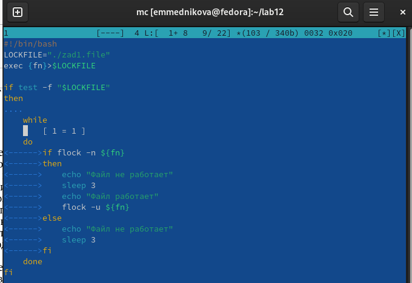
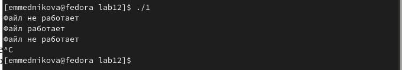
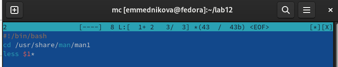
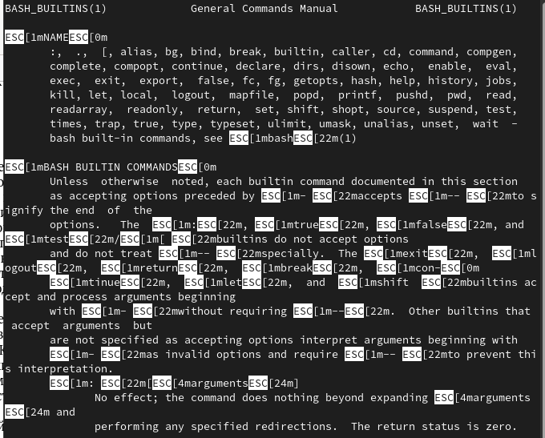
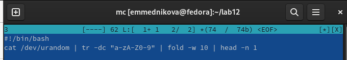
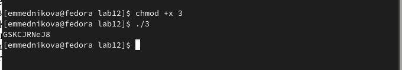

---
## Front matter
lang: ru-RU
title: Лабораторная работа №12
subtitle: Программирование в командном процессоре ОС UNIX. Расширенное программирование
author:
  - Медникова Е. М.
institute:
  - Российский университет дружбы народов, Москва, Россия
  - Факультет физико-математических и естественных наук
date: 28 апреля 2023

## i18n babel
babel-lang: russian
babel-otherlangs: english

## Formatting pdf
toc: false
toc-title: Содержание
slide_level: 2
aspectratio: 169
section-titles: true
theme: metropolis
header-includes:
 - \metroset{progressbar=frametitle,sectionpage=progressbar,numbering=fraction}
 - '\makeatletter'
 - '\beamer@ignorenonframefalse'
 - '\makeatother'
---

# Информация

## Докладчик

:::::::::::::: {.columns align=center}
::: {.column width="70%"}

  * Медникова Екатерина Михайловна 
  * студентка направления бакалавриата 01.03.00 Математика и механика
  * Российский университет дружбы народов
  * [1132226549@rudn.ru](mailto:1132226549@rudn.ru)

:::
::: {.column width="30%"}

:::
::::::::::::::

# Цели и задачи 

Изучить основы программирования в оболочке ОС UNIX. Научиться писать более сложные командные файлы с использованием логических управляющих конструкций и циклов.

# Выполнение лабораторной работы

## Написала командный файл, реализующий упрощённый механизм семафоров.

## Результат

## Реализовала команду man с помощью командного файла. Изучила содержимое каталога /usr/share/man/man1.

## Результат

## Написала командный файл, генерирующий случайную последовательность букв латинского алфавита.

## Результат 

# Выводы

Изучила основы программирования в оболочке ОС UNIX. Научилась писать более сложные командные файлы с использованием логических управляющих конструкций и циклов.

