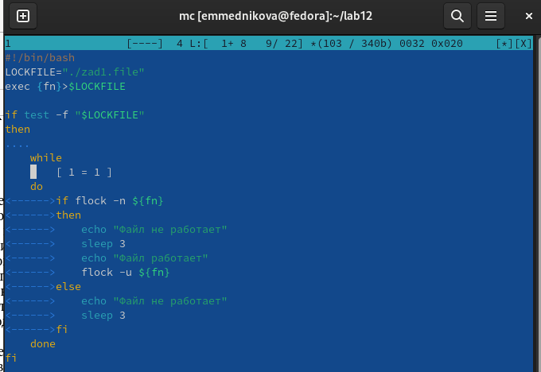
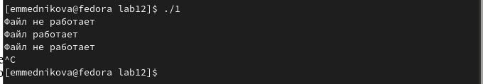
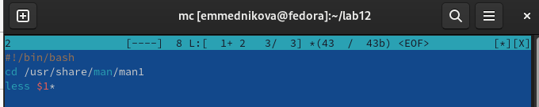
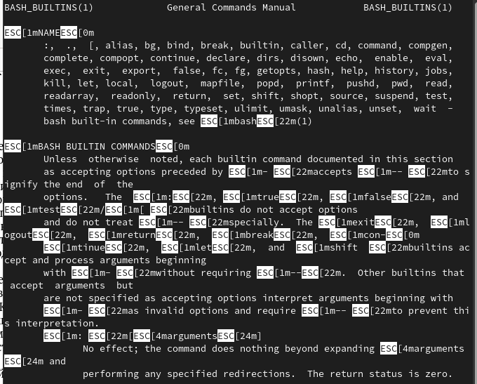
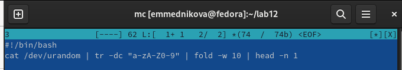

---
## Front matter
title: "Лабораторная работа №12"
subtitle: "Программирование в командном процессоре ОС UNIX. Расширенное программирование"
author: "Медникова Екатерина Михайловна"

## Generic otions
lang: ru-RU
toc-title: "Содержание"

## Bibliography
bibliography: bib/cite.bib
csl: pandoc/csl/gost-r-7-0-5-2008-numeric.csl

## Pdf output format
toc: true # Table of contents
toc-depth: 2
lof: true # List of figures
lot: true # List of tables
fontsize: 12pt
linestretch: 1.5
papersize: a4
documentclass: scrreprt
## I18n polyglossia
polyglossia-lang:
  name: russian
  options:
	- spelling=modern
	- babelshorthands=true
polyglossia-otherlangs:
  name: english
## I18n babel
babel-lang: russian
babel-otherlangs: english
## Fonts
mainfont: PT Serif
romanfont: PT Serif
sansfont: PT Sans
monofont: PT Mono
mainfontoptions: Ligatures=TeX
romanfontoptions: Ligatures=TeX
sansfontoptions: Ligatures=TeX,Scale=MatchLowercase
monofontoptions: Scale=MatchLowercase,Scale=0.9
## Biblatex
biblatex: true
biblio-style: "gost-numeric"
biblatexoptions:
  - parentracker=true
  - backend=biber
  - hyperref=auto
  - language=auto
  - autolang=other*
  - citestyle=gost-numeric
## Pandoc-crossref LaTeX customization
figureTitle: "Рис."
tableTitle: "Таблица"
listingTitle: "Листинг"
lofTitle: "Список иллюстраций"
lotTitle: "Список таблиц"
lolTitle: "Листинги"
## Misc options
indent: true
header-includes:
  - \usepackage{indentfirst}
  - \usepackage{float} # keep figures where there are in the text
  - \floatplacement{figure}{H} # keep figures where there are in the text
---

# Цель работы

Изучить основы программирования в оболочке ОС UNIX. Научиться писать более сложные командные файлы с использованием логических управляющих конструкций и циклов.

# Выполнение лабораторной работы

1. Написала командный файл, реализующий упрощённый механизм семафоров.

{#fig:001 width=70%}

{#fig:002 width=70%}

2. Реализовала команду man с помощью командного файла. Изучила содержимое каталога /usr/share/man/man1.

{#fig:003 width=70%}

{#fig:004 width=70%}

3. Написала командный файл, генерирующий случайную последовательность букв латинского алфавита.

{#fig:005 width=70%}

{#fig:006 width=70%}

# Выводы

Изучила основы программирования в оболочке ОС UNIX. Научилась писать более сложные командные файлы с использованием логических управляющих конструкций и циклов.

# Контрольные вопросы

1. *Найдите синтаксическую ошибку в следующей строке:* while [$1 != "exit"]

Ответ: Ошибка заключается в $1. Также нет пробелов между квадратными скобками.

2. *Как объединить (конкатенация) несколько строк в одну?*

Ответ: Добавление переменных или литеральных строк к переменной с помощью оператора +=

3. *Найдите информацию об утилите seq. Какими иными способами можно реализовать её функционал при программировании на bash?*

Ответ: Утилит seq выдаёт последовательность чисел. Реализовать можно с помощью команды for n in {1..5} do done.

4. *Какой результат даст вычисление выражения $((10/3))?*

Ответ: 3

5. *Укажите кратко основные отличия командной оболочки zsh от bash.*

Ответ: Оболочка zsh предлагает встроенную коррекцию орфографии, улучшенное завершение командной строки, загружаемые модули, которые выступают в качестве плагинов для оболочки, глобальные псевдонимы, которые позволяют использовать псевдонимы имен файлов или чего-либо еще в командной строке вместо просто команд, и больше поддержки тем. Это похоже на bash, но с множеством дополнительных возможностей, дополнительных функций и настраиваемых параметров. 

6. *Проверьте, верен ли синтаксис данной конструкции:* for ((a=1; a <= LIMIT; a++))

Ответ: Да, верен.

7. *Сравните язык bash с какими-либо языками программирования. Какие преимущества у bash по сравнению с ними? Какие недостатки?*

Bash — это командный язык, а не язык программирования общего назначения. Поэтому с усложнением кода он становится более запутанным и менее читаемым. Кроме того, Bash всё и всегда воспринимает как команду, потому что это командный язык. У Bash нет стандартного API, однако он поставляется с простыми встроенными функциями (например, со встроенной тестовой обработкой). Однако часто придется создавать процессы для обработки данных. 
