---
## Front matter
lang: ru-RU
title: Лабораторная работа №13
subtitle: Средства, применяемые при разработке программного обеспечения в OC типа UNIX/Linux
author:
  - Медникова Е.М.
institute:
  - Российский университет дружбы народов, Москва, Россия
  - Факультет физико-математических и естественных наук
date: 06 мая 2023

## i18n babel
babel-lang: russian
babel-otherlangs: english

## Formatting pdf
toc: false
toc-title: Содержание
slide_level: 2
aspectratio: 169
section-titles: true
theme: metropolis
header-includes:
 - \metroset{progressbar=frametitle,sectionpage=progressbar,numbering=fraction}
 - '\makeatletter'
 - '\beamer@ignorenonframefalse'
 - '\makeatother'
---

# Информация

## Докладчик

:::::::::::::: {.columns align=center}
::: {.column width="70%"}

  * Медникова Екатерина Михайловна
  * студентка направления бакалавриата 01.03.00 Математика и механика
  * Российский университет дружбы народов
  * [1132226549@rudn.ru](mailto:1132226549@rudn.ru)
 

:::
::: {.column width="30%"}

:::
::::::::::::::

# Цели и задачи 

Приобрести простейшие навыки разработки, анализа, тестирования и отладки приложений в ОС типа UNIX/Linux на примере создания на языке программирования С калькулятора с простейшими функциями.

# Выполнение лабораторной работы 

## В домашнем каталоге создала подкаталог ~/work/os/lab_prog.

## Создала в нём файлы: calculate.h, calculate.c, main.c.

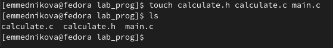

## Написала программы в созданные файлы.

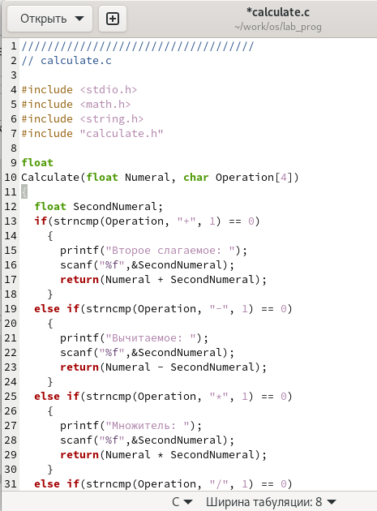

## Написала программы в созданные файлы.

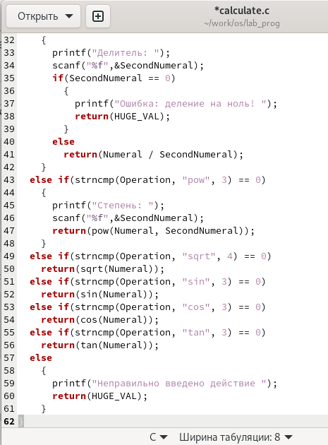

## Написала программы в созданные файлы.

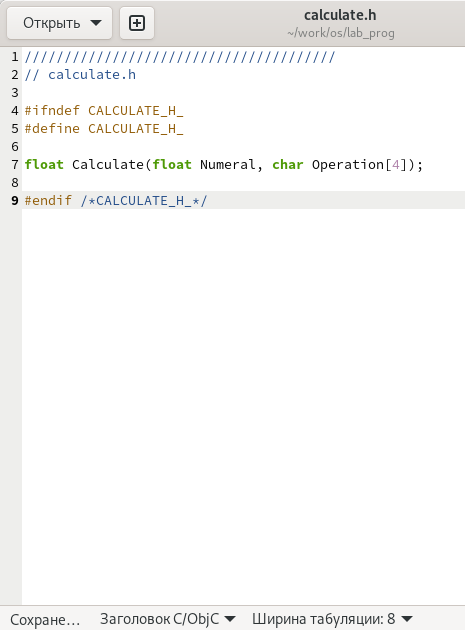

## Написала программы в созданные файлы.

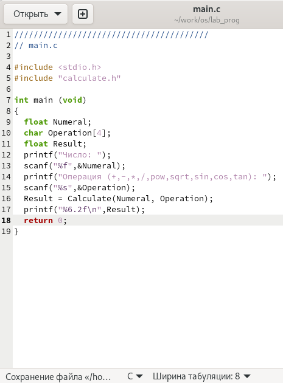

## Выполнила компиляцию программы посредством gcc.

## При компиляции программы синтаксических ошибок выявлено не было.

## Создала  файл Makefile.

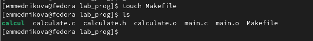

## Написала программу в данный файл.

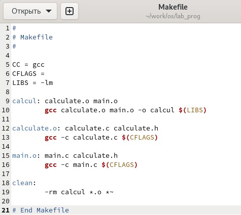

## Данный файл нужен для автоматической компиляции файлов calculate.c, main.c, а также их объединения в один исполняемый файл calcul. Функция clean - автоматическое удаление файлов. Переменная СС отвечает за утилиту для компиляции. Переменная CFLAGS отвечает за опции в данной утилите. Переменная LIBS отвечает за опции для объединения объектных файлов в один исполняемый файл.

## Перед использованием gdb исправила Makefile.

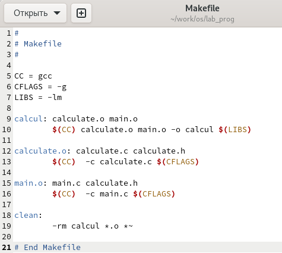

## Выполнила компиляцию файлов.

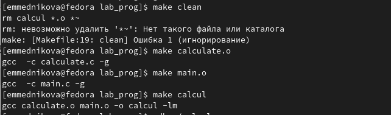

## С помощью gdb выполнила отладку программы calcul.

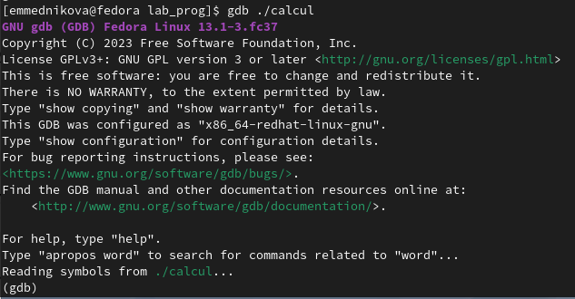

## Для запуска программы внутри отладчика ввела команду run.

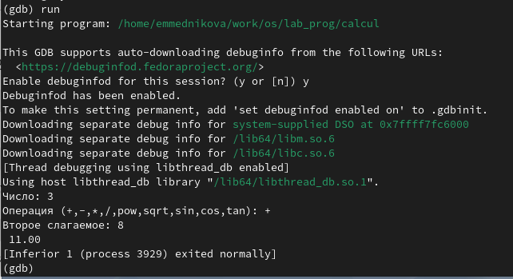

## Для постраничного (по 9 строк) просмотра исходного код использовала команду list.

## Для просмотра строк с 12 по 15 основного файла использовала list с параметрами.

## Для просмотра определённых строк не основного файла использовала list с параметрами.

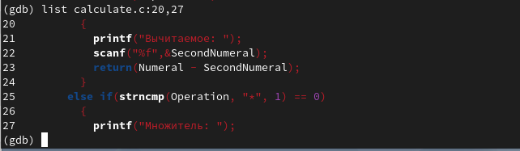

## Установила точку останова в файле calculate.c на строке номер 21.

## Вывела информацию об имеющихся в проекте точках останова.

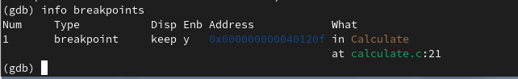

## Запустила программу внутри отладчика и убедилась, что программа остановится в момент прохождения точки останова.

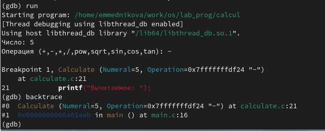

## Отладчик выдал следующую информацию:

## Посмотрела, чему равно на этом этапе значение переменной Numeral, введя команду print Numeral. На экран было выведено число 5.

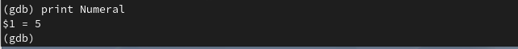

## После использования команды display Numeral на экран также было выведено число 5.

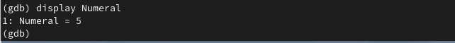

## Убрала точки останова.

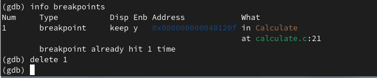

## С помощью утилиты splint было замечено, что в файлах calculate.c и main.c есть функция scanf, которая возвращает целое число, но данные числа не используются и нигде не сохраняются. Далее утилита вывела предупреждение о том, что в файле calculate.c происходит сравнение вещественного числа с нулём.

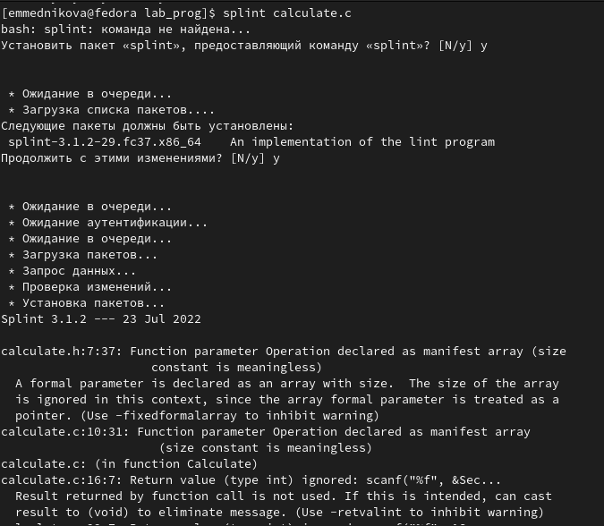

## С помощью утилиты splint было замечено, что в файлах calculate.c и main.c есть функция scanf, которая возвращает целое число, но данные числа не используются и нигде не сохраняются. Далее утилита вывела предупреждение о том, что в файле calculate.c происходит сравнение вещественного числа с нулём.

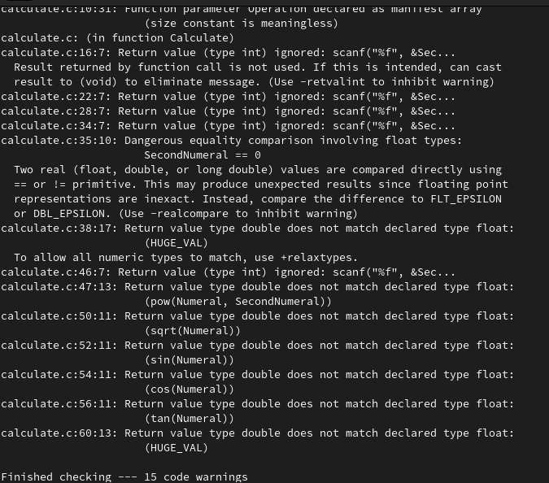

## С помощью утилиты splint было замечено, что в файлах calculate.c и main.c есть функция scanf, которая возвращает целое число, но данные числа не используются и нигде не сохраняются. Далее утилита вывела предупреждение о том, что в файле calculate.c происходит сравнение вещественного числа с нулём.

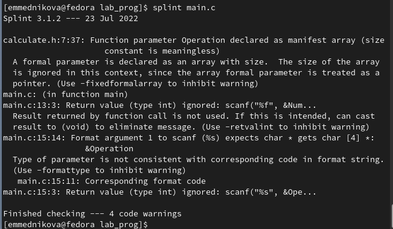

# Выводы

Приобрела простейшие навыки разработки, анализа, тестирования и отладки приложений в ОС типа UNIX/Linux на примере создания на языке программирования С калькулятора с простейшими функциями.

