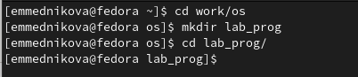

---
## Front matter
title: "Лабораторная работа №13"
subtitle: "Средства, применяемые при разработке программного обеспечения в OC типа UNIX/Linux"
author: "Медникова Екатерина Михайловна"

## Generic otions
lang: ru-RU
toc-title: "Содержание"

## Bibliography
bibliography: bib/cite.bib
csl: pandoc/csl/gost-r-7-0-5-2008-numeric.csl

## Pdf output format
toc: true # Table of contents
toc-depth: 2
lof: true # List of figures
lot: true # List of tables
fontsize: 12pt
linestretch: 1.5
papersize: a4
documentclass: scrreprt
## I18n polyglossia
polyglossia-lang:
  name: russian
  options:
	- spelling=modern
	- babelshorthands=true
polyglossia-otherlangs:
  name: english
## I18n babel
babel-lang: russian
babel-otherlangs: english
## Fonts
mainfont: PT Serif
romanfont: PT Serif
sansfont: PT Sans
monofont: PT Mono
mainfontoptions: Ligatures=TeX
romanfontoptions: Ligatures=TeX
sansfontoptions: Ligatures=TeX,Scale=MatchLowercase
monofontoptions: Scale=MatchLowercase,Scale=0.9
## Biblatex
biblatex: true
biblio-style: "gost-numeric"
biblatexoptions:
  - parentracker=true
  - backend=biber
  - hyperref=auto
  - language=auto
  - autolang=other*
  - citestyle=gost-numeric
## Pandoc-crossref LaTeX customization
figureTitle: "Рис."
tableTitle: "Таблица"
listingTitle: "Листинг"
lofTitle: "Список иллюстраций"
lotTitle: "Список таблиц"
lolTitle: "Листинги"
## Misc options
indent: true
header-includes:
  - \usepackage{indentfirst}
  - \usepackage{float} # keep figures where there are in the text
  - \floatplacement{figure}{H} # keep figures where there are in the text
---

# Цель работы

Приобрести простейшие навыки разработки, анализа, тестирования и отладки приложений в ОС типа UNIX/Linux на примере создания на языке программирования С калькулятора с простейшими функциями.

# Выполнение лабораторной работы

1. В домашнем каталоге создала подкаталог ~/work/os/lab_prog.

{#fig:001 width=70%}

2. Создала в нём файлы: calculate.h, calculate.c, main.c.

{#fig:002 width=70%}

Написала программы в созданные файлы.

{#fig:003 width=70%}

{#fig:004 width=70%}

{#fig:005 width=70%}

{#fig:006 width=70%}

3. Выполнила компиляцию программы посредством gcc:

{#fig:007 width=70%}

4. При компиляции программы синтаксических ошибок выявлено не было.

5. Создала Makefile со следующим содержанием:

{#fig:008 width=70%}

{#fig:009 width=70%}

Данный файл нужен для автоматической компиляции файлов calculate.c, main.c, а также их объединения в один исполняемый файл calcul. Функция clean - автоматическое удаление файлов. Переменная СС отвечает за утилиту для компиляции. Переменная CFLAGS отвечает за опции в данной утилите. Переменная LIBS отвечает за опции для объединения объектных файлов в один исполняемый файл.

6. Перед использованием gdb исправила Makefile:

{#fig:0010 width=70%}

Выполнила компиляцию файлов. 

{#fig:0011 width=70%}

С помощью gdb выполнила отладку программы calcul.

{#fig:0012 width=70%}

Для запуска программы внутри отладчика ввела команду run.

{#fig:0013 width=70%}

Для постраничного (по 9 строк) просмотра исходного код использовала команду list.

{#fig:0014 width=70%}

Для просмотра строк с 12 по 15 основного файла использовала list с параметрами.

{#fig:0015 width=70%}

Для просмотра определённых строк не основного файла использовала list с параметрами.

{#fig:0016 width=70%}

Установила точку останова в файле calculate.c на строке номер 21.

{#fig:0017 width=70%}

Вывела информацию об имеющихся в проекте точках останова.

{#fig:0018 width=70%}

Запустила программу внутри отладчика и убедилась, что программа остановится в момент прохождения точки останова.

{#fig:0019 width=70%}

Отладчик выдал следующую информацию:

{#fig:0020 width=70%}

Посмотрела, чему равно на этом этапе значение переменной Numeral, введя команду print Numeral. На экран было выведено число 5.

{#fig:0021 width=70%}

После использования команды display Numeral на экран также было выведено число 5.

{#fig:0022 width=70%}

Убрала точки останова.

{#fig:0023 width=70%}

7. С помощью утилиты splint было замечено, что в файлах calculate.c и main.c есть функция scanf, которая возвращает целое число, но данные числа не используются и нигде не сохраняются. Далее утилита вывела предупреждение о том, что в файле calculate.c происходит сравнение вещественного числа с нулём. 
 
{#fig:0024 width=70%}

{#fig:0025 width=70%}

{#fig:0026 width=70%}

# Выводы

Приобрела простейшие навыки разработки, анализа, тестирования и отладки приложений в ОС типа UNIX/Linux на примере создания на языке программирования С калькулятора с простейшими функциями.

# Контрольные вопросы

1. *Как получить информацию о возможностях программ gcc, make, gdb и др.?*

Чтобы получить информацию о возможностях программ gcc, make, gdb и др., нужно использовать команду man или -help (-h).

2. *Назовите и дайте краткую характеристику основным этапам разработки приложений в UNIX.*

Процесс разработки программного обеспечения обычно разделяется на следующие
этапы:
– планирование, включающее сбор и анализ требований к функционалу и другим ха-
рактеристикам разрабатываемого приложения;
– проектирование, включающее в себя разработку базовых алгоритмов и спецификаций,
определение языка программирования;
– непосредственная разработка приложения:
– кодирование — по сути создание исходного текста программы (возможно
в нескольких вариантах);
– анализ разработанного кода;
– сборка, компиляция и разработка исполняемого модуля;
– тестирование и отладка, сохранение произведённых изменений;
– документирование.
Для создания исходного текста программы разработчик может воспользоваться любым
удобным для него редактором текста: vi, vim, mceditor, emacs, geany и др.
После завершения написания исходного кода программы (возможно состоящей из
нескольких файлов), необходимо её скомпилировать и получить исполняемый модуль.

3. *Что такое суффикс в контексте языка программирования? Приведите примеры использования.*

Для имени входного файла суффикс определяет, какая компиляция требуется. Суффиксы указывают на тип объекта. Файлы с расширением (суффиксом) .c воспринимаются gcc как программы на языке С, файлы с расширением .cc или .C — как файлы на языке C++, а файлы c расширением .o считаются объектными. Например, в команде "gcc-cmain.c": gcc по расширению .с распознаёт тип файла для компиляции и формирует объектный модуль - файл с расширением .о. 

4. *Каково основное назначение компилятора языка С в UNIX?*

Основное назначение компилятора языка С в UNIX заключается в компиляции всей программы и получении исполняемого файла/модуля.

5. *Для чего предназначена утилита make?*

Для сборки разрабатываемого приложения и компиляции лучше всего воспользоваться командой make. Она позволяет автоматизировать процесс преобразования файлов программы из одной формы в другую, отслеживает взаимосвязи между файлами.

6. *Приведите пример структуры Makefile. Дайте характеристику основным элементам этого файла.*

Для работы с утилитой make необходимо в корне рабочего каталога с проектом создать файл с названием makefile или Makefile, в котором будут описаны правила
обработки файлов Вашего программного комплекса. В самом простом случае Makefile имеет следующий синтаксис:

 <цель_1> <цель_2> ... : <зависимость_1> <зависимость_2> ...
 <команда 1>
 ...
 <команда n>
 
Сначала задаётся список целей, разделённых пробелами, за которым идёт двоеточие и список зависимостей. Затем в следующих строках указываются команды. Строки с командами обязательно должны начинаться с табуляции. 
В качестве цели в Makefile может выступать имя файла или название какого-то действия. Зависимость задаёт исходные параметры (условия) для достижения указанной
цели. Зависимость также может быть названием какого-то действия. Команды  - собственно действия, которые необходимо выполнить для достижения цели.
Для запуска программы необходимо в командной строке набрать команду make:

 make
 
Общий синтаксис Makefile имеет вид:

 target1 [target2...]:[:] [dependment1...]
 [(tab)commands] [#commentary]
 [(tab)commands] [#commentary]
 
Здесь знак # определяет начало комментария (содержимое от знака # и до конца строки не будет обрабатываться. Одинарное двоеточие указывает на то, что последовательность команд должна содержаться в одной строке. Для переноса можно в длинной строке команд можно использовать обратный слэш (\). Двойное двоеточие указывает на то, что последовательность команд может содержаться в нескольких последовательных строках.

7. *Назовите основное свойство, присущее всем программам отладки. Что необходимо сделать, чтобы его можно было использовать?*

Во время работы над кодом программы программист неизбежно сталкивается с появлением ошибок в ней. Использование отладчика для поиска и устранения ошибок в программе существенно облегчает жизнь программиста. В комплект программ GNU для ОС типа UNIX входит отладчик GDB (GNU Debugger).
Для использования GDB необходимо скомпилировать анализируемый код программы
таким образом, чтобы отладочная информация содержалась в результирующем бинарном файле. Для этого следует воспользоваться опцией -g компилятора gcc:

 gcc -c file.c -g
 
После этого для начала работы с gdb необходимо в командной строке ввести одноимённую команду, указав в качестве аргумента анализируемый бинарный файл:

 gdb file.o
 
 Затем можно использовать по мере необходимости различные команды gdb.
Для выхода из gdb можно воспользоваться командой quit (или её сокращённым вариантом q) или комбинацией клавиш Ctrl-d . Более подробную информацию по работе с gdb можно получить с помощью команд gdb -h и man gdb.

8. *Назовите и дайте основную характеристику основным командам отладчика gdb.*

backtrace - вывод на экран пути к текущей точке останова (по сути вывод названий всех функций).
break - установить точку останова (в качестве параметра может быть указан номер строки или название функции).
clear - удалить все точки останова в функции.
continue - продолжить выполнение программы.
delete - удалить точку останова.
display - добавить выражение в список выражений, значения которых отображаются при достижении точки останова программы.
finish - выполнить программу до момента выхода из функции.
info breakpoints - вывести на экран список используемых точек останова.
info watchpoints - вывести на экран список используемых контрольных выражений.
list - вывести на экран исходный код (в качестве параметра может быть указано название файла и через двоеточие номера начальной и конечной строк).
next - выполнить программу пошагово, но без выполнения вызываемых в программе функций.
print - вывести значение указываемого в качестве параметра выражения.
run - запуск программы на выполнение.
set - установить новое значение переменной.
step - пошаговое выполнение программы.
watch - установить контрольное выражение, при изменении значения которого программа будет остановлена.

9. *Опишите по шагам схему отладки программы, которую Вы использовали при выполнении лабораторной работы.*

Схема отладки программы показана в 6 пункте лабораторной работы.

10. *Прокомментируйте реакцию компилятора на синтаксические ошибки в программе при его первом запуске.*

При первом запуске компилятор не выдал никаких синтаксических ошибок.

11. *Назовите основные средства, повышающие понимание исходного кода программы.*

Система разработки приложений UNIX предоставляет различные средства, повышающие понимание исходного кода. К ним относятся:

scope - исследование функций, содержащихся в программе;

lint - критическая проверка программ, написанных на языке С.

12. *Каковы основные задачи, решаемые программой splint?*

Ещё одним средством проверки исходных кодов программ, написанных на языке C,
является утилита splint. Эта утилита анализирует программный код, проверяет
корректность задания аргументов использованных в программе функций и типов возвращаемых значений, обнаруживает синтаксические и семантические ошибки.
В отличие от компилятора C анализатор splint генерирует комментарии с описанием разбора кода программы и осуществляет общий контроль, обнаруживая такие ошибки,
как одинаковые объекты, определённые в разных файлах, или объекты, чьи значения не используются в работе программы, переменные с некорректно заданными значениями и типами и многое другое.

