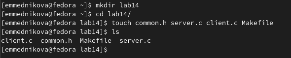
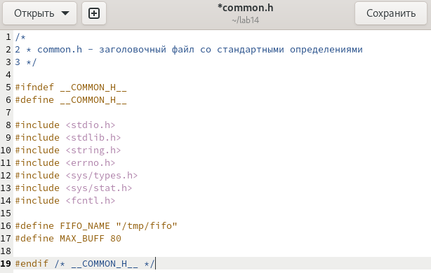
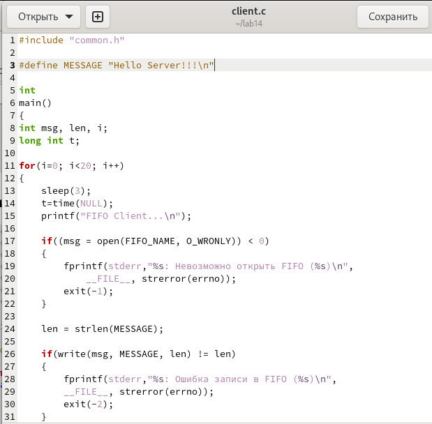
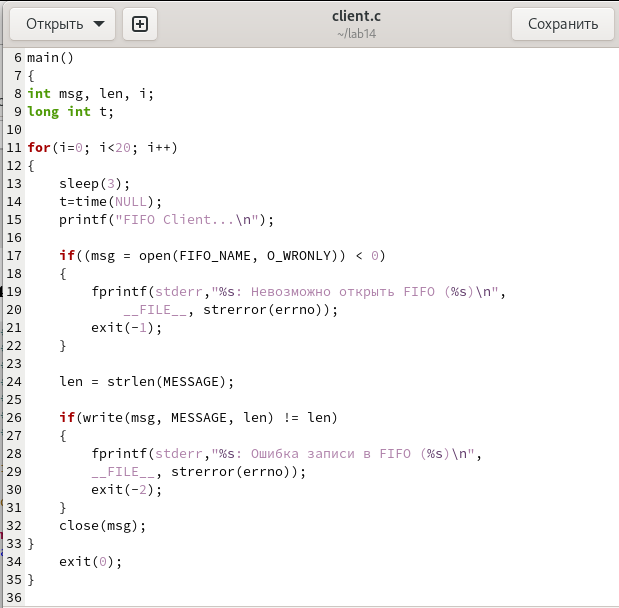
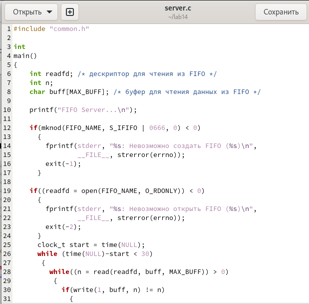
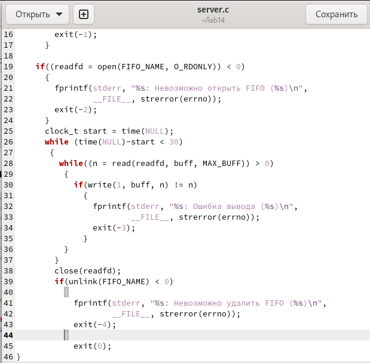
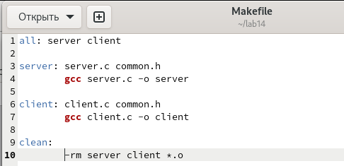
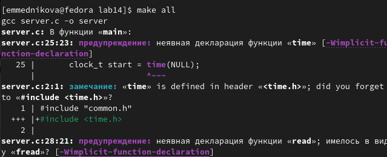
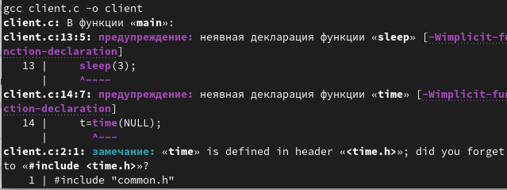
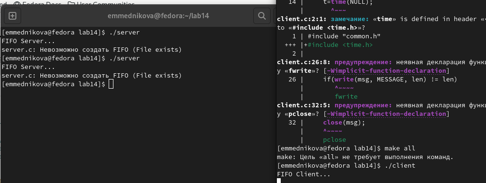

---
## Front matter
lang: ru-RU
title: Лабораторная работа №14
subtitle: Именованные каналы
author:
  - Медникова Е. М.
institute:
  - Российский университет дружбы народов, Москва, Россия
  - Факультет физико-математических и естественных наук
date: 13 мая 2023

## i18n babel
babel-lang: russian
babel-otherlangs: english

## Formatting pdf
toc: false
toc-title: Содержание
slide_level: 2
aspectratio: 169
section-titles: true
theme: metropolis
header-includes:
 - \metroset{progressbar=frametitle,sectionpage=progressbar,numbering=fraction}
 - '\makeatletter'
 - '\beamer@ignorenonframefalse'
 - '\makeatother'
---

# Информация

## Докладчик

:::::::::::::: {.columns align=center}
::: {.column width="70%"}

  * Медникова Екатерина Михайловна
  * студентка направления бакалавриата 01.03.00 Математика и механика
  * Российский университет дружбы народов
  * [1132226549@rudn.ru](mailto:1132226549@rudn.ru)

:::
::: {.column width="30%"}

:::
::::::::::::::

# Цель работы 

Приобретение практических навыков работы с именованными каналами.

# Задание

Изучить приведённые в тексте программы server.c и client.c. Взяв данные примеры
за образец, написать аналогичные программы, внеся следующие изменения:

 Работает не 1 клиент, а несколько (например, два).

 Клиенты передают текущее время с некоторой периодичностью (например, раз в пять
секунд). Использовать функцию sleep() для приостановки работы клиента.

 Сервер работает не бесконечно, а прекращает работу через некоторое время (напри-
мер, 30 сек). Использовать функцию clock() для определения времени работы сервера.

Что будет в случае, если сервер завершит работу, не закрыв канал?

# Выполнение лабораторной работы

## Изучила материал лабораторной работы. На основе примеров написала аналогичные программы, внеся некоторые изменения.

## Перед началом выполнения лабораторной работы создала каталог lab14 и файлы: common.h, server.c, client.c, Makefile. 
 

## Вставила текст программы в файл common.h, ничего не меняя.

## Вставила текст программы в файл client.c, изменила его.

## Вставила текст программы в файл client.c, изменила его.

## Вставила текст программы в файл server.c, добавив некоторые корректировки.

## Вставила текст программы в файл server.c, добавив некоторые корректировки.

## Вставила текст программы в файл Makefile, ничего не меняя.

## Далее делаем компиляцию файлов с помощью команды make all.

## Далее делаем компиляцию файлов с помощью команды make all.

## При создании и проверке работы файлов каждый терминал (использовалось два терминала) вывел несколько сообщений, после 30 секунд работа сервера была завершена. Если сервер завершит работу, не закрывая канал, то при повторном запуске появится ошибка, так как уже существует один канал. 

# Выводы

Приобрела практические навыки работы с именованными каналами.

